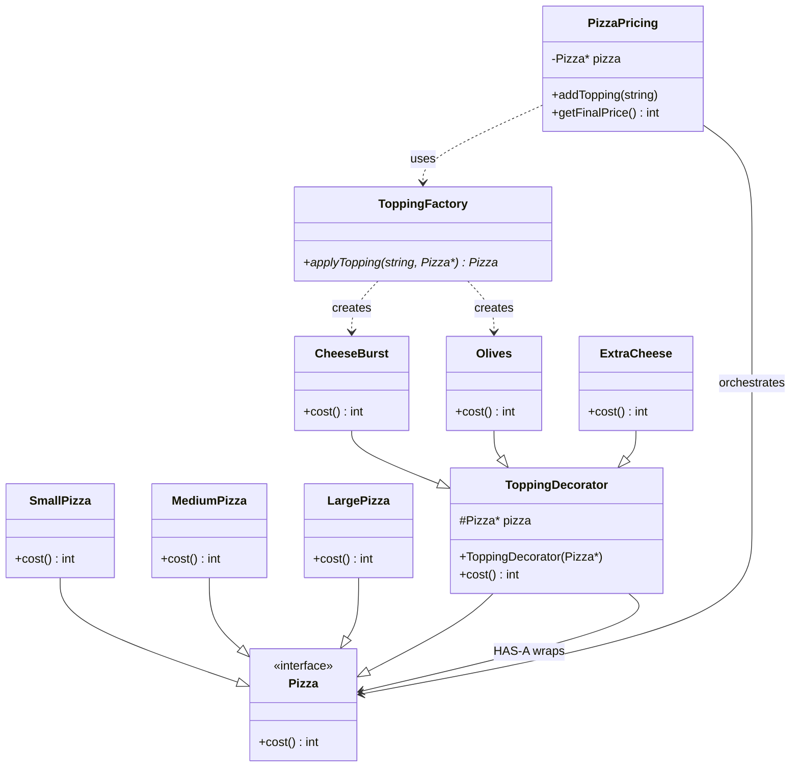

# Decorator Design Pattern — Pizza Example

## Definition

> Attach additional behavior to an object **dynamically**, wrapping it with another object of the **same interface**, so you can stack features without exploding subclasses.

In this example:

> Base pizzas (Small / Medium / Large) are the core. Toppings wrap a `Pizza` and add to `cost()`.

This is enough for an interview LLD. Don’t overcomplicate unless they add size-specific topping prices, coupons, crust types, taxes, etc.

---

## 1. Problem

A pizza shop: sizes + toppings.

We don’t want classes like:

```text
MediumPizzaWithCheeseAndOlives
LargePizzaWithOlives
SmallPizzaWithExtraCheeseAndOlives
...
```

That is **class explosion**. Decorator = wrap the same `Pizza` again and again at runtime.

---

## 2. Overall design

```text
                    Pizza
                 /         \
                /           \
       Base Pizzas        ToppingDecorator
       /   |   \               |
   Small Medium Large      -------------------
                          |        |          |
                      Cheese    Olives    ExtraCheese
```



### The important part of the pattern

```text
ToppingDecorator IS-A Pizza
ToppingDecorator HAS-A Pizza
```

- **IS-A** — caller still talks to `Pizza*` (`cost()`).  
- **HAS-A** — the wrapper holds the inner pizza and delegates, then adds its own price.

That’s why you can wrap wrappers: `Olives` around `CheeseBurst` around `MediumPizza`.

---

## 3. Common interface

```cpp
class Pizza {
public:
    virtual int cost() = 0;
};
```

Everything that has a price is a `Pizza` — base or decorated.

---

## 4. Base pizzas — initial price

```cpp
class SmallPizza : public Pizza {
public:
    int cost() override {
        return 200;
    }
};

class MediumPizza : public Pizza {
public:
    int cost() override {
        return 300;
    }
};

class LargePizza : public Pizza {
public:
    int cost() override {
        return 400;
    }
};
```

These are the **innermost** objects. Toppings wrap them; they don’t know about toppings.

---

## 5. Abstract decorator

```cpp
class ToppingDecorator : public Pizza {
protected:
    Pizza* pizza;

public:
    ToppingDecorator(Pizza* pizza) : pizza(pizza) {}
};
```

Shared wrap logic lives here. Concrete toppings only add **their** extra cost.

---

## 6. Concrete toppings

```cpp
class CheeseBurst : public ToppingDecorator {
public:
    CheeseBurst(Pizza* pizza) : ToppingDecorator(pizza) {}

    int cost() override {
        return pizza->cost() + 100;
    }
};

class Olives : public ToppingDecorator {
public:
    Olives(Pizza* pizza) : ToppingDecorator(pizza) {}

    int cost() override {
        return pizza->cost() + 50;
    }
};
```

Same shape for ExtraCheese, etc. Each topping’s **pricing behavior is encapsulated** in that class.

---

## 7. Factory — who constructs the wrap

```cpp
class ToppingFactory {
public:
    static Pizza* applyTopping(string topping, Pizza* pizza) {
        if (topping == "cheeseBurst")
            return new CheeseBurst(pizza);

        if (topping == "olives")
            return new Olives(pizza);

        return pizza;
    }
};
```

`PizzaPricing` doesn’t `new CheeseBurst` itself. Unknown topping → return the pizza unchanged (or throw, if they want strictness).

---

## 8. PizzaPricing — orchestration / service

Not part of the GoF pattern. It’s the **service layer** that holds the current `Pizza*` and reassigns it after each wrap.

```cpp
class PizzaPricing {
    Pizza* pizza;

public:
    PizzaPricing(Pizza* pizza) : pizza(pizza) {}

    void addTopping(string topping) {
        pizza = ToppingFactory::applyTopping(topping, pizza);
    }

    int getFinalPrice() {
        return pizza->cost();
    }
};
```

### API cleanup

Don’t need a separate `initialize()`. Construct with the base pizza:

```cpp
PizzaPricing pricing(new MediumPizza());
```

Cleaner than `initialize()` then `addToppings()`.

---

## 9. Usage

```cpp
PizzaPricing pricing(new MediumPizza());

pricing.addTopping("cheeseBurst");
pricing.addTopping("olives");

cout << pricing.getFinalPrice();  // 450
```

Internally:

```text
Olives
  ↓
CheeseBurst
  ↓
MediumPizza

300 + 100 + 50 = 450
```

`cost()` walks **outward → inward**: olives asks cheese, cheese asks medium, then adds on the way back.

---

## 10. Why Decorator, not `vector<Topping>` inside Pizza?

If they ask:

> Why not keep `vector<Topping>` on Pizza and sum prices in a loop?

**Answer:**

Decorator lets us **dynamically compose** toppings while keeping **each topping’s pricing behavior encapsulated**. It avoids classes like `MediumPizzaWithCheeseAndOlives`.

Extra talking points (only if they push):

- New topping = new class; base pizzas don’t change (Open/Closed).  
- A `vector` of price ints is fine for **flat add-ons**. Decorator shines when wrapping **changes behavior**, not just a number (e.g. “buy one topping, second half price” as a wrapper — stretch; don’t invent unless asked).  
- Interview LLD: Decorator is the expected pattern for “add-ons on a product.” `vector<Topping>` is a valid simpler design; say you’d switch if toppings are **data** (name + price from DB) rather than **types**.

---

## 11. What not to add unless they ask

- Size-specific topping prices  
- Coupons / discounts  
- Crust types  
- Taxes  

Those are extra **decorators** or a **pricing pipeline**. Don’t volunteer them.

---

## Follow-up: health constraint (mutual exclusion)

**Requirement:** mushroom is “healthy.” It **cannot** be added if cheeseBurst is already there, and cheeseBurst **cannot** be added if mushroom is already there.

On violation: `addTopping` returns **`false`** and there is **no state change**.

### Why pure Decorator feels awkward

If the only structure is nested wrappers, “does this pizza already contain mushroom?” is not a field you can look up. You have to **walk the chain**.

Your instinct (a map of ingredients) is valid — but then you have **two sources of truth** unless you keep them in sync:

```text
Decorator chain
+
set<string> toppings     ← duplication
```

Prefer **one** source of truth for this requirement: the chain itself.

### Cleaner interview fix: `hasTopping` on `Pizza`

Keep Decorator for **pricing / composition**. Add a small **query** on the same interface:

```cpp
class Pizza {
public:
    virtual int cost() = 0;
    virtual bool hasTopping(string topping) = 0;
};
```

Base pizza has **no** toppings:

```cpp
class MediumPizza : public Pizza {
public:
    int cost() override {
        return 300;
    }

    bool hasTopping(string topping) override {
        return false;
    }
};
```

Each decorator answers “is it **me**, or someone **inside**?”:

```cpp
class CheeseBurst : public ToppingDecorator {
public:
    CheeseBurst(Pizza* pizza) : ToppingDecorator(pizza) {}

    int cost() override {
        return pizza->cost() + 100;
    }

    bool hasTopping(string topping) override {
        return topping == "cheeseBurst" || pizza->hasTopping(topping);
    }
};
```

Mushroom:

```cpp
bool hasTopping(string topping) override {
    return topping == "mushroom" || pizza->hasTopping(topping);
}
```

Same idea as `cost()`: walk **this wrapper → inner pizza**.

```text
Olives
  ↓
Mushroom
  ↓
MediumPizza

pizza->hasTopping("mushroom")  → true
```

### Validate **before** wrapping

```cpp
bool addTopping(string topping) {
    if (topping == "mushroom" && pizza->hasTopping("cheeseBurst"))
        return false;

    if (topping == "cheeseBurst" && pizza->hasTopping("mushroom"))
        return false;

    pizza = ToppingFactory::applyTopping(topping, pizza);
    return true;
}
```

Mushroom already on + add cheeseBurst → **`false`**, `pizza` pointer **unchanged**.

Don’t wrap first and try to “unwrap” on failure — that’s messy with `new` and ownership.

### Why not a map yet

A `set<string>` on `PizzaPricing` also works for “what’s on the pizza?” Then `addTopping` checks the set, wraps, and inserts.

Cost: **chain and set can drift** (forget to insert, or wrap fails). For **this** rule, `hasTopping()` on the decorator is enough.

A map becomes more attractive if they want “list all toppings,” counts, or toppings as **data from DB** rather than classes.

### Next evolution: many rules → validator

If they keep piling rules:

```text
Mushroom incompatible with CheeseBurst
Pineapple incompatible with X
Jalapeno requires Y
```

Don’t fill `PizzaPricing` with `if`s. Extract:

```text
PizzaPricing
     ↓
ToppingValidator / ToppingPolicy
     ↓  asks
pizza->hasTopping(...)
```

`PizzaPricing` still: validate → wrap or return false. **Policy** owns incompatibility / requires. That’s Open/Closed for new rules.

Don’t introduce the validator until they add **more than one** constraint.

**Interview line:** *Keep Decorator for wrapping. hasTopping() walks the chain so we don’t duplicate toppings in a set. Mutual exclusion is checked in addTopping before wrap — false means no state change. Many rules → ToppingPolicy, not more ifs in the service.*

---

## Interview lines

- *Decorator IS-A and HAS-A the same type — that’s how you stack wrappers.*  
- *Base pizza is the core; each topping wraps and adds cost.*  
- *Factory builds the wrap; PizzaPricing just holds the current Pizza\* and adds toppings.*  
- *Constructor instead of initialize().*  
- *We use Decorator so we don’t create MediumWithCheeseAndOlives.*  
- *Mutual exclusion: hasTopping() on the chain; fail before wrap so the pointer doesn’t move.*
