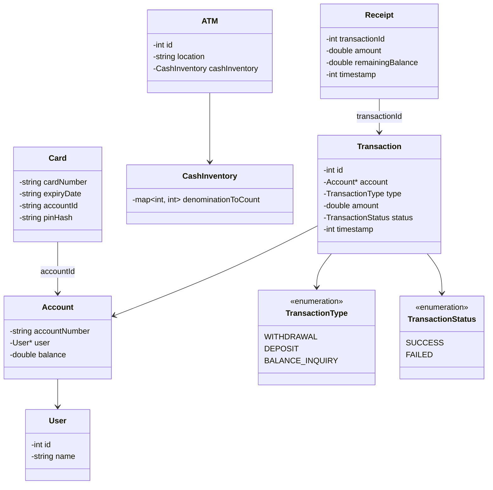
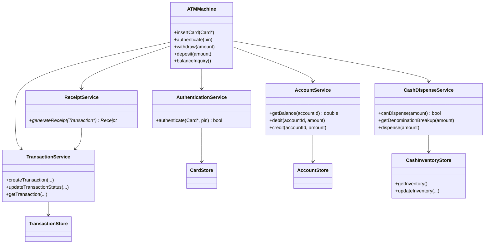

# ATM Machine — LLD Notes

Keep the entity model **small**. First-pass grouping:

```text
User / Card / Account
ATM / CashInventory
Transaction / Receipt
```

---

## Class diagram



**Interview line:** *Inventory of notes, not a single ATMCash balance. PIN lives on the card / AuthService, not User. Transaction is generic — no amountWithdrawn field.*

---

## Core entities

### 1. Card

```text
Card
- cardNumber
- expiryDate
- accountId
```

### 2. User

```text
User
- id
- name
```

### 3. Account

```text
Account
- accountNumber
- User*
- balance
```

### 4. ATM

```text
ATM
- id
- location
- CashInventory
```

### 5. CashInventory

```text
CashInventory
- map<denomination, count>
```

Example:

```text
2000 → 2
500  → 5
200  → 10
100  → 20
```

Do **not** make an `ATMCash` entity with only `currentBalance`. What matters is the **inventory of notes** — denomination counts.

### 6. Transaction

```text
Transaction
- id
- Account*
- TransactionType
- amount
- TransactionStatus
- timestamp
```

Avoid withdrawal-only fields like `amountWithdrawn`. The same class must work for **deposit** and **balance inquiry**.

### 7. Receipt

```text
Receipt
- transactionId
- amount
- remainingBalance
- timestamp
```

---

## Enums

```text
TransactionType
- WITHDRAWAL
- DEPOSIT
- BALANCE_INQUIRY

TransactionStatus
- SUCCESS
- FAILED
```

---

## PIN / auth

PIN should **not** live on `User`. It belongs to card / authentication, e.g.:

```text
Card
- cardNumber
- pinHash
- accountId
```

or via `CardStore` / `AuthService`.

---

## Services

Facade:

```text
ATMMachine
→ orchestrates the overall flow
```

Then:

| Service | Job |
|---|---|
| **AuthenticationService** | `authenticate(card, pin)` |
| **AccountService** | `getBalance`, `debit`, `credit` |
| **CashDispenseService** | `canDispense`, `getDenominationBreakup`, `dispense` |
| **TransactionService** | `createTransaction`, `updateTransactionStatus`, `getTransaction` |
| **ReceiptService** | `generateReceipt(transaction)` |

Do **not** put `CardService.withdraw()`. A card is **identification / auth**. Withdrawal spans several domains.

Options:

```text
ATMMachine          (orchestrate first)
or WithdrawalService
```

If they want more split (don’t start here):

```text
TransactionService
   |
   +-- WithdrawalService
   +-- DepositService
   +-- BalanceInquiryService
```

For an interview, **don’t** start with that much abstraction.

```text
ATMMachine
AuthenticationService
AccountService
CashDispenseService
TransactionService
ReceiptService
```

That’s enough.

---

## Stores

```text
CardStore
- cardNumber → card / auth details

AccountStore
- accountId → Account

TransactionStore
- transactionId → Transaction
```

ATM cash either lives on `ATM` / `CashInventory` or behind:

```text
CashInventoryStore
- getInventory()
- updateInventory(...)
```

---

## Withdrawal flow

```text
ATMMachine.insertCard(card)
        ↓
AuthenticationService.authenticate(card, pin)
        ↓
show options
        ↓
Withdrawal chosen
        ↓
AccountService.getBalance()
        ↓
CashDispenseService.canDispense(amount)
        ↓
AccountService.debit()
        ↓
CashDispenseService.dispense()
        ↓
TransactionService.createTransaction()
        ↓
ReceiptService.generateReceipt()
```

---

## Service class diagram



---

## Next question to decide

> Should `ATMMachine` itself contain all withdrawal steps, or should we introduce a `WithdrawalService`? Which one, and why?

Start with orchestration on `ATMMachine`. Extract `WithdrawalService` if the withdraw path (debit vs dispense failure, rollback) gets heavy.


