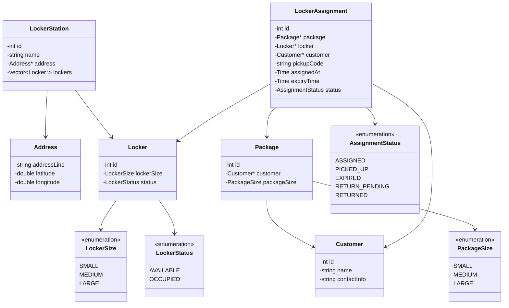
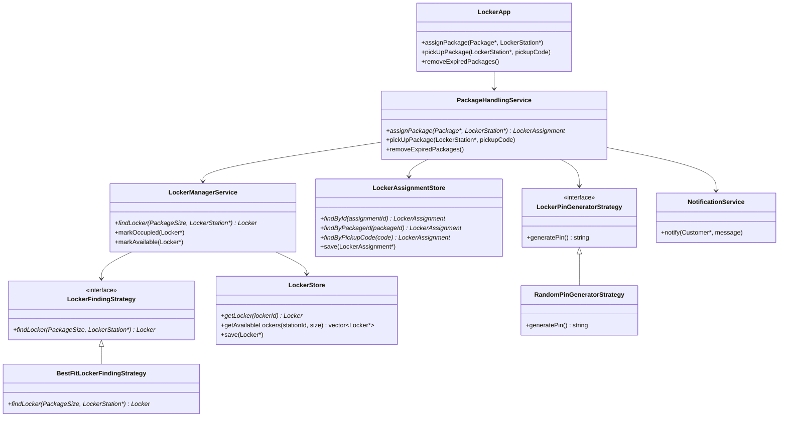

# Amazon Locker — LLD Notes

Keep the entity model **small**. First-pass grouping:

```text
Customer / Package / Address
LockerStation / Locker
LockerAssignment
```

---

## Class diagram



**Interview line:** *`LockerAssignment` is the relationship entity — PIN, expiry, and status live here, not on `Locker`. Assignment lifecycle is not the same as physical locker availability.*

---

## Service class diagram



**Interview line:** *`PackageHandlingService` owns the workflow. `LockerManagerService` only finds and occupies lockers — no PIN, notify, or expiry.*

---

## 1. Requirements

Amazon has multiple locker locations. Each location contains lockers of different sizes.

```text
LockerSize
SMALL
MEDIUM
LARGE
```

A package is assigned to an appropriate available locker. Prefer the exact size; if unavailable, use the next larger size.

After assignment, generate a unique pickup PIN/code. The customer goes to the locker location and enters the PIN. The system resolves the assignment and opens the correct locker.

Pickup code expires after **3 days**. Expiry does **not** immediately make the locker available, because the package is still physically inside. The locker becomes available only after pickup or physical removal/return.

---

## 2. Core entities

### Customer

```cpp
class Customer {
    int id;
    string name;
    string contactInfo;
};
```

### Package

```cpp
class Package {
    int id;
    Customer* customer;
    PackageSize packageSize;
};
```

### Locker

```cpp
class Locker {
    int id;
    LockerSize lockerSize;
    LockerStatus status;
};
```

```text
LockerStatus
AVAILABLE
OCCUPIED
```

Introduce `RESERVED` later only if the assignment workflow needs a hold before occupy.

### Address

```cpp
class Address {
    string addressLine;
    double latitude;
    double longitude;
};
```

### LockerStation

Represents an actual Amazon Locker facility — not just a geo point.

```cpp
class LockerStation {
    int id;
    string name;
    Address* address;
    vector<Locker*> lockers;
};
```

```text
Address        = geographical information
LockerStation  = facility that contains lockers
```

`LockerStation -> Locker` is the **domain relationship**. `LockerStore` exists for persistence/querying. Both can coexist.

---

## 3. LockerAssignment

Originally this was `Order`. `LockerAssignment` describes the relationship better.

```cpp
class LockerAssignment {
    int id;
    Package* package;
    Locker* locker;
    Customer* customer;
    string pickupCode;
    Time assignedAt;
    Time expiryTime;
    AssignmentStatus status;
};
```

```text
AssignmentStatus
ASSIGNED
PICKED_UP
EXPIRED
RETURN_PENDING
RETURNED
```

This is a **relationship entity**:

```text
Package
    ↓
LockerAssignment
    ↓
Locker
```

The relationship itself holds:

```text
pickupCode
expiry
status
assignedAt
```

Do not add a separate `OrderCredentials` unless pickup credentials become more complicated.

---

## 4. Stores

### LockerStore

Persistence and querying of lockers.

```cpp
class LockerStore {
    Locker* getLocker(int lockerId);
    vector<Locker*> getAvailableLockers(int stationId, LockerSize size);
    void save(Locker* locker);
};
```

Potential indexes:

```text
lockerId → Locker

(stationId, size, status)
        ↓
available lockers
```

Avoid scanning `station->lockers` on every assignment.

### LockerAssignmentStore

```cpp
class LockerAssignmentStore {
    LockerAssignment* findById(int assignmentId);
    LockerAssignment* findByPackageId(int packageId);
    LockerAssignment* findByPickupCode(string code);
    void save(LockerAssignment* assignment);
};
```

Potential indexes:

```text
assignmentId → LockerAssignment
packageId    → LockerAssignment
pickupCode   → LockerAssignment
```

`packageId` is the key for **idempotency**.

---

## 5. PackageHandlingService

Main business workflow. `LockerApp` is only a thin orchestrator/controller.

```cpp
class PackageHandlingService {
    LockerManagerService* lockerManagerService;
    LockerAssignmentStore* lockerAssignmentStore;
    LockerPinGeneratorStrategy* pinGenerator;
    NotificationService* notificationService;

    LockerAssignment* assignPackage(Package* package, LockerStation* station);
    void pickUpPackage(LockerStation* station, string pickupCode);
    void removeExpiredPackages();
};
```

### Assignment flow

```text
assignPackage(package, station)
        ↓
check whether package already has assignment
        ↓
LockerManagerService finds / reserves suitable locker
        ↓
generate pickup PIN
        ↓
create LockerAssignment
        ↓
save LockerAssignment
        ↓
notify customer
```

---

## 6. LockerManagerService

Locker-specific operations only.

```cpp
class LockerManagerService {
    LockerFindingStrategy* lockerFindingStrategy;
    LockerStore* lockerStore;

    Locker* findLocker(PackageSize packageSize, LockerStation* station);
    void markOccupied(Locker* locker);
    void markAvailable(Locker* locker);
};
```

It should **not** own:

```text
pickup PIN generation
notifications
assignment expiry
customer handling
```

---

## 7. LockerFindingStrategy

Strategy, because allocation logic may change.

```cpp
class LockerFindingStrategy {
    virtual Locker* findLocker(PackageSize packageSize, LockerStation* station) = 0;
};

class BestFitLockerFindingStrategy : public LockerFindingStrategy {};
```

### Best-fit logic

```text
SMALL package   SMALL → MEDIUM → LARGE
MEDIUM package  MEDIUM → LARGE
LARGE package   LARGE
```

Example: SMALL unavailable, MEDIUM and LARGE available → choose **MEDIUM**. Preserve LARGE lockers for packages that need LARGE.

This is still **one strategy**. Do not switch strategy classes when SMALL is unavailable.

---

## 8. LockerPinGeneratorStrategy

```cpp
class LockerPinGeneratorStrategy {
    virtual string generatePin() = 0;
};
```

Example: `RandomPinGeneratorStrategy`. PIN/code must be unique for the lookup scope (global vs per station).

---

## 9. NotificationService

Keep it simple.

```cpp
class NotificationService {
    void notify(Customer* customer, string message);
};
```

Observer is **not** required for this problem.

Observer is useful if many independent systems react to the same event (`PackageAssigned` → notification, analytics, audit, delivery tracking). For current requirements, `notificationService->notify(...)` is enough.

---

## 10. Pickup flow

The customer does not need the internal `LockerAssignment` id. They receive:

```text
Locker Station: CP Locker Station
Pickup Code:    482913
Expires:        21 Sep
```

API:

```cpp
pickUpPackage(LockerStation* station, string pickupCode);
```

```text
Customer enters PIN
        ↓
LockerAssignmentStore.findByPickupCode(pin)
        ↓
validate: correct station? ASSIGNED? not expired?
        ↓
assignment->locker
        ↓
open locker
        ↓
customer collects package
        ↓
Assignment → PICKED_UP
Locker     → AVAILABLE
```

PIN entry / door open alone should not necessarily mark the locker available. Ideally wait for physical collection / door-close confirmation. Hardware can stay abstracted in LLD.

---

## 11. Expiry

Assignment expires after 3 days:

```text
Assignment: ASSIGNED → EXPIRED / RETURN_PENDING
Locker:     still OCCUPIED
```

The package is still physically inside. After Amazon/delivery removes it:

```text
Assignment: RETURN_PENDING → RETURNED
Locker:     OCCUPIED → AVAILABLE
```

> **Assignment lifecycle != physical locker availability.**

---

## 12. Concurrency — in-memory / single server

Suppose only one MEDIUM locker `M1` remains.

```text
Thread A                    Thread B
findLocker() → M1           findLocker() → M1
```

Both saw it as available. Locking only the **update** is not enough if both already passed the check.

Wrong:

```text
check AVAILABLE
lock(M1)
mark OCCUPIED
unlock
```

Correct:

```text
lock(M1)
RECHECK locker.status
if AVAILABLE: reserve / mark OCCUPIED
else: fail and find another locker
unlock(M1)
```

> **CHECK + UPDATE must be atomic.**

A cleaner API is `reserveLocker(...)` rather than exposing `findLocker()` and `markOccupied()` as independent operations.

---

## 13. Fine-grained locking

Do not lock the entire locker system. Use `lockerId → mutex`.

```text
M1 → mutex1
M2 → mutex2
M3 → mutex3
```

Assigning `M1` does not block assigning `M8`.

Same idea as other LLDs:

```text
BookMyShow:   (showId, seatId)
Rate limiter: userId / resourceKey
Stock broker: orderId
Amazon Locker: lockerId
```

---

## 14. Idempotent request — retry

```text
Client → assignPackage(P1)
Server assigns P1 → M1
response is lost
Client retries assignPackage(P1)
```

Without idempotency: `P1 → M1` and `P1 → M2`.

If one active assignment per package is the rule, use `packageId`:

```cpp
auto existing = lockerAssignmentStore->findByPackageId(package->id);
if (existing) return existing;
```

Retry returns the original assignment. If the same package can be reassigned many times over its lifetime, use a separate `idempotencyKey` / `requestId`.

---

## 15. Concurrent idempotent requests — single server

Two identical requests at the same time:

```text
A: findByPackage(P1) → none
B: findByPackage(P1) → none
A: create A1
B: create A2             ❌
```

Lock on `packageId`:

```text
lock(P1)
check whether assignment exists
if exists: return existing
otherwise: create / save assignment
unlock(P1)
```

> **CHECK + CREATE must be atomic.** Release the package lock **after** the assignment is saved, not right after the check.

---

## 16. Two different locks / invariants

### Package lock

```text
one package → at most one active assignment
key: packageId
```

### Locker lock

```text
one locker → at most one package
key: lockerId
```

```text
packageId lock  → prevents P1 → M1 AND P1 → M2
lockerId lock   → prevents P1 → M1 AND P2 → M1
```

Different invariants → different lock keys.

---

## 17. Distributed system — in-memory mutex does not work

```text
Server A                     Server B
mutexMapA                    mutexMapB
```

A process-local `mutex` on Server A does not block Server B. Shared persistent storage must enforce the invariant.

---

## 18. Distributed idempotency — unique constraint

```text
UNIQUE(packageId)
```

```text
Server A                       Server B
SELECT P1 → none               SELECT P1 → none
INSERT P1 SUCCESS              INSERT P1 UNIQUE violation
```

Server B catches the duplicate, `findByPackageId(P1)`, and returns the existing assignment.

`SELECT → INSERT` is **not** atomic. The SELECT is for normal retries / avoiding extra work. The guarantee is:

```text
UNIQUE constraint + atomic INSERT
```

---

## 19. Sequential vs concurrent idempotency

### Normal retry

```text
Request 1 → creates assignment
Request 2 → SELECT finds existing assignment → return it
```

### Concurrent duplicates

```text
A: SELECT → none
B: SELECT → none
A: INSERT → success
B: INSERT → unique constraint failure
```

> **Persistent lookup handles normal retries. DB uniqueness handles the race when duplicate requests arrive concurrently.**

---

## 20. Distributed locker allocation

Do not:

```text
SELECT locker AVAILABLE
later
UPDATE locker OCCUPIED
```

Use a conditional update:

```sql
UPDATE Locker
SET status = 'OCCUPIED'
WHERE lockerId = M1
AND status = 'AVAILABLE';
```

```text
affectedRows == 1  → claimed M1
affectedRows == 0  → already claimed → try another locker
```

```text
Same package → two assignments  → UNIQUE constraint / atomic INSERT
Same locker  → two packages     → conditional atomic UPDATE
```

---

## 21. Core concurrency rules

```text
1. Single process concurrency  → fine-grained mutex
2. Check + Update/Create       → must happen atomically
3. Multiple servers            → don't rely on in-memory mutex
4. Shared storage enforces invariants
   → UNIQUE constraint / conditional UPDATE / transaction
```

Amazon Locker keys:

```text
packageId   → package assignment uniqueness
lockerId    → locker ownership
pickupCode  → identifies assignment during pickup
```

---

## Next follow-up

> We successfully claim `M1`, then crash before creating `LockerAssignment`. How do we keep locker occupy and assignment creation consistent?

That question connects the two DB operations: conditional locker `UPDATE` and assignment `INSERT`.
