# BookMyShow — LLD

Movie-ticket booking. Facade + admin / search / booking services + stores. Matches the **current headers**, not a finished product (payment, ticket, concurrency, locking seats).

---

## Final code class diagram

```text
addNewCinemaHall      → AdminService → CinemaStore.save
addShowsToHall        → AdminService → ShowStore.saveShowsToCinema
searchShowsForAMovie  → SearchService → ShowStore.getShowsForAMovieInACity
bookAShow             → BookingService
                          Auditorium.checkSeat
                          ShowSeatStore.getSeatStatus
                          (create/save ShowSeat — not implemented yet)
```

`User` is passed into `BookMyShow::bookAShow` but **not** into `BookingService` yet. `PaymentService` and `Ticket` exist as empty stubs.

```mermaid
classDiagram
    class BookMyShow {
        -AdminService* adminService
        -SearchService* searchService
        -BookingService* bookingService
        +addNewCinemaHall(CinemaHall*)
        +addShowsToHall(CinemaHall*, vector~Show*~)
        +searchShowsForAMovie(City, Movie*) vector~Show*~
        +bookAShow(Show*, Seat*, User*)
    }

    class AdminService {
        -CinemaStore* cinemaStore
        -ShowStore* showStore
        +addCinemaHall(CinemaHall*)
        +addShowsToAHall(CinemaHall*, vector~Show*~)
    }

    class SearchService {
        -ShowStore* showStore
        +searchShowsForAMovie(Movie*, City) vector~Show*~
    }

    class BookingService {
        -ShowSeatStore* showSeatStore
        +bookAShow(Show*, Seat*)
    }

    class PaymentService

    class CinemaStore {
        -unordered_map~CinemaHall*, bool~ halls
        +save(CinemaHall*)
    }

    class ShowStore {
        -unordered_map~CinemaHall*, vector~Show*~~ showHallMapping
        +saveShowsToCinema(CinemaHall*, vector~Show*~)
        +getShowsForAMovieInACity(Movie*, City) vector~Show*~
    }

    class ShowSeatStore {
        -vector~ShowSeat*~ showSeats
        +getSeatStatus(Seat*, Show*) ShowSeatStatus
    }

    class CinemaHall {
        -vector~Auditorium*~ auditoriums
    }

    class Auditorium {
        -vector~Seat*~ seats
        +checkSeat(Seat*) bool
    }

    class Seat {
        -int id
    }

    class Movie {
        -string name
        -int id
    }

    class Show {
        +Movie* movie
        +CinemaHall* hall
        +Auditorium* auditorium
        +int startTime
        +int duration
    }

    class ShowSeat {
        -Show* show
        -Seat* seat
        -ShowSeatStatus* status
    }

    class User {
        -string username
        -int id
    }

    class Ticket

    class City {
        <<enumeration>>
        DELHI
        MUMBAI
    }

    class ShowSeatStatus {
        <<enumeration>>
        BOOKED
        AVAILABLE
    }

    BookMyShow --> AdminService
    BookMyShow --> SearchService
    BookMyShow --> BookingService
    AdminService --> CinemaStore
    AdminService --> ShowStore
    SearchService --> ShowStore
    BookingService --> ShowSeatStore
    CinemaStore --> CinemaHall
    ShowStore --> CinemaHall
    ShowStore --> Show
    CinemaHall --> Auditorium
    Auditorium --> Seat
    Show --> Movie
    Show --> CinemaHall
    Show --> Auditorium
    ShowSeat --> Show
    ShowSeat --> Seat
    ShowSeat --> ShowSeatStatus
    ShowSeatStore --> ShowSeat
    BookingService --> Show
    BookingService --> Seat
    BookingService --> Auditorium
    SearchService --> Movie
    SearchService --> City
```



---

## How the flow works (today)

| Layer | Role |
|---|---|
| **BookMyShow** | Facade. Forwards admin / search / book. Does **not** own stores itself. |
| **AdminService** | Onboard hall + attach shows. |
| **SearchService** | Movie + city → list of shows. |
| **BookingService** | Seat must belong to the show’s audi, then status must be `AVAILABLE`. Persist `ShowSeat` is still a TODO. |
| **Stores** | In-memory maps / vectors. Swap later for DB without changing the facade. |

**Inventory vs layout**

- `Seat` / `Auditorium` = **physical** layout (does this seat exist in this room?).
- `ShowSeat` = **this seat for this show** (`AVAILABLE` / `BOOKED`). Same chair, different shows, different booking state.

That’s why `bookAShow` does `checkSeat` **then** `getSeatStatus`.

**Search**

`ShowStore` keeps `CinemaHall* → vector<Show*>`. `getShowsForAMovieInACity` is still a stub (returns empty). To implement: walk halls (need **city** on hall or a city index), filter shows by `movie`.

---

## What’s missing vs a full interview design

- `ShowSeatStore` always returns `AVAILABLE`; no save after book.
- `bookAShow` does not take `User*`, does not create `Ticket`, does not call `PaymentService`.
- `PaymentService` / `Ticket` empty. `CinemaHall` has no `City` yet (search by city will need it).
- `ShowSeat::status` is `ShowSeatStatus*` — usually the enum **by value**, not a pointer.
- No lock / “held” state for two users booking the same seat — see **Concurrency & locking** below.

**Interview line:** *Facade talks to Admin, Search, Booking. Halls and shows live in stores. A Seat is layout; ShowSeat is availability for one show. Booking: valid seat in audi, then AVAILABLE, then persist ShowSeat.*

---

## Concurrency & locking

### 1. Core concurrency problem: double booking

Suppose two users try to book the same seat:

```text
User A → Show 101, Seat A5
User B → Show 101, Seat A5
```

Naive implementation:

```text
check AVAILABLE
if available:
    mark BOOKED
```

Race:

```text
A → reads AVAILABLE
B → reads AVAILABLE
A → BOOKED
B → BOOKED ❌
```

Therefore:

> **Check availability + change status must be one atomic critical section.**

---

### 2. What should we lock?

Don’t globally lock the entire `BookingService` or `ShowSeatStore`.

That would make unrelated bookings wait:

```text
User A → Show 101, A5
User B → Show 101, B8
```

These should happen concurrently.

Instead, lock the resource:

```text
(showId, seatId)
```

For example:

```text
(Show101, A5) → Mutex1
(Show101, A6) → Mutex2
(Show102, A5) → Mutex3
```

**Show ID must be part of the key**, because physical seat A5 can independently be booked for different shows.

---

### 3. Booking critical section

Physical validation can happen **before** locking:

```text
Does A5 actually exist in the show's auditorium?
```

The auditorium structure isn’t changing during normal booking.

Then:

```text
Acquire lock(showId, seatId)

    Check ShowSeat status

    if AVAILABLE:
        mark BOOKED
        persist state
        create booking

Release lock
```

The important atomic section is:

```text
CHECK STATUS
     +
UPDATE STATUS
```

---

### 4. Search availability vs booking availability

Suppose the search API returns:

```text
A5 → AVAILABLE
```

That does **not** guarantee that A5 will still be available when the user clicks Book.

Another user could book it milliseconds later.

Therefore:

```text
Search availability
→ informational / snapshot

Booking
→ recheck availability atomically
```

Never rely on the previous search result when booking.

---

### 5. Per-seat LockManager

Conceptually:

```text
LockManager

(show101, A5) → mutex
(show101, A6) → mutex
(show102, A5) → mutex
```

Could initially look like:

```cpp
unordered_map<ShowId,
    unordered_map<SeatId, mutex*>> locks;
```

Then:

```cpp
mutex* seatMutex = lockManager->getLock(showId, seatId);

unique_lock<mutex> lock(*seatMutex);

// check + update
```

This gives fine-grained concurrency.

---

### 6. The LockManager itself has a race condition

This is unsafe:

```cpp
if (lock doesn't exist)
    create lock
```

Two threads could do:

```text
Thread A → doesn't find lock
Thread B → doesn't find lock

A → creates Mutex1
B → creates Mutex2
```

Now:

```text
A locks Mutex1
B locks Mutex2
```

Both enter the supposedly protected section. ❌

Therefore the **lock map itself needs synchronization**.

---

### 7. Two levels of locking

Use:

```text
LockManager
   |
   ├── mapMutex
   |
   └── (showId, seatId) → seatMutex
```

Responsibilities:

```text
mapMutex
→ protects finding/creating mutex objects

seatMutex
→ protects actual seat booking
```

For example:

```cpp
mutex* getLock(ShowId show, SeatId seat) {

    lock_guard<mutex> guard(mapMutex);

    if (lock doesn't exist)
        create lock;

    return lock;
}
```

Crucially, `mapMutex` is released immediately after finding/creating the seat mutex.

We **do not** hold it while performing the booking.

---

### 8. Doesn’t global `mapMutex` become a bottleneck?

Yes, potentially.

Even:

```text
User A → A5
User B → B7
User C → C3
```

must briefly serialize while accessing the lock map.

But the critical section is tiny:

```text
lookup / create lock
```

not:

```text
lookup
payment
booking
database update
...
```

So for a simple LLD implementation, this is reasonable.

If the interviewer asks how to improve it, there are alternatives (`shared_mutex`, lock striping — below).

---

### 9. `shared_mutex` for the lock map

Most requests will eventually just **read an already-created lock**.

So:

```text
Existing lock
→ shared / read lock

Need to create lock
→ exclusive / write lock
```

Conceptually:

```cpp
shared_mutex mapMutex;
```

Flow:

```text
Acquire shared lock
       ↓
Does mutex exist?
   ↓           ↓
 YES          NO
return     release shared lock
           acquire write lock
                 ↓
           CHECK AGAIN
                 ↓
           create if absent
```

Why **check again**?

Because:

```text
Thread A → read → missing
Thread B → read → missing

A switches to write lock → creates mutex
B eventually gets write lock
```

B must check again rather than creating another mutex.

---

### 10. Lock striping

Another scalable alternative is **not** creating one mutex per seat at all.

Create a fixed number:

```cpp
mutex locks[1024];
```

Then:

```text
lockIndex = hash(showId, seatId) % 1024
```

Example:

```text
(show101, A5) → mutex 73
(show101, A6) → mutex 901
(show202, B7) → mutex 420
```

Advantage:

```text
No millions of dynamically created mutexes
No lock-map creation problem
```

Tradeoff:

Two unrelated seats can hash to the same mutex and unnecessarily block each other.

That’s called **lock striping**.

---

### 11. Multiple-seat booking

Suppose:

```text
User A → A5, A6, A7
User B → A7, A8
```

Requirement:

> Either all requested seats are booked or none are booked.

Global booking lock works but destroys concurrency.

Show-level lock is better but still unnecessarily blocks users booking different seats.

Best approach:

> **Acquire all required seat locks.**

But this introduces another problem: **deadlock**.

---

### 12. Multi-lock deadlock

Imagine:

```text
Request A wants A5 + A6
Request B wants A5 + A6
```

If locks are acquired inconsistently:

```text
Request A:
locks A5
waits A6

Request B:
locks A6
waits A5
```

Neither can continue:

```text
A owns A5 → wants A6
              ↑
              |
B owns A6 → wants A5
```

Deadlock.

---

### 13. Prevent deadlock with deterministic lock ordering

Define one global rule:

> **Everyone acquires seat locks in the same deterministic order.**

For example, sort by seat ID:

```cpp
sort(seatIds.begin(), seatIds.end());
```

Then:

```text
A5 → A6 → A7 → A8
```

Every request follows that order.

Example:

```text
Request A wants A7, A5, A6
→ sort
→ A5, A6, A7

Request B wants A8, A7
→ sort
→ A7, A8
```

Now circular waiting cannot occur from different acquisition orders.

---

### 14. Atomic multi-seat booking flow

Final flow:

```text
User requests:
A5, A6, A7

        ↓

Sort seats

A5, A6, A7

        ↓

Acquire locks in order

lock A5
lock A6
lock A7

        ↓

Recheck ALL statuses

A5 → AVAILABLE
A6 → AVAILABLE
A7 → AVAILABLE

        ↓

ALL available?
   /       \
 YES        NO
  |          |
Book all   Book none
  |          |
Create     Release
Booking    locks
  |
Release all locks
```

Don’t do:

```text
check A5 → book A5
check A6 → book A6
check A7 → unavailable ❌
```

because now you’ve **partially** booked the request.

Instead:

```text
Acquire ALL locks
      ↓
Check ALL seats
      ↓
Only if ALL available
      ↓
Update ALL
```

This gives **all-or-nothing** semantics.

---

### 15. In-memory locks don’t solve distributed concurrency

Everything above works when:

```text
One application process
        ↓
one LockManager
```

But production BookMyShow will have multiple servers:

```text
             Load Balancer
             /          \
        Server A       Server B
           |              |
      LockManager A   LockManager B
```

Now:

```text
Server A locks its A5 mutex
Server B locks its A5 mutex
```

Those are completely different mutex objects.

So both could still book A5.

Therefore:

> **C++ mutexes solve concurrency within one process, not across distributed servers.**

For multiple servers, the final authoritative concurrency control generally needs something shared, such as:

```text
Database transaction + row-level locking

OR

atomic conditional DB update

OR

distributed locking mechanism
```

We haven’t gone deeply into that BookMyShow distributed case yet.

---

### Mental model to remember

For any concurrency question, ask these four things:

```text
1. What is the shared resource?
        ↓
   (showId, seatId)

2. What operations must be atomic?
        ↓
   check AVAILABLE + update status

3. What is the smallest thing I can lock?
        ↓
   individual ShowSeat

4. Am I acquiring multiple locks?
        ↓
   yes → deterministic ordering
```

And then one final question:

```text
Is my application distributed?
```

If yes:

> **An in-memory mutex is no longer sufficient.**

That’s the locking foundation for LLD interviews.
