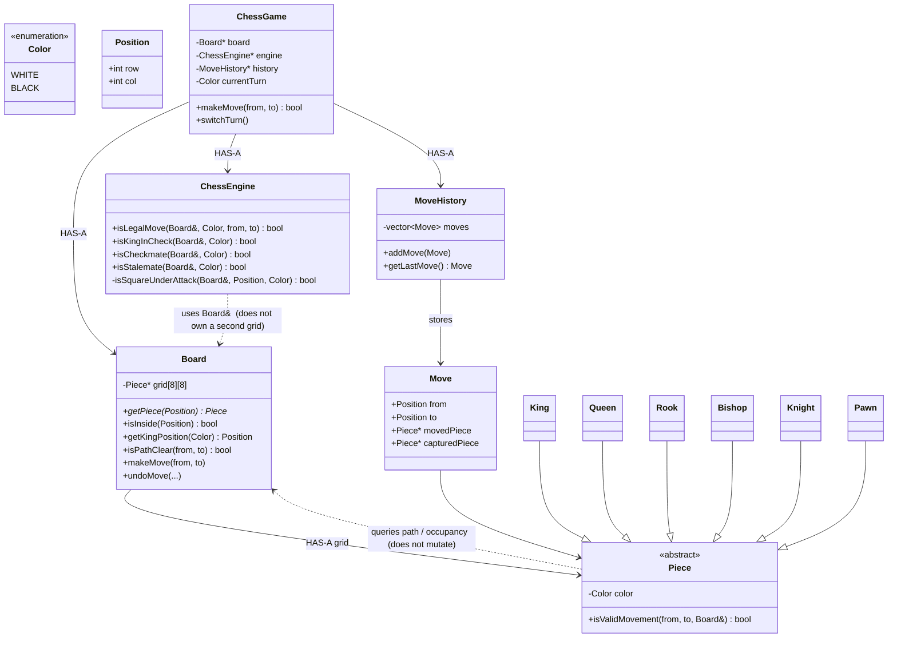

# Chess LLD — Interview-Ready Notes

Initial scope: 2 players, 8×8, six piece types, capture, legal moves, check/checkmate, move history, turns.

Ignore until asked: clocks, network, UI, persistence, AI.

---

## Naive design (don’t stop here)

```text
ChessGame
 ├── Board
 ├── Players
 ├── Pieces
 └── validate / check / path / everything
```

`makeMove`, `isCheck`, `isPathClear`, `getPiece` all on `ChessGame` → **God class**.

Ask: which responsibilities are actually **different**?

---

## v1 class diagram — responsibilities, not a dump of functions



| Class | One sentence |
|---|---|
| `ChessGame` | Orchestration: turn, call engine, tell board to move, record history |
| `Board` | Current position — **one** grid, source of truth |
| `Piece` / King… | Geometric movement of **that** piece |
| `ChessEngine` | Chess **rules**: legal move, check, mate (uses `Board&`) |
| `MoveHistory` | Past events, not the live grid |

**Data ownership ≠ rule ownership.** Board owns squares. Engine **queries** `getPiece` / `getKingPosition`. Don’t duplicate `grid[8][8]` on the engine.

---

## Piece vs engine (say this in the interview)

```text
Piece:   Can a Rook geometrically go A1 → A5?
Engine:  Is that legal? (does it leave my king in check?)
```

```text
Rook can move A1 → A5
        ↓
Does this expose my King?
        ↓
yes → illegal
```

---

## `makeMove` flow (orchestration only)

```text
1. Whose turn?
2. Piece at `from` exists and is mine
3. Piece.isValidMovement(from, to, board)
4. Board constraints (inside, path, capture rules)
5. Temporary makeMove
6. Engine.isKingInCheck(myColor)?  → undo + reject
7. Real makeMove
8. history.addMove
9. Opponent in check / mate?
10. switchTurn
```

Temporary move: you only need `isKingInCheck(me)` after the hypothetical position.

---

## What NOT to do

Don’t invent `BoardUtility` / `ChessService` / `ChessHelper` because a class has many methods.

Group by **reason to change**:

```text
Current position  → Board
Chess rules       → ChessEngine
History           → MoveHistory
```

---

## LLD mental model (from this problem)

**Old:** data lives here → dump every function here → Utility.

**New:** requirements → responsibilities → entities → assign work → then data → then patterns.

> The class that owns the data does not automatically own every behavior that uses that data.

Same idea: `BankAccount` owns balance; `FraudDetector` uses it.

Create a class only if you can describe it in **one sentence**. Don’t split just because of function count.

Patterns last: *what varies?* Then Strategy. Don’t start with “where do I put Strategy?”

---

## CMake notes (when you add code later)

This folder is **notes only** — no sources yet.

When you add `main.cpp` + headers, match Tic-Tac-Toe / Splitwise:

**`Questions/Chess/CMakeLists.txt`**

```cmake
cmake_minimum_required(VERSION 3.20)

project(Chess)

set(CMAKE_CXX_STANDARD 20)
set(CMAKE_CXX_STANDARD_REQUIRED ON)

add_executable(Chess
    main.cpp
)
```

List extra `.cpp` files under `add_executable` if you split implementation out of headers.

**Repo root `CMakeLists.txt`** — one line (comment others if you only want Chess):

```cmake
add_subdirectory("Questions/Chess")
```

Then in Cursor: **CMake: Delete Cache and Reconfigure** → status bar target **`Chess`** → play.

If CMake still points at Splitwise, pick the `Chess` target; don’t change `cmake.sourceDirectory` unless you want a single-folder project.

---

## Interview line

> `ChessGame` only runs the turn. `Board` is the position. Each `Piece` answers geometric movement. `ChessEngine` takes `Board&` and answers legal / check / mate — it does not own a second board. `MoveHistory` is events, not state. I won’t put checkmate on `Board` just because the king sits on the grid.
