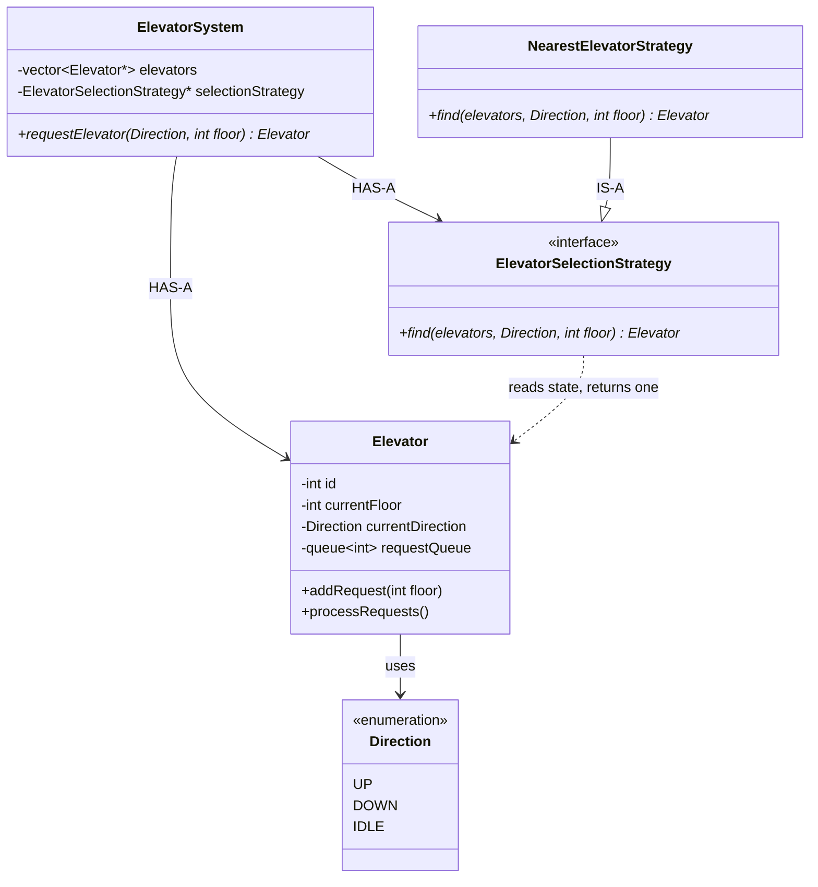
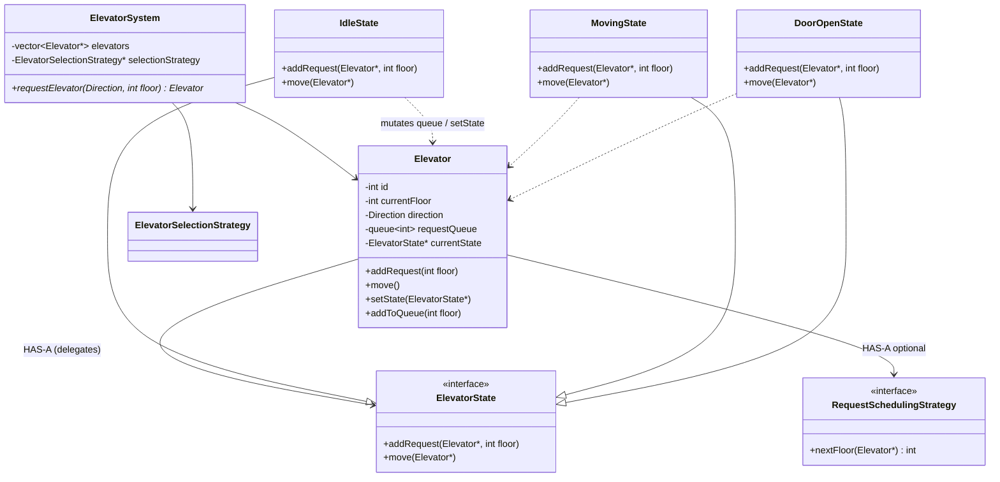

# Elevator System — LLD Notes

## Problem

A building with **multiple elevators**. Two request types:

| Type | Example | Who handles it |
|---|---|---|
| **External** | Floor 4 → UP | System picks **which** elevator |
| **Internal** | Inside E2 → Floor 10 | That elevator **already owns** the request |

Skip until asked: concurrency, timers, fire/emergency/maintenance hardware.

---

## Simple design (no State Pattern yet)

```text
External:  UP/DOWN  →  ElevatorSystem  →  ElevatorSelectionStrategy  →  E.addRequest(floor)
Internal:  button   →  that Elevator   →  addRequest(destination)
```

`ElevatorSystem` **assigns**. The elevator **moves** itself. The system does not micromanage floors one-by-one.

A `Floor` class is optional at first — `int floorNumber` is enough until buttons/displays appear.

Do **not** add `ElevatorManager` just because you have `vector<Elevator*>`. Add a manager only for register/remove/maintenance/lifecycle.

### Class diagram — v1



**Flow:** `requestElevator` → strategy looks at **current** floors/directions → `elevator->addRequest(floor)`. Assignment is one-shot; we don’t keep reassigning if another car later becomes closer.

Optional later: `Fastest`, `SameDirection` as more strategies.

---

## Two different problems

| Strategy | Question |
|---|---|
| `ElevatorSelectionStrategy` | **Which elevator** gets this **external** request? |
| `RequestSchedulingStrategy` | **Which pending floor** does **this** elevator serve next? |

FIFO `2 → 10 → 3 → 8` is a bad path. SCAN-style `2 → 3 → 8 → 10` is scheduling — **not** selection. Don’t mix them in one class.

`processRequests()` can stay abstract in an interview (no 1-second timer unless they ask).

---

## When State Pattern appears

Start with:

```text
enum { IDLE, MOVING, DOOR_OPEN }
```

Use State Pattern only when **the same methods** (`addRequest`, `move`, `openDoor`) grow `if (state == …)` everywhere.

**Elevator still owns data** (`floor`, `direction`, `queue`). States only decide **behavior + transitions**. States are not second elevators.

```text
IDLE  --request-->  MOVING  --arrive-->  DOOR_OPEN  --close-->  MOVING or IDLE
```

### Class diagram — v2 (State)



| State | Typical behavior |
|---|---|
| `IdleState` | New request → queue + go `MovingState` |
| `MovingState` | Extra request → just queue; on arrival → `DoorOpenState` |
| `DoorOpenState` | No move; after close → `Moving` if queue left, else `Idle` |

---

## Evolution (one line)

```text
v1: System + selection strategy + Elevator(queue)
v2: + scheduling strategy (which floor next)
v3: + ElevatorState when if/else explodes
```

**Interview line:** *External request is assignment (`ElevatorSelectionStrategy`). Internal is `thatElevator.addRequest`. Scheduling is a second strategy. State Pattern only when IDLE/MOVING/DOOR_OPEN change the same operations.*
