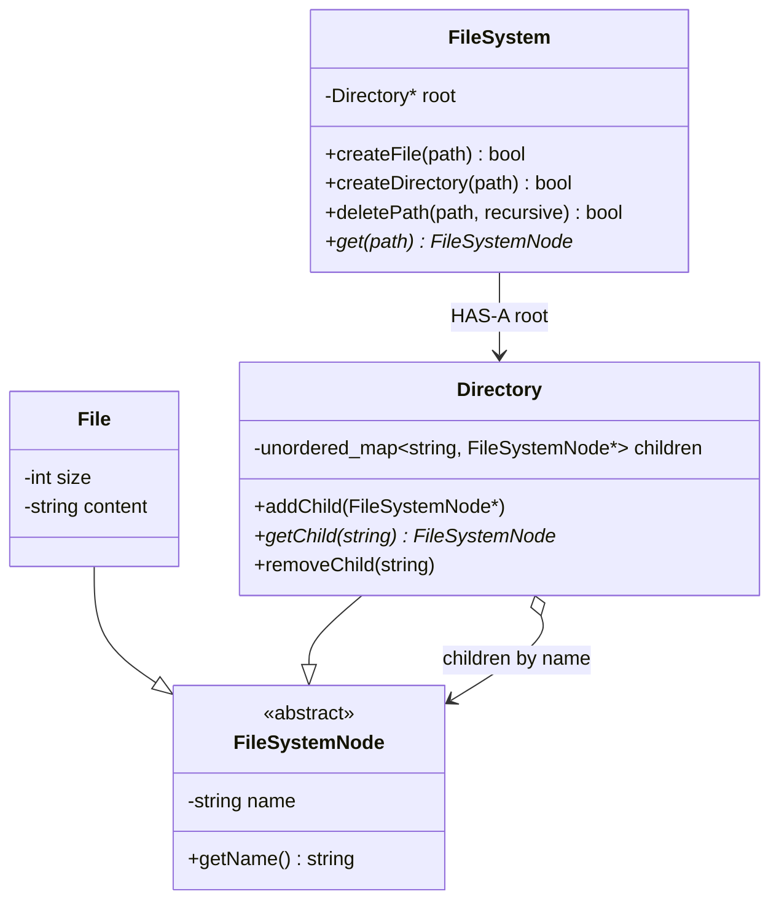

# File System — LLD Notes

In-memory FS. Out of scope: permissions, persistence, symlinks (until asked).

---

## Requirements

- `createFile(path)`
- `createDirectory(path)`
- `delete(path, recursive)`
- `get(path)`

**File:** name, size, content  
**Directory:** name, children (files **and** directories)

```text
/
└── home
    └── sahil
        └── projects
            ├── job_scheduler.cpp
            ├── leetcode.cpp
            └── LLD/
```

---

## Core abstraction

```text
                 FileSystemNode
                 /            \
               File         Directory
```

Extracted because both are **nodes** with a **name**. Directory **owns** children.



---

## Children representation

**Don’t:**

```text
vector<File*>
vector<Directory*>
```

Duplicate logic + **O(N)** lookup.

**Do:**

```text
unordered_map<string, FileSystemNode*> children
```

Key = **child name only**, not full path.

```text
/home/sahil/projects
```

`projects` lives in `sahil`’s map as `children["projects"]`.

Traversal: `home → sahil → projects` — **O(1)** average per hop → **O(D)** for the path (`D` = components).

---

## Invariant: unique name in a directory

Invalid:

```text
/home/sahil
    ├── projects   (Directory)
    └── projects   (File)
```

`createFile("/home/sahil/projects")` **fails** if `projects` already exists (file **or** dir). Same for `createDirectory`. The map enforces **one name → one node**.

---

## Parent must exist

`createFile("/home/sahil/projects/a.cpp")` does **not** mkdir missing parents.

If `/home/sahil/projects` is missing → **false**. Caller must `createDirectory` first. Explicit semantics.

---

## Path traversal (`FileSystem`)

`/home/sahil/projects/a.cpp`:

```text
root → home → sahil → projects → a.cpp
```

Every **intermediate** component must be a **Directory**. If `sahil` is a **File**, create under `/home/sahil/projects/...` **fails**.

`FileSystem` owns path-level validation (public API + traversal).

---

## Delete

`delete(path, recursive)`

| Target | `recursive` | Result |
|---|---|---|
| File | anything | delete file |
| Empty directory | `false` | delete dir |
| Non-empty directory | `false` | **fail** |
| Directory | `true` | delete **whole subtree** |

```text
projects/
├── a.cpp
├── b.cpp
└── LLD/
    └── design.cpp

delete("/projects", true)
→ projects, a.cpp, b.cpp, LLD, design.cpp
```

`FileSystem` finds the target and **coordinates** recursive delete (it already walks paths).

---

## `get()` — don’t over-expose

Option A: `FileSystemNode* get(path)` — caller checks File vs Directory.

Option B if you only need listing: `vector<string> list(path)`.

> Don’t expose more of the internal model than the requirement needs.

---

## Follow-ups (don’t add until asked)

### Directory size

Don’t put `size` on `Directory` unless defined. `/home` with 10+20 byte files: is size 0, 30, or metadata? **No derived/ambiguous state** without a requirement.

### File write

`writeFile(path, content)`: **size vs content** can drift (`content = "hello"`, `size = 100`). Prefer **size derived from content**, or one write path that updates both.

### Symbolic links (out of scope)

```text
FileSystemNode
├── File
├── Directory
└── SymbolicLink → targetPath
```

Lesson: can you add another **node type** without rewriting everything? `FileSystemNode` makes that possible.

---

## Complexity

`D` = path components, `N` = nodes in a directory/subtree.

| Op | Average |
|---|---|
| Lookup / create / delete file or empty dir | **O(D)** (+ O(1) insert) |
| Recursive delete | **O(D + N)** |

---

## Final picture

```text
                         FileSystem
                             |
                           root
                             |
                         Directory
                             |
                    unordered_map
                    name → Node
                             |
                    ┌────────┴────────┐
                    ↓                 ↓
                  File             Directory
                    │                 │
              name/size/content    children
```

**Interview line:** *Composite node + map by name. FileSystem walks the path; unique names; no auto-mkdir; recursive delete only when asked. Size on directories only if the problem defines it.*
