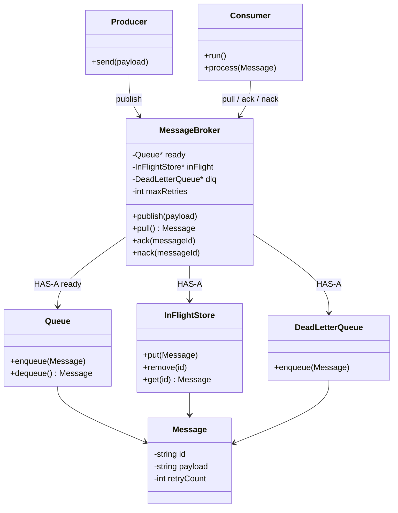
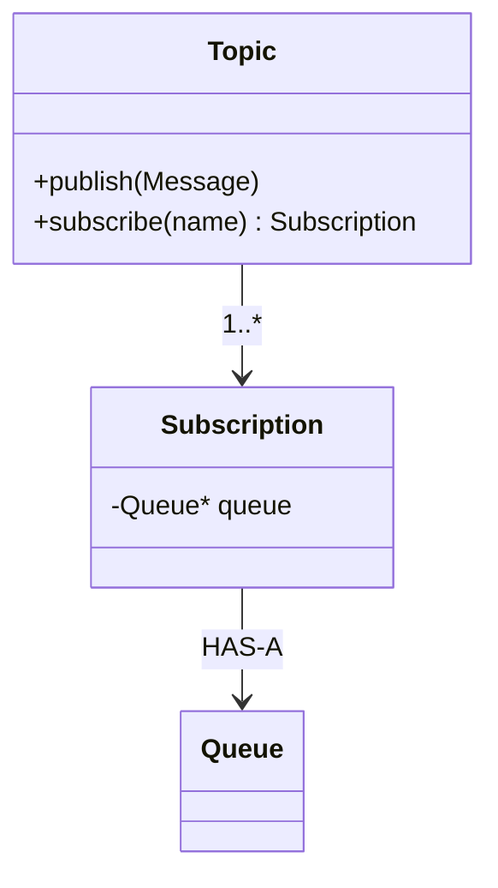

# In-Memory Message Queue — LLD

Concepts live in [Readme.md](./Readme.md). This file is the **design**.

**v1 scope:** one process, in-memory, **competing-consumer queue** (work distribution). Pull-based. ACK, retry, DLQ.

**Out of scope until asked:** disk/Kafka, network, pub/sub topics, consumer groups as a product, exactly-once, real timers.

---

## Five questions (this design)

| Question | v1 answer |
|---|---|
| Who produces? | `Producer` → `MessageBroker.publish` |
| Who consumes? Multiple? | `Consumer`s **compete** on one queue — one message, one worker |
| When is it done? | **ACK** after successful `process` |
| Failure? | Increment retries → back to queue, or **DLQ** after max |
| Guarantee? | **At-least-once** + consumers should be **idempotent** |

---

## Core flow (pull)

```text
Producer.publish(payload)
        ↓
MessageBroker → Queue (ready)
        ↓
Consumer.pull()  →  in-flight (unacked)
        ↓
process()
        ↓
    ┌── ACK  →  drop from in-flight
    └── fail / timeout / crash  →  retry or DLQ
```

Do **not** delete from the ready queue until ACK. **In-flight** = delivered, not yet successful.

---

## Responsibilities (not a God `Queue`)

| Class | One sentence |
|---|---|
| `Message` | Payload + `id` + `retryCount` |
| `Queue` | Ready buffer (FIFO). Enqueue / dequeue only. |
| `InFlightStore` | Messages waiting for ACK (id → message + attempt) |
| `DeadLetterQueue` | Poison messages after max retries |
| `MessageBroker` | Orchestrates publish, pull, ack, nack, retry, DLQ. **Does not** run business logic. |
| `Producer` | Calls `publish` |
| `Consumer` | Pulls, processes, **acks** or **nacks** |
| `RetryPolicy` (optional v1) | Max retries — or a constant on the broker |

`Queue` should not know about ACK. Broker moves **ready → in-flight → gone / retry / DLQ**.

---

## Class diagram — v1 (competing queue + ACK)



**Competing consumers:** several `Consumer`s call `pull()` on the **same** broker. Each `Message` goes to **one** of them.

```text
Producer → Broker → ready Queue
                      |
              pull / pull / pull
                      |
                   C1  C2  C3     competing
```

---

## ACK / nack (match the notes)

```text
pull  →  in-flight
process OK  →  ack(id)  →  remove in-flight
process FAIL →  nack(id) → retryCount++ → enqueue ready  OR  DLQ
crash before ack → message stays in-flight → timeout → treat as nack
```

v1 timeout: scan in-flight (or a visibility timeout) — say it in the interview; don’t need a real timer class unless asked.

**Famous failure:** DB write then crash before ACK → redelivery → **idempotent** `process`.

---

## Push vs pull in this LLD

**v1 = pull** so the consumer sets the pace (backpressure).

If they ask for **push:** `Consumer` registers with the broker; broker calls `onMessage` — then you need **prefetch / max in-flight per consumer** or you flood workers (notes §5).

Push that sends **the same** `M1` to every registered callback is **pub/sub**, not this queue.

---

## Backpressure (v1)

- Cap **ready** queue size → `publish` blocks or fails  
- Cap **in-flight** per consumer  
- Don’t pull faster than `process`

---

## Follow-ups (don’t build until asked)

| They say | You add |
|---|---|
| Pub/Sub | `Topic` + per-subscription `Queue` (fan-out); workers compete **inside** a subscription |
| Consumer groups | Same as subscription + competing workers (Kafka naming) |
| Key ordering | Same key → same partition/queue; different keys parallel |
| Durable | Queue store interface; in-memory vs disk |
| Visibility timeout | In-flight + deadline thread |
| Exactly-once | Say: hard; at-least-once + idempotency |

### Pub/Sub sketch (later)



Email slow ≠ Analytics blocked.

---

## What not to do

- One class named `MessageQueue` that publish + retry + DLQ + pub/sub + Kafka offsets  
- `setProcessed(true)` on the message from a random helper  
- Strategy for provider order on day one (same lesson as notifications)

---

## CMake (when you add code)

```cmake
# Questions/Message Queues/CMakeLists.txt
add_executable(MessageQueue main.cpp)
```

Root: `add_subdirectory("Questions/Message Queues")` → target `MessageQueue`.

---

## Interview line

> In-memory **work queue**: broker owns ready, in-flight, DLQ. Pull, then ACK. Fail → retry then DLQ. Competing consumers share work. At-least-once; handlers must be idempotent. Pub/sub is a **later** fan-out of copies per subscription, each with its own queue.
