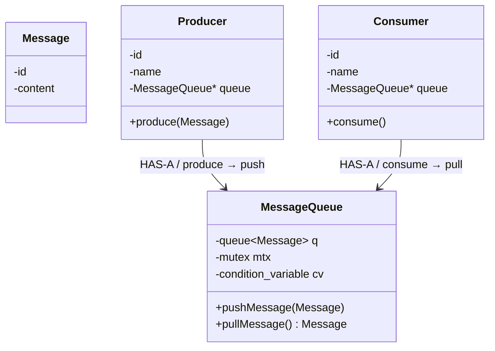

# Message Queue — Level 1

**Scope:** in-memory **FIFO** queue + **concurrency** (mutex + condition variable).

**Not in Level 1:** ACK, retry, DLQ, topics, pub/sub, consumer groups, persistence.

---

## What this level handles

- Messages sit in a FIFO `queue<Message>`.
- Several **producers** can `push` at the same time.
- Several **consumers** can `pull` at the same time (**competing consumers**).
- If the queue is **empty**, `pull` **waits** (condition variable) instead of spinning or failing.
- `push` **notifies** one waiter.

```text
                    MessageQueue
                ┌──────────────────┐
                │ queue<Message>   │
                │ mutex            │
                │ condition_variable│
                │                  │
                │ pushMessage()    │
                │ pullMessage()    │
                └──────────────────┘
                   ↑            ↑
                   │            │
              Producer      Consumer
```

---

## Class diagram



---

## 1. Message

```text
Message
├── id
└── content
```

The payload being transferred.

---

## 2. Producer

```text
Producer
├── id
├── name
└── MessageQueue*
     └── produce(Message)
```

Knows **which queue** it produces into.

```text
Producer
   │
   │ produce(message)
   ↓
MessageQueue.pushMessage()
```

---

## 3. Consumer

```text
Consumer
├── id
├── name
└── MessageQueue*
     └── consume()
```

Knows **which queue** it consumes from.

```text
Consumer
   │
   │ consume()
   ↓
MessageQueue.pullMessage()
   │
   ├── message available → return message
   └── queue empty → wait
```

---

## 4. MessageQueue

```text
MessageQueue
├── queue<Message>
├── mutex
├── condition_variable
├── pushMessage(Message)
└── pullMessage() → Message
```

### `pushMessage()`

1. Lock  
2. Add message  
3. Unlock  
4. Notify a waiting consumer  

```text
pushMessage()
      ↓
lock
      ↓
push message
      ↓
unlock
      ↓
notify_one()
```

(Unlock then `notify_one`, or notify while still holding the lock — both work; don’t hold the lock during user `process()`.)

### `pullMessage()`

1. Lock  
2. If empty → **wait** on the condition variable  
3. When a message exists → pop front  
4. Unlock  
5. Return message  

```text
pullMessage()
      ↓
lock
      ↓
while queue empty
      ↓
    wait()
      ↓
pop front
      ↓
unlock
      ↓
return message
```

Use `while (empty)` not `if` — spurious wakeup / another consumer may have taken the last message.

---

## Design decision: queue does not know consumers

**No** `vector<Consumer*>` on `MessageQueue`.

**Pull + competing consumers:**

```text
        MessageQueue
       [ M1 M2 M3 M4 ]
        ↑    ↑    ↑
        │    │    │
       C1   C2   C3
```

Any consumer can pull the next message. One message → **one** consumer.

> **Consumer knows Queue. Queue does not know Consumer.**

That is the complete Level 1 design.
