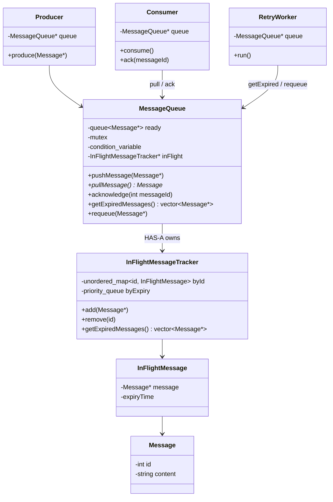

# Message Queue — Level 2

**Scope:** FIFO + concurrency (Level 1), plus **ACK**, **in-flight**, **timeout requeue**.

**Not in Level 2:** DLQ (later), topics, pub/sub, consumer groups.

---

## Problem with Level 1

```text
Producer → MessageQueue → Consumer pulls M1
                              ↓
                         M1 removed from queue
```

If the consumer **crashes** after pull, **M1 is lost**.

> Pulling ≠ successfully processing. **ACK** closes that gap.

---

## Lifecycle

```text
             pull
READY ─────────────────► IN_FLIGHT
                           │
                    ┌──────┴──────┐
                    │             │
                   ACK          TIMEOUT
                    │             │
                    ▼             ▼
                  DONE         REQUEUE
                                  │
                                  ▼
                                READY
```

| State | Meaning |
|---|---|
| **READY** | Waiting to be consumed |
| **IN_FLIGHT** | Given to a consumer, not ACKed yet |
| **ACKED / DONE** | Processed successfully |

DLQ is **not** the first answer for a missed ACK. Timeout → **requeue**. DLQ only after **many** failures (Level 3+).

---

## Don’t put delivery state on `Message`

```text
Message { id, content, state }   ❌
```

The consumer holds `Message*` and could flip `state`. **Message** = payload. **Queue** owns delivery lifecycle. Metadata lives in **InFlightMessageTracker**.

Don’t use `unordered_map<id, bool>` — `false` is meaningless (not delivered? processing? timed out?).

```text
InFlightMessage
├── Message*
└── expiryTime
```

Index by `Message::id`:

```text
unordered_map<int, InFlightMessage>
```

---

## Pull and ACK flow

```text
Ready [M1 M2 M3]  --pull-->  Ready [M2 M3]
                             InFlight [M1]

process M1
    ↓
ack(M1.id)
    ↓
remove from InFlight
```

`pullMessage()` **inside the queue** (queue owns lifecycle):

```text
lock
 ↓
pop from ready
 ↓
add to InFlightTracker (+ expiry)
 ↓
unlock
 ↓
return message
```

`acknowledge(messageId)` → tracker remove.

---

## Timeout → RetryWorker (not DLQ yet)

Missed ACK: message stays **IN_FLIGHT** too long.

```text
RetryWorker (periodic)
    ↓
MessageQueue.getExpiredMessages()
    ↓
[M1, M2]
    ↓
MessageQueue.requeue(M1 / M2)
    ↓
READY again → another consumer
```

---

## Circular dependency — don’t do this

```text
MessageQueue → InFlightTracker
       ↑              │
       └──────────────┘   tracker calling queue.push()
```

**Don’t** give the tracker a `MessageQueue*`.

**Coordinator:** `RetryWorker` has `MessageQueue*`. Tracker stays **inside** the queue. Worker never sees the tracker.

```text
             ┌───────────────────┐
             │   MessageQueue    │
             │  readyQueue       │
             │  inFlightTracker  │
             └─────────▲─────────┘
                       │
                 RetryWorker
```

### Preferred API (hide the tracker)

```text
MessageQueue
  pullMessage()
  acknowledge(messageId)
  getExpiredMessages()
  requeue(Message*)
```

```text
RetryWorker
  MessageQueue* queue
  run():
    for m in queue->getExpiredMessages()
        queue->requeue(m)
```

**Lesson:** two parts that must interact don’t both hold pointers to each other. Find **who orchestrates**. Here: **RetryWorker → MessageQueue**. Queue **owns** the tracker.

Consumer does **not** call `inFlightTracker.add` — `pullMessage()` does.

---

## Class diagram — Level 2



**No** `InFlightMessageTracker → MessageQueue`.

---

## Two indexes on the tracker

| Structure | Why |
|---|---|
| `unordered_map<id, InFlightMessage>` | Fast **`ack(id)`** |
| Priority queue by **expiry** | Fast “what timed out?” without scanning everything |

```text
M1 expires 10:01
M3 expires 10:02
M2 expires 10:05
        earliest → M1
```

Same LLD idea as a **secondary index** for a different access pattern.

---

## Mental model

> **Delivered ≠ processed.** ACK means processed.

`RetryWorker` only asks the **queue** to recover expired messages. The queue owns READY / IN_FLIGHT / requeue.
