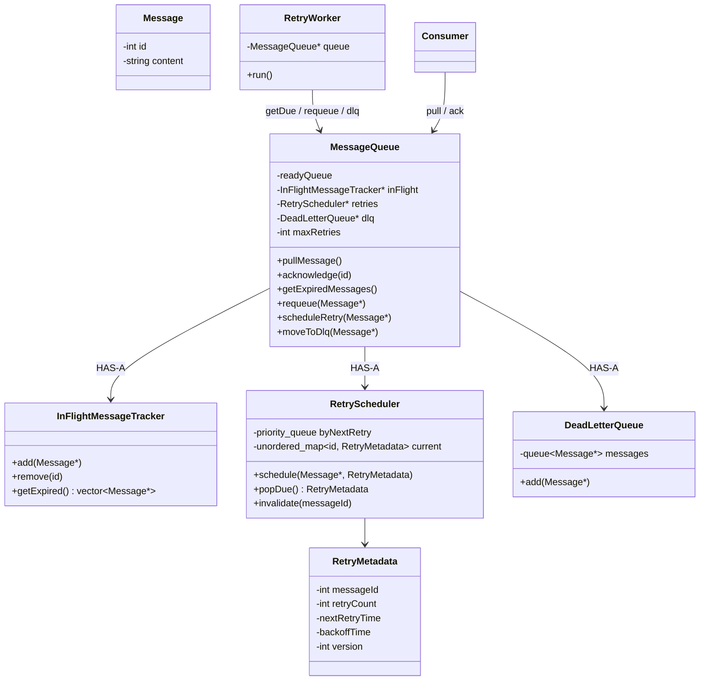

# Message Queue — Level 3

**Retry + exponential backoff + DLQ.** Builds on Level 2 (ACK / in-flight / timeout).

A consumer can **fail again and again**. Don’t retry forever, and don’t immediately re-pull the same poison message.

---

## 1. Retry metadata is not on `Message`

`Message` = payload. Delivery/retry lives elsewhere.

```text
Message
 ├── id
 └── content

RetryMetadata
 ├── messageId
 ├── retryCount
 ├── nextRetryTime
 └── backoffTime
```

Same instinct as Level 2: don’t put `state` / `retryCount` on the object the consumer holds.

---

## 2. Retry flow

```text
READY
  ↓
IN_FLIGHT
  ↓
fail / no ACK
  ↓
RETRY  (wait backoff)
  ↓
IN_FLIGHT
  ↓
...
  ↓
max retries exceeded
  ↓
DLQ
```

**Exponential backoff** (example):

```text
Attempt 1 → wait 1s
Attempt 2 → wait 2s
Attempt 3 → wait 4s
Attempt 4 → wait 8s
```

Avoids hammering a dying Payment API.

---

## 3. Don’t scan every message

```text
M1 → retry at 10:01
M2 → retry at 10:05
M3 → retry at 10:02
```

**Priority queue** ordered by `nextRetryTime`:

```text
RetryWorker
     ↓
PriorityQueue<RetryMetadata>
     ↓
M1 → M3 → M2     (earliest first)
```

Worker asks: *what retry is due now?*

Still keep a **hash map** `messageId → current RetryMetadata` for ACK / lookup.

---

## 4. ACK vs stale heap entries (lazy deletion)

```text
10:00  M1 fails → schedule retry 10:05
10:03  consumer succeeds → ACK
10:05  heap still has M1
```

Don’t delete arbitrary nodes from a heap. **Lazy deletion:**

When the worker pops M1 at 10:05:

```text
Is M1 still eligible for retry?
        |
       NO (already ACKed)
        ↓
    ignore it
```

> Don’t always remove stale entries from the PQ. **Validate when they reach the top.**

Optional: `retryCount` / **version** on `RetryMetadata` so an old heap node doesn’t match a **newer** schedule of the same id.

```text
PriorityQueue → RetryMetadata (by nextRetryTime)
HashMap      → messageId → current retry state
```

---

## 5. DLQ

After `retryCount >= MAX_RETRIES`:

```text
RetryWorker
     ↓
DeadLetterQueue.add(message)
```

```text
DeadLetterQueue
 └── queue<Message*>
     add(Message*)
```

Inspect / reprocess later. Not infinite retry on the ready queue.

---

## Mental model

```text
                  MessageQueue
                       |
              ┌────────┴────────┐
              ↓                 ↓
          READY QUEUE       IN-FLIGHT
                                |
                           ACK received?
                          /             \
                        YES              NO
                         |                |
                      remove          timeout
                                          ↓
                                    RetryMetadata
                                          ↓
                                  Priority Queue
                                          ↓
                                     RetryWorker
                                      /       \
                              retry remains   max retries
                                   |              |
                                READY             ↓
                                                DLQ
```

---

## Class diagram — Level 3



`RetryWorker` still only talks to **`MessageQueue*`**. It does not own the heap or DLQ.

---

## What this level teaches

- Retry count belongs in **RetryMetadata**, not `Message`
- **Backoff** so you don’t spin on a failing consumer
- **PQ** by `nextRetryTime` + **map** by `messageId`
- ACK can leave **stale** PQ nodes → **lazy deletion** (+ optional version)
- Max retries → **DLQ**
- Queue owns lifecycle; worker only **asks** the queue

---

## Interview line

> After timeout I don’t DLQ immediately. I schedule retry with backoff in metadata off the Message. Heap by next retry; map for ACK. Stale heap entries ignored on pop. After max attempts, Dead Letter Queue.
