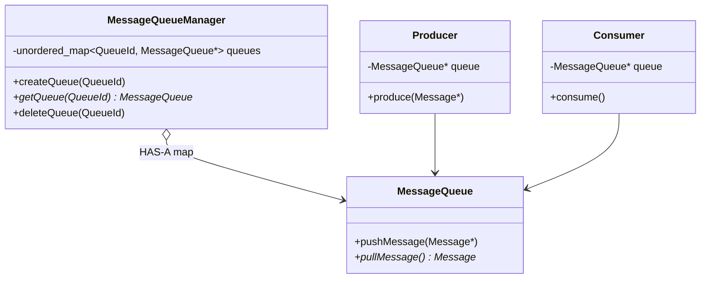
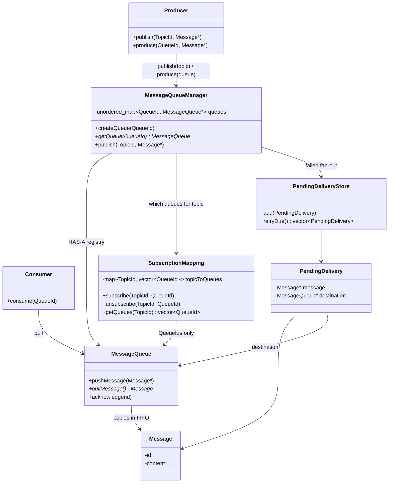

# Message Queue — Level 4

**Multiple independent queues** (roadmap 5) + **topics / pub-sub** (roadmap 6).

Each `MessageQueue` is still Level 1–3 internally (FIFO, locks, ACK, retry, DLQ as you already designed). This level is **how many queues exist** and **how one publish fans out**.

---

## Part A — Multiple queues

### Requirement

```text
orders        → MessageQueue
payments      → MessageQueue
notifications → MessageQueue
```

Each queue:

- Own messages  
- Own FIFO  
- Own producers/consumers  
- Can be **created dynamically**

### No inheritance

Same behavior → **instances**, not subclasses.

```text
MessageQueue queue1;
MessageQueue queue2;
MessageQueue queue3;
```

An abstract `MessageQueue` only if types of queues **behave differently**.

### Queue manager

```text
MessageQueueManager
        |
        ├── Queue1
        ├── Queue2
        └── Queue3
```

```text
unordered_map<QueueId, MessageQueue*>
```

**Manager:** create / delete / **find** queues.  
**Queue:** still `push` / `pull` / FIFO / mutex / `cv`.

### Producer / consumer

```text
Producer A → Queue1     Consumer A → Queue1
Producer B → Queue2     Consumer B → Queue2
```

Or pick a queue per call. **Queue still does not know its consumers.**

```text
Producer → Queue
Consumer → Queue
Manager  → Queues
```



---

## Part B — Topics / pub-sub

### Requirement

One event → **many independent** consumers.

```text
OrderCreated
     ↓
   Topic
  /  |  \
 ↓   ↓   ↓
C1  C2  C3
```

```text
Queue:  M1 → ONE consumer
Pub/Sub: M1 → EVERY subscriber
```

### Topic = several subscriber queues

If C1 is slow, C2 must still get **its copy**.

```text
Topic A
   ├── Queue A → Consumer A
   ├── Queue B → Consumer B
   └── Queue C → Consumer C
```

```text
Topic → [Queue1, Queue2, Queue3]
```

### Subscription mapping (not the queue manager)

**Don’t** dump “who subscribed to what” into `MessageQueueManager` if that’s a different job.

| Component | Question |
|---|---|
| **SubscriptionMapping** | Which queues listen to this **topic**? `subscribe()` lives here. |
| **MessageQueueManager** | Create/lookup **queue instances**. On publish: “send this to **these** queues.” |
| **MessageQueue** | Store this **copy** (`push`). |

```text
SubscriptionMapping
    ├── Topic A → Queue1, Queue2
    └── Topic B → Queue2, Queue3
```

### Publish flow

```text
Producer
   ↓
publish(topic, message)
   ↓
MessageQueueManager (orchestrate)
   ↓
SubscriptionMapping → [Q1, Q2, Q3]
   ↓
Q1.push  Q2.push  Q3.push
```

### Failure during publish — not all-or-nothing

```text
Topic A
  ├── Queue1 ✓
  ├── Queue2 ✗
  └── Queue3 ✓
```

Do **not** roll back Q1 and Q3 because Q2 failed. Each destination is independent.

Pending unit is **(message, destination queue)**, not the message globally:

```text
PendingDelivery
 ├── Message
 └── Destination Queue

M1
 ├── Queue1 ✓
 ├── Queue2 ✗ → PendingDelivery(M1, Queue2)
 └── Queue3 ✓
```

> Delivery state is **per destination**, not one global flag on `Message`.

```text
Failed delivery
       ↓
PendingDeliveryStore
       └── (Message, DestinationQueue)
```

---

## Final class diagram (Level 4)

Recall this picture.



```text
                    Producer
                       |
                 publish(topic, M)
                       |
                       ↓
              MessageQueueManager
                       |
                       ↓
             SubscriptionMapping
                       |
              ┌────────┼────────┐
              ↓        ↓        ↓
           Queue1    Queue2    Queue3
              ↓        ↓        ↓
          Consumer1 Consumer2 Consumer3

Failed hop → PendingDeliveryStore (Message + that Queue)
```

---

## Interview line

> Many queues = many `MessageQueue` instances in a manager map — no inheritance. Pub-sub = topic maps to **several queues**; each subscriber has its own FIFO so they don’t block each other. Subscription mapping answers “who is subscribed?”; the manager fans out `push`. A failed `push` to one queue is a **PendingDelivery** for that pair, not a global rollback.
