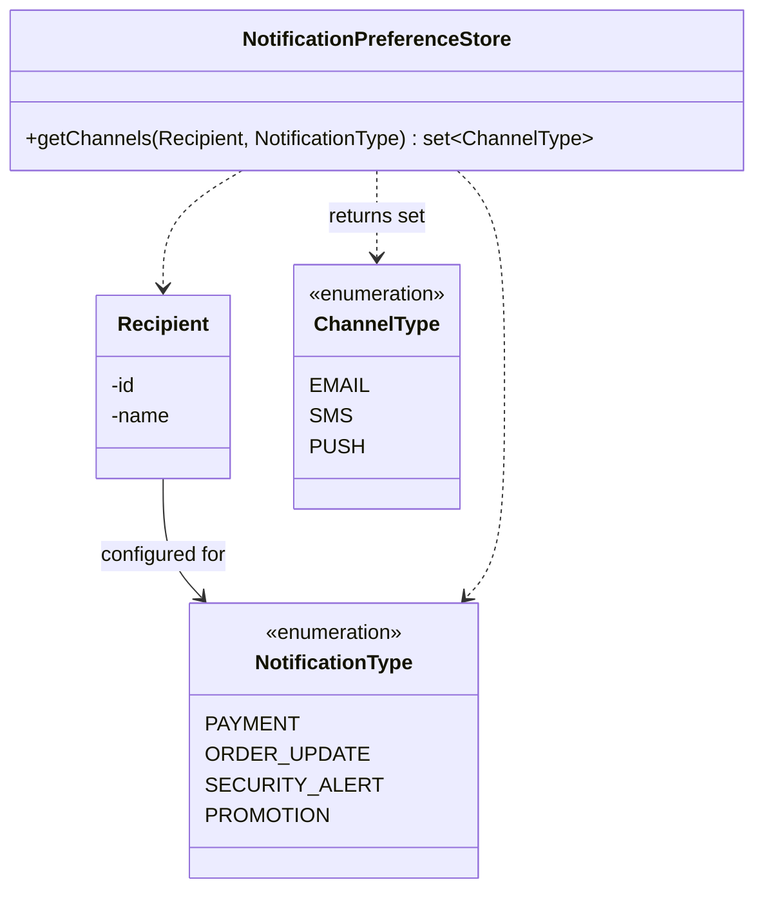
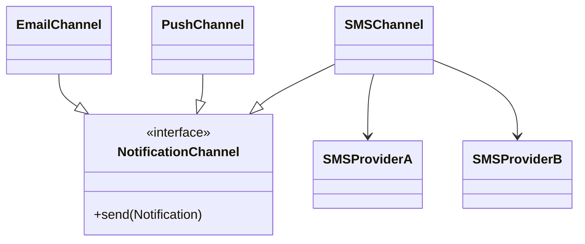
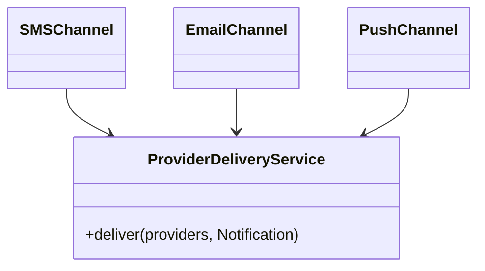
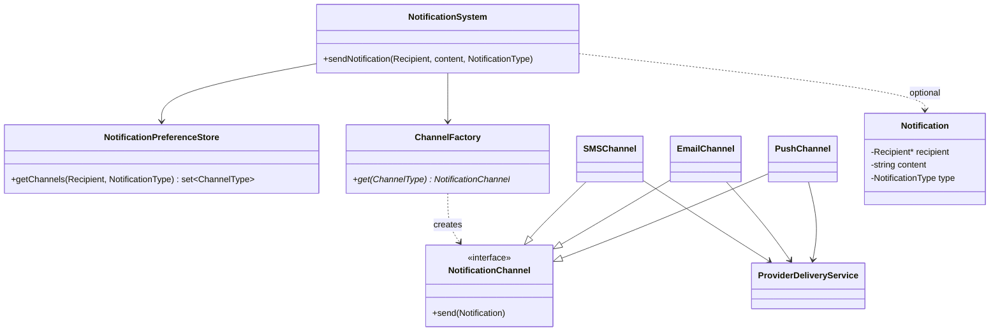

# Notification System — LLD Notes

Support sending notifications. Ignore DB, Kafka, networking, and real third-party APIs at first.

---

## Requirements

- Send to a **recipient**
- Types: Payment, Order Update, Security Alert, Promotion, …
- Channels: **Email, SMS, Push**
- Recipient configures **which channels per type**
- A channel can have **multiple providers**
- Provider fail → **retry / fallback**
- New channel (WhatsApp) → **minimal change**

---

## Core relationship

```text
Recipient + NotificationType
                ↓
       Notification Preferences
                ↓
        [ChannelType, ...]
```

```text
Sahil
  ├── PAYMENT       → EMAIL, SMS
  ├── PROMOTION     → EMAIL
  └── SECURITY      → EMAIL, SMS, PUSH
```

**Data, not classes.** Don’t create `SahilPaymentEmailSms` types. Finite `NotificationType` × `ChannelType`; each recipient is a **map**.



---

## Entities

| Piece | Role |
|---|---|
| `Recipient` | `id`, `name` (later: email, phone, deviceToken) |
| `NotificationType` | Enum of kinds of alerts |
| `ChannelType` | Enum of how we send |
| `Notification` (optional v1) | recipient + content + type |

Content can start as a string on `sendNotification`; a `Notification` object helps as the system grows.

---

## Orchestration vs God class

`NotificationSystem` / `NotificationService` **coordinates**. It is not a God class unless it **implements** SMS/email/preferences itself.

```text
sendNotification(recipient, content, type)
        ↓
PreferenceStore → [EMAIL, SMS]
        ↓
ChannelFactory.get each
        ↓
channel.send(notification)
```

---

## Channel vs provider

```text
Channel  = HOW we notify   (SMS / Email / Push)
Provider = WHO delivers    (Twilio vs another SMS vendor)
```



---

## ProviderDeliveryService (shared retry/fallback)

Without it, **every** channel copies retry/fallback.

```text
SMSChannel / EmailChannel / PushChannel
        ↓
ProviderDeliveryService
        ↓
try A → fail → retry A? → fail → B → success
```



**Retry** = same provider again. **Fallback** = next provider. For v1, this service owns both. No `RetryPolicy` yet.

---

## ChannelFactory

Maps **one** `ChannelType` → **one** channel. Preference store already returns the list; factory does not return a vector.

```text
[SMS, EMAIL]
get(SMS)   → SMSChannel
get(EMAIL) → EmailChannel
```

---

## Final conceptual architecture



```text
NotificationSystem
     ├── PreferenceStore  →  (recipient, type) → [channels]
     └── ChannelFactory   →  ChannelType → Channel
                │
         SMS / Email / Push Channel
                │
         ProviderDeliveryService
                │
         Provider A, Provider B, ...
```

---

## Main flow

```text
sendNotification(Sahil, "Payment successful", PAYMENT)

1. PreferenceStore(Sahil, PAYMENT) → [EMAIL, SMS]
2. Factory: EMAIL → EmailChannel, SMS → SMSChannel
3. Each channel.send
4. Channel → ProviderDeliveryService
     EmailProviderA fail → EmailProviderB success
```

---

## When to add more classes

| Idea | When |
|---|---|
| `ProviderSelectionStrategy` | Cheapest / fastest / health / round-robin — **not** for a simple A-then-B list |
| `NotificationPreferenceService` | Policies: mandatory security SMS, verified phone, channel outage — **not** to wrap a single `getChannels` |
| WhatsApp | `ChannelType::WHATSAPP` + `WhatsAppChannel` + providers; **don’t** edit Email/SMS/Push |

Strategy **emerges from variation**. Service **emerges from business logic**, not from a “service layer.”

---

## Principles

1. **Config vs send vs deliver:** preferences → channel → provider  
2. **Don’t abstract early** (retry policy, selection strategy, preference service)  
3. **Duplicated retry** → `ProviderDeliveryService`  
4. **Orchestration ≠ implementation** (`NotificationSystem` is OK)  
5. **Name after responsibility**, not `ChannelService` / `Helper`

---

## Interview follow-ups

| Question | Answer |
|---|---|
| Who picks channels for (recipient, type)? | Preference **store**. Preference **service** only if extra rules. |
| Who handles provider failure? | Channel delegates to `ProviderDeliveryService`. |
| Why not fallback inside every channel? | Duplication. |
| Why not Strategy on day one? | Selection isn’t varying yet. |
| Why isn’t the system a God class? | It coordinates; it doesn’t send SMS. |
| WhatsApp? | New type + channel + providers. |

---

## Takeaway

Don’t start with “what class?” Start with **unowned, duplicated, or varying** responsibility — that’s how `ProviderDeliveryService` appears.

**Interview line:** *Preferences are data (type → channels). System asks the store, factory gives channels, each channel uses a shared delivery service for retry/fallback. New channel = new enum + class, not a rewrite.*
