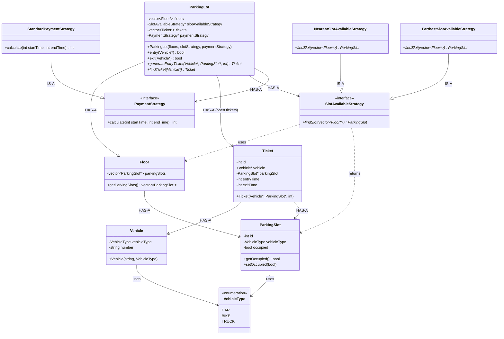
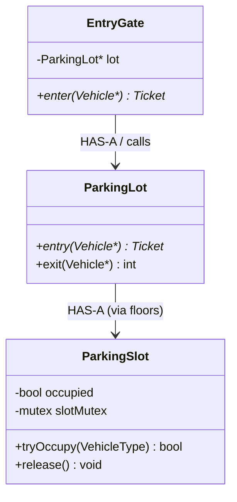

# Parking Lot LLD

## Functional requirements

- Different vehicle types (car, bike, truck)
- Entry and exit
- Slots can be typed per vehicle
- On entry: take vehicle number, issue a ticket (receipt) with time
- On exit: find that vehicle’s entry, calculate fare, take payment, free the slot

---

## Current code — Class diagram

This is **what the code has now**, not the full interview evolution.



### How to read it

| Relationship | Meaning in the code |
|---|---|
| `ParkingLot` HAS-A floors | Lot owns the building layout |
| `ParkingLot` HAS-A `SlotAvailableStrategy` | How to pick a free slot (nearest / farthest) |
| `ParkingLot` HAS-A `PaymentStrategy` | How to compute fare |
| `ParkingLot` HAS-A tickets | Open tickets until exit |
| `Floor` HAS-A slots | Each floor is a list of `ParkingSlot` |
| `Ticket` HAS-A `Vehicle` + `ParkingSlot` | Receipt links car to the booked spot |
| Strategies IS-A interfaces | Injected into `ParkingLot` |

### Runtime flow today

```text
entry(vehicle)
    ↓
SlotAvailableStrategy.findSlot(floors)
    ↓
slot.setOccupied(true)
    ↓
new Ticket(vehicle, slot, entryTime)
    ↓
tickets.push_back

exit(vehicle)
    ↓
PaymentStrategy.calculate(hardcoded times)
    ↓
findTicket(vehicle)   // pointer compare
    ↓
ticket update / free slot   // not implemented
```

---

## What can be improved (interview)

The **skeleton is right**: `ParkingLot` is the orchestrator, `Floor` / `ParkingSlot` / `Vehicle` / `Ticket` are models, slot-picking and pricing are Strategy. Do **not** add Factory/Observer until they ask.

These are the gaps they will poke.

### 1. Slot strategy ignores vehicle type

`findSlot` only checks `!occupied`. A bike can get a truck slot.

Pass `Vehicle` (or `VehicleType`) into `findSlot(floors, vehicleType)`.

### 2. `Floor` never gets slots

`Floor` has a vector and a getter, **no constructor / `addSlot`**. `getParkingSlots()` is always empty, so nearest-slot will always throw.

### 3. `entry` does not return a ticket

Your FR says “give a receipt.” Today `entry` returns `bool`. Return `Ticket*` (or ticket id) so the driver has something at exit.

### 4. `exit` is incomplete and in the wrong order

Today:

- fare uses hardcoded `calculate(1, 2)`
- ticket is found **after** payment
- slot is **never** freed (`setOccupied(false)`)
- exit time is never set

Should be:

```text
find ticket by vehicle number
    ↓
endTime = now
    ↓
fare = paymentStrategy->calculate(ticket.entry, endTime)
    ↓
free slot
    ↓
close / remove ticket
```

### 5. Find ticket by **number**, not pointer

`Vehicle` has no getters. `findTicket` compares `node->vehicle == vehicle` (same pointer). Two `Vehicle` objects with the same plate will not match.

Add `getNumber()` and look up by plate. `Ticket.vehicle` should not be public.

### 6. `ParkingLot` is doing a bit of everything — still OK for v1

Orchestrating entry/exit is correct. If they add gates, display boards, persistence, then split later (same story as Tic-Tac-Toe `Game`).

Do **not** extract a service on day one.

### 7. Interview hygiene

- Strategy interfaces need `virtual ~...() = default`
- Catch `const runtime_error&`, not by value
- `NearestSlotAvailableStrategy` uses absolute Windows `#include` paths — use `"../Modals/Floor.h"`
- Folder is `Modals` (typo for Models) — fine if consistent
- `main.cpp` is empty — no demo of entry/exit
- Raw `new` tickets never `delete`d

### 8. Follow-ups they may ask (don’t build until asked)

| They say | You add |
|---|---|
| Different rates for car vs bike | Payment strategy takes `VehicleType` (or hours × rate table) |
| Multiple entries / exits | See **Follow-up 1** below |
| Nearest to elevator | Richer slot strategy (slot has distance) |
| Display free slots | Query on floors; or Observer if many UIs |
| Save lot state | `ParkingLotState` DTO + repository — not a State class per model |

### Interview line

> `ParkingLot` owns floors, tickets, and injected strategies. Entry finds a type-matching slot, occupies it, issues a ticket. Exit finds ticket by plate, prices from real times, frees the slot. Slot allocation and pricing vary independently via Strategy.

---

## Follow-up 1: Multiple entry gates (and two cars at once)

**Do not add this until the interviewer asks.** Extremely likely follow-up.

### Multiple gates

You already think of several gates:

```text
EntryGate   EntryGate   EntryGate
        \       |       /
         ParkingLot (shared floors + slots)
```

Gates do **not** each own a copy of the slots. They all call the same `ParkingLot` (or a shared allocator).

```text
car at Gate A          car at Gate B
        \                    /
         ParkingLot.entry()
```

### The real question

> If two cars enter simultaneously, how do you prevent both from getting the same spot?

Today:

```text
check availability
      ↓
occupy
```

That is **not atomic**.

```text
Thread A                Thread B
find spot #10           find spot #10
      ↓                       ↓
occupy #10               occupy #10
```

Both thought #10 was free.

### What to say

> Allocation and occupation of a spot must be synchronized so that **checking and reserving happen atomically**.

A single mutex on the whole `ParkingLot` works and is a valid first answer. Better: **granular locking on the slot**, so two cars on **different** spots do not wait on each other.

### Granular lock (best interview answer)

Lock **that** `ParkingSlot` on occupy and on release. Keep the critical section small.

**Important:** locking only *after* `findSlot` already returned #10 is **not** enough. Thread B may still have chosen #10 before A occupied it.

Check + reserve must be **inside** the slot lock:

```text
tryOccupy(slot):
    lock(slot)
    if slot is free AND type matches:
        occupied = true
        success
    unlock(slot)
```

Release:

```text
release(slot):
    lock(slot)
    occupied = false
    unlock(slot)
```

`findSlot` / `entry` then **tries** spots in nearest order until `tryOccupy` succeeds. If #10 is taken between scan and lock, the lock sees occupied and you try #11.

```text
Thread A                         Thread B
tryOccupy(#10)                   tryOccupy(#10)
lock #10                         wait
occupy, unlock                   lock #10
                                 already occupied → try #11
```

| Approach | When to mention |
|---|---|
| One mutex on `ParkingLot.entry()` | Simple, correct, serializes all entries |
| Mutex per `ParkingSlot` + `tryOccupy` | Better: critical section is one slot; other gates can park elsewhere in parallel |

Do **not** lock the entire lot for the whole ticket + payment flow — only for the occupy/release of that spot.

### Class diagram (after this follow-up)



### Interview line

> Multiple gates share one `ParkingLot`. I won’t add threads until asked. When asked: check and occupy must be atomic. I lock per slot in `tryOccupy` / `release` so the critical section is small. If two threads pick the same spot, the second lock sees it occupied and tries the next one. I do not hold a lot-wide lock for payment.

---

## Final rules for this problem

1. Start with models: `Vehicle`, `ParkingSlot`, `Floor`, `Ticket`, `ParkingLot`.
2. Strategy only where behavior varies: **which slot** and **how much to pay**.
3. Ticket is the link between vehicle, slot, and time — not the lot scanning every car.
4. Free the slot on exit. Occupied-only search is not enough; match **vehicle type**.
