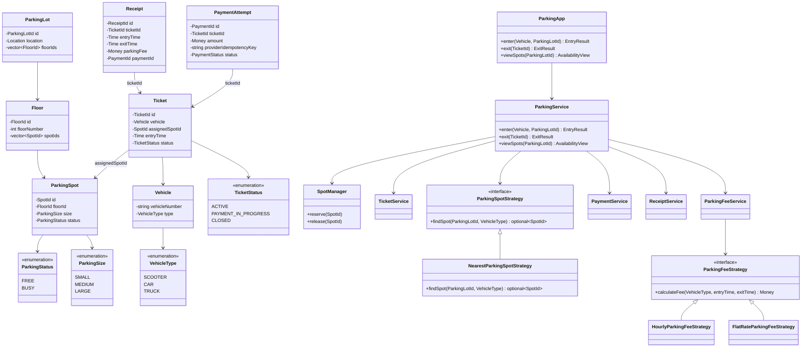

# Parking Lot — Complete LLD Revision Notes

These notes consolidate your original design, the refinements we discussed, and the interview follow-ups on spot allocation, concurrency, database locking, ticket consistency, efficient lookup, and payment handling.

---

## 1. Problem statement

Design a multi-floor parking lot system where vehicles enter, receive a compatible parking spot and ticket, and pay a parking fee when exiting.

### Functional requirements

1. A parking lot contains multiple floors, each with `SMALL`, `MEDIUM`, and `LARGE` parking spots.
2. Support `SCOOTER`, `CAR`, and `TRUCK`.
3. Spot compatibility:
   - Scooter → Small, Medium, or Large
   - Car → Medium or Large
   - Truck → Large only
4. Assign an available compatible spot when a vehicle enters.
5. Generate a ticket containing the vehicle, assigned spot, and entry time.
6. Calculate the parking fee based on duration and vehicle type.
7. Accept payment, generate a receipt, close the ticket, and release the spot.
8. Display available spots by floor and size.
9. Support multiple entry and exit gates operating concurrently.

**Assumptions:** One vehicle per spot, one active parking session per vehicle, and a successful payment is required before the spot is released.

---

## 2. Entities

Keep the entity model **small**. First-pass grouping:

```text
ParkingLot / Floor / ParkingSpot
Vehicle / Ticket / Receipt
```

### ParkingSpot

Your original fields were `id`, `ParkingStatus`, and `ParkingSize`. We retained these and added `floorId` so the spot can be located independently.

```cpp
class ParkingSpot {
    SpotId id;
    FloorId floorId;
    ParkingSize size;
    ParkingStatus status;
};
```

For the current requirements, `FREE` and `BUSY` are sufficient. Your proposed `PARTIALLY_BUSY` status would need an additional requirement, since only one vehicle occupies a spot.

### Floor

```cpp
class Floor {
    FloorId id;
    int floorNumber;
    vector<SpotId> spotIds;
};
```

Your original `vector<ParkingSpot*>` is also fine for a purely in-memory implementation. Using IDs makes persistence and cross-service references easier.

### ParkingLot

```cpp
class ParkingLot {
    ParkingLotId id;
    Location location;
    vector<FloorId> floorIds;
};
```

Your hierarchy was correct:

```text
ParkingLot
    └── Floors
          └── ParkingSpots
```

### Vehicle

```cpp
class Vehicle {
    string vehicleNumber;
    VehicleType type;
};
```

You initially included `name`. It is optional; the vehicle number and type are sufficient for our requirements.

### Ticket

```cpp
class Ticket {
    TicketId id;
    Vehicle vehicle;
    SpotId assignedSpotId;
    Time entryTime;
    TicketStatus status;
};
```

We added `ticketId` and `TicketStatus` to support ticket lookup, exit validation, and duplicate-request handling.

For payment handling, we later extended the statuses to:

```text
ACTIVE → PAYMENT_IN_PROGRESS → CLOSED
```

### Receipt

```cpp
class Receipt {
    ReceiptId id;
    TicketId ticketId;
    Time entryTime;
    Time exitTime;
    Money parkingFee;
    PaymentId paymentId;
};
```

Your original receipt fields were vehicle, entry time, exit time, assigned spot, and parking fee. Those can be included directly or retrieved through the associated ticket.

### Enums

```cpp
enum class ParkingStatus {
    FREE,
    BUSY
};

enum class ParkingSize {
    SMALL,
    MEDIUM,
    LARGE
};

enum class VehicleType {
    SCOOTER,
    CAR,
    TRUCK
};

enum class TicketStatus {
    ACTIVE,
    PAYMENT_IN_PROGRESS,
    CLOSED
};
```

---

## 3. Services and responsibilities

Your design started with `ParkingApp` as the orchestrator and `ParkingService` handling entry, exit, and spot viewing. We refined it by separating spot selection, reservation, ticket persistence, fee calculation, and payment.

| Component | Responsibility |
| --- | --- |
| `ParkingApp` | Expose entry, exit, and availability APIs |
| `ParkingService` | Orchestrate vehicle entry and exit |
| `ParkingSpotStrategy` | Select a suitable candidate spot |
| `SpotManager` | Reserve and release spots safely |
| `TicketService` | Create, retrieve, and update tickets |
| `ParkingFeeService` | Calculate the fee using a pricing strategy |
| `PaymentService` | Initiate payment and retrieve payment status |
| `ReceiptService` | Generate and retrieve receipts |

**Important separation:** The parking strategy selects a candidate. `SpotManager` performs the actual state change. The strategy should not independently mark a spot `BUSY`.

### ParkingApp

```cpp
class ParkingApp {
    ParkingService* parkingService;

public:
    EntryResult enter(
        const Vehicle& vehicle,
        ParkingLotId parkingLotId
    );

    ExitResult exit(TicketId ticketId);

    AvailabilityView viewSpots(ParkingLotId parkingLotId);
};
```

Your original `entryGate()` returned `bool`. Returning a ticket or an `EntryResult` is more useful because the driver needs the ticket to exit.

### ParkingService

```cpp
class ParkingService {
    ParkingSpotStrategy* spotStrategy;
    SpotManager* spotManager;
    TicketService* ticketService;
    ParkingFeeService* feeService;
    PaymentService* paymentService;
    ReceiptService* receiptService;

public:
    EntryResult enter(
        const Vehicle& vehicle,
        ParkingLotId parkingLotId
    );

    ExitResult exit(TicketId ticketId);

    AvailabilityView viewSpots(ParkingLotId parkingLotId);
};
```

This is the main orchestrator for the business flows. It delegates selection, persistence, fee calculation, and payment rather than implementing all of them itself.

---

## 4. Strategies

### ParkingSpotStrategy

Your original strategy was `NearestParkingSpotStrategy`, which traversed floors and spots to find a compatible available spot.

```cpp
class ParkingSpotStrategy {
public:
    virtual optional<SpotId> findSpot(
        ParkingLotId parkingLotId,
        VehicleType vehicleType
    ) = 0;

    virtual ~ParkingSpotStrategy() = default;
};

class NearestParkingSpotStrategy
    : public ParkingSpotStrategy {
public:
    optional<SpotId> findSpot(
        ParkingLotId parkingLotId,
        VehicleType vehicleType
    ) override;
};
```

The strategy needs to know the compatibility rules:

| Vehicle | Eligible sizes, in preferred order |
| --- | --- |
| Scooter | Small → Medium → Large |
| Car | Medium → Large |
| Truck | Large |

For our simplified design, “nearest” means checking floors in their configured order and preferring the smallest compatible spot. If physical distance to an entry gate matters, that distance must also be represented in the model.

### ParkingFeeStrategy

```cpp
class ParkingFeeStrategy {
public:
    virtual Money calculateFee(
        VehicleType vehicleType,
        Time entryTime,
        Time exitTime
    ) = 0;

    virtual ~ParkingFeeStrategy() = default;
};
```

Possible implementations include `HourlyParkingFeeStrategy` and `FlatRateParkingFeeStrategy`.

`ParkingFeeService` chooses the configured pricing strategy. Fee calculation does not reserve spots, update tickets, or initiate payments.

---

## 5. Class diagram



This is a conceptual class diagram, not a requirement to create a separate class for every database operation. For a smaller machine-coding exercise, `ParkingService` can directly use stores where that keeps the implementation clearer.

**Interview line:** *Strategy selects a candidate. `SpotManager` reserves. Ticket insert and spot `BUSY` must be one transaction. Payment is claimed before charging.*

---

## 6. Main flows

### A. Vehicle entry

Your original entry flow was:

```text
Find spot → Block spot → Generate ticket → Save ticket
```

We refined it to ensure spot reservation and ticket creation are consistent:

```text
Vehicle enters
      ↓
Validate vehicle and parking lot
      ↓
ParkingSpotStrategy finds a compatible candidate
      ↓
SpotManager atomically reserves candidate
      ↓
TicketService creates and saves ticket
      ↓
Return ticket
```

Database-backed implementation: Reserve the spot and insert the ticket in the same transaction.

If another request reserves the candidate first, try another compatible spot. If no compatible spot is available, return `NO_SPOT_AVAILABLE`.

### B. Vehicle exit

Your original exit flow released the spot before calculating the fee and taking payment. We corrected the ordering:

```text
Find and validate ACTIVE ticket
      ↓
Claim ticket for payment processing
      ↓
Calculate parking fee
      ↓
Initiate or retrieve payment
      ↓
Payment successful?
      ├── No → Keep spot BUSY; allow a safe payment retry
      └── Yes
              ↓
        Close ticket + release spot atomically
              ↓
        Generate or retrieve receipt
```

The driver should not receive a second charge simply because an exit request was retried.

### C. View available spots

For a basic in-memory design, traverse floors and count spots with `status == FREE`.

For faster queries, maintain an availability index grouped by parking lot, floor, and spot size. The index is an optimization; the authoritative reservation check still happens against the spot's actual state.

---

## 7. Follow-up: Two entry gates select the same spot

Question: Gate A and Gate B both select S1 when only one compatible spot remains. How do we ensure only one vehicle receives S1?

You identified two valid approaches:

1. Make finding and reserving one critical section.
2. Find a candidate without a broad lock, then lock it, recheck its status, and retry if another request won.

### In-memory approach A: Parking-lot lock

```text
lock(parkingLotId)
    find compatible FREE spot
    mark spot BUSY
unlock(parkingLotId)
```

This is correct but coarse-grained. Vehicles entering different floors still block one another.

### In-memory approach B: Floor-level lock

This was your proposed improvement.

```text
For each floor in preferred order:
    lock(parkingLotId, floorId)

    find compatible FREE spot on this floor

    if found:
        mark spot BUSY
        unlock
        return spot

    unlock
```

Different floors can process allocations concurrently. Searching and reserving within a floor must happen under the same lock.

If a floor has no compatible spot, release its lock before trying the next floor. There is no need to hold all floor locks at once.

### In-memory approach C: Per-spot lock

```text
Find candidate S1
       ↓
lock(S1)
       ↓
Recheck S1.status
       ↓
FREE → mark BUSY and return
BUSY → unlock and find another candidate
```

This provides finer-grained concurrency but may cause retries when many gates repeatedly select the same candidate.

Your interview takeaway: Start with floor-level locking for this design. Explain per-spot locking as a refinement if contention becomes significant.

---

## 8. Follow-up: Multiple application servers

Question: Gate A calls Server 1 and Gate B calls Server 2. Both servers have their own C++ mutexes. How do we prevent both from reserving S1?

A process-local mutex is insufficient because it does not coordinate independent servers.

We discussed three database approaches.

### A. Optimistic locking with a version column

Both servers read:

```text
S1: FREE, version = 5
```

Then both attempt:

```sql
UPDATE parking_spots
SET status = 'BUSY',
    version = version + 1
WHERE id = :spotId
  AND status = 'FREE'
  AND version = 5
RETURNING id;
```

Only one request succeeds. The other gets no returned row and searches for another candidate.

Your questions and the answers:

- Do we increment `version` ourselves in PostgreSQL? Yes. In ordinary SQL, `version = version + 1` explicitly updates your custom version column. PostgreSQL does not automatically maintain that column for you.
- Who handles a failed optimistic update? The application. If the row no longer matches, find another compatible spot and retry with a limit.
- Should we retry the same spot? Not blindly. If it is now `BUSY`, select another candidate.

A version column is particularly useful when the application must detect any modification since its earlier read, not just whether the spot is currently free.

### B. Pessimistic locking

Here, we lock the row before modifying it.

```sql
BEGIN;

SELECT id, status
FROM parking_spots
WHERE id = :spotId
FOR UPDATE;

-- If the returned spot is FREE:
UPDATE parking_spots
SET status = 'BUSY'
WHERE id = :spotId;

COMMIT;
```

The point that confused you: `SELECT ... FOR UPDATE` does not set the status to `BUSY`. It locks the selected row. You still need the separate `UPDATE`.

The lock is held until `COMMIT` or `ROLLBACK`, provided both statements run within the same transaction context.

```text
BEGIN
  → SELECT ... FOR UPDATE   (lock and read)
  → UPDATE                  (change status)
COMMIT                      (persist and release lock)
```

If Server B attempts to lock S1 while Server A holds the lock, B normally waits. After A commits, B must check the current state and avoid reserving S1 if it is now `BUSY`.

For candidate selection, PostgreSQL also supports `FOR UPDATE SKIP LOCKED`, allowing a transaction to skip rows currently locked by another transaction instead of waiting for those rows.

### C. Single atomic conditional update

For this specific invariant—reserve S1 only if it is currently free—you do not need a separate version field or a separate `SELECT ... FOR UPDATE`:

```sql
UPDATE parking_spots
SET status = 'BUSY'
WHERE id = :spotId
  AND status = 'FREE'
RETURNING id;
```

- One row returned → reservation succeeded.
- No row returned → this request did not reserve S1; try another candidate.

You correctly recognized that `status = 'FREE'` is already the condition we need. This is an atomic conditional update, rather than version-based optimistic locking against an earlier read.

Memory trick: Optimistic = check that an earlier read is still valid when writing. Pessimistic = lock, then read and write inside one transaction. Atomic conditional update = perform the guarded state change in one statement.

---

## 9. Follow-up: Spot reserved, but ticket creation fails

Question: The database marks S1 `BUSY`, but the server crashes before saving the ticket. How do we avoid a busy spot with no corresponding ticket?

Your answer was correct: one database transaction.

```sql
BEGIN;

UPDATE parking_spots
SET status = 'BUSY'
WHERE id = :spotId
  AND status = 'FREE'
RETURNING id;

-- Proceed only if a row was returned.

INSERT INTO tickets (
    vehicle_number,
    spot_id,
    entry_time,
    status
)
VALUES (
    :vehicleNumber,
    :spotId,
    NOW(),
    'ACTIVE'
);

COMMIT;
```

If the spot reservation fails, do not insert the ticket. If ticket insertion fails, roll back the reservation.

If the application crashes before committing, the database rolls back the uncommitted transaction.

Result: Either the spot is reserved and its ticket exists, or neither change is committed.

---

## 10. Follow-up: Efficient spot lookup

Question: The lot has 100 floors with 1,000 spots each. How do we avoid scanning 100,000 spots for every entry?

You suggested an `unordered_map`. We refined the key and value:

```cpp
// parkingLotId -> floorId -> size -> available spot IDs

unordered_map<
    ParkingLotId,
    unordered_map<
        FloorId,
        unordered_map<
            ParkingSize,
            unordered_set<SpotId>
        >
    >
> availableSpots;
```

For a car:

```text
Floor 1:
    Check MEDIUM bucket
    If empty, check LARGE bucket

Floor 2:
    Check MEDIUM bucket
    If empty, check LARGE bucket

... continue in preferred floor order
```

Getting a candidate from a particular floor-and-size bucket is O(1) on average with an unordered set.

**Important nuance:** The map does not determine which floor or spot is nearest. Maintain a separate floor ordering—and a spot ordering or distance-based structure if actual physical proximity matters.

When a spot is reserved, remove it from the available index. When released, add it back.

---

## 11. Follow-up: In-memory index becomes stale

Question: The database successfully reserves S1, but the server crashes before removing S1 from its in-memory availability index.

Your answer was correct: the database remains the source of truth.

Even if the index returns S1, this query prevents duplicate reservation:

```sql
UPDATE parking_spots
SET status = 'BUSY'
WHERE id = :spotId
  AND status = 'FREE'
RETURNING id;
```

If it returns no row, remove the stale candidate from the local index and try another spot.

Additional refinements:

- Rebuild the index from the database when a server starts.
- Refresh or invalidate index entries when spot states change.
- If multiple servers maintain separate indexes, expect their copies to become temporarily stale.
- Update the index after the reservation transaction commits, so a rolled-back reservation does not incorrectly hide a free spot.

**Invariant:** The index helps find candidates; it never independently authorizes a reservation.

---

## 12. Follow-up: Duplicate exit requests and double payment

Question: A driver scans the same ticket at two exit gates simultaneously. Both requests see `ACTIVE` and attempt payment.

You proposed letting both payments happen, allowing only one ticket close to succeed, and refunding the other charge.

The issue is that the driver could be charged twice, even temporarily. A refund can also fail or take time.

### Refined approach: Claim the ticket before payment

Use:

```text
ACTIVE → PAYMENT_IN_PROGRESS → CLOSED
```

Both gates attempt:

```sql
UPDATE tickets
SET status = 'PAYMENT_IN_PROGRESS'
WHERE id = :ticketId
  AND status = 'ACTIVE'
RETURNING id;
```

Only one gate can claim the ticket. The other must not initiate another charge.

The successful claimant calculates the fee and starts payment.

After confirmed payment, close the ticket and release the spot in one database transaction.

If payment definitively fails, make the ticket eligible for another payment attempt while keeping the spot occupied.

### Payment timeout versus payment failure

A timeout does not necessarily mean payment failed. The provider might have charged the driver even though your server never received the response.

Before retrying, query the payment provider using the existing payment-attempt ID or retry with the same supported idempotency key. Do not blindly create a fresh charge.

---

## 13. Follow-up: Server crashes after charging the driver

We raised this question but did not work through your answer before you requested notes. Here is the recovery design to retain.

Scenario:

```text
Ticket → PAYMENT_IN_PROGRESS
Payment provider → charge successful
Server → crashes before closing ticket
```

A database transaction cannot atomically cover both your PostgreSQL database and an external payment provider.

### Recovery approach

Persist a payment attempt associated with the ticket:

```cpp
class PaymentAttempt {
    PaymentId id;
    TicketId ticketId;
    Money amount;
    string providerIdempotencyKey;
    PaymentStatus status;
};
```

On a retry or recovery job:

1. Find the existing payment attempt for the ticket.
2. Check its status with the payment provider, using the stored provider reference or idempotency key.
3. If payment succeeded, do not charge again.
4. Close the ticket, release the spot, and record the successful payment in one local database transaction.
5. If payment definitively failed, allow a new attempt.
6. If the outcome is still unknown, keep the ticket from starting an independent second charge until the outcome is resolved.

A recovery worker can also revisit tickets stuck in `PAYMENT_IN_PROGRESS`.

**Key distinction:** A database transaction protects your local ticket/spot changes. Payment idempotency and reconciliation protect against duplicate external charges.

---

## 14. Final interview revision checklist

- [ ] Model `ParkingLot → Floor → ParkingSpot`, `Vehicle`, `Ticket`, and `Receipt`.
- [ ] Explain why spot selection and spot reservation are separate responsibilities.
- [ ] Describe the entry and exit flows in the correct order.
- [ ] Explain whole-lot, floor-level, and per-spot in-memory locking.
- [ ] Explain why in-memory mutexes do not coordinate multiple application servers.
- [ ] Write a version-based optimistic-locking update.
- [ ] Explain `SELECT ... FOR UPDATE` and why the subsequent `UPDATE` must be in the same transaction.
- [ ] Write a single atomic `UPDATE ... WHERE status = 'FREE' RETURNING id`.
- [ ] Put spot reservation and ticket creation in one database transaction.
- [ ] Use an availability index without treating it as the source of truth.
- [ ] Prevent duplicate exit requests from initiating duplicate charges.
- [ ] Explain payment idempotency and recovery after a server crash.

**Core design principle:** Spot allocation must be exclusive, ticket creation must be atomic with reservation, and payment must be protected against duplicate requests and uncertain outcomes.
