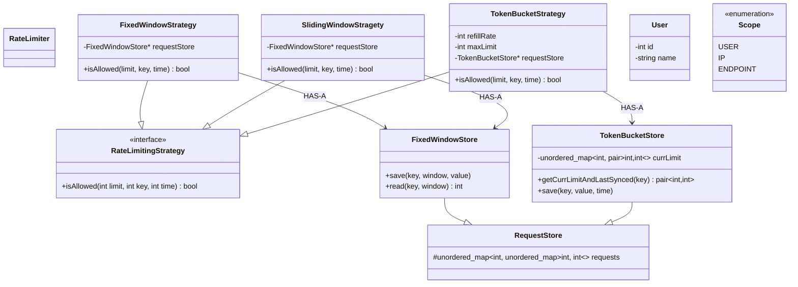

# Rate Limiter — Deep Dive

---

## Final code class diagram

Matches the **current headers**, not a future Redis/distributed design.

```text
allow(limit, key, time)
        ↓
RateLimitingStrategy.isAllowed(...)
        ↓
read/update Store for that key
        ↓
true / false
```

`RateLimiter` is still an empty facade. Callers use a **strategy** + its **store**. `key` is an `int` (user id, hashed IP, etc.). `Scope` / `User` exist but are **not wired** into `isAllowed` yet.



### How the flow works

| Strategy | Store | What it remembers |
|---|---|---|
| **Fixed window** | `FixedWindowStore` | Count per `(key, window)` where `window = time/60`. Allow if count &lt; limit, then increment. |
| **Sliding window** | same `FixedWindowStore` | Current + previous minute counts; weighted mix (how far you are into this minute). Approximate rolling minute. |
| **Token bucket** | `TokenBucketStore` | Per key: `(tokensLeft, lastSyncedTime)`. On request, refill `min(max, tokens + Δt × refillRate)`, then spend 1. |

**Strategy** = algorithm. **Store** = per-key state (so you can later swap in-memory for Redis). `RequestStore` is a shared nested-map base; token bucket mostly uses its own `pair` map for tokens + timestamp.

**Interview line:** *RateLimiter will pick a strategy. Each strategy owns a store. Fixed/sliding share window counters; token bucket stores tokens and last refill time. Algorithm can change without rewriting storage — and the opposite.*

---

## Follow-up checklist

Interview extensions on top of the current design. Don’t wait to be asked about **concurrency**, **multiple scopes**, or **distributed**.

### 1. Concurrency / thread safety

`read → check → update` must be **atomic**.

Separate `read()` and `save()` locks are **not** enough:

```text
Thread A: read count = 99
Thread B: read count = 99
Thread A: 99 < 100 → save 100
Thread B: 99 < 100 → save 100   ← both allowed, limit was 100
```

**Start simple:** one **global lock** around the whole `isAllowed`.

| | |
|---|---|
| **Win** | Correct, easy to explain |
| **Cost** | Contention — every request serializes |

That’s the tradeoff: **correctness / simple design** vs **contention / scalability**.

### 2. Multiple rate-limit scopes

One request can hit **several** limits:

```text
User       → 100/min
IP         → 500/min
Endpoint   → 20/min
```

Same `isAllowed(limit, key, time)` — **different keys** (user id, hashed IP, endpoint id). If **any** policy fails, reject.

`Scope` (`USER` / `IP` / `ENDPOINT`) is already in the codebase; wire it as “which key we pass,” not a new algorithm.

### 3. Multiple checks + rollback

Naive:

```text
User     → increment
IP       → increment
Endpoint → reject
         → rollback User + IP
```

**Atomic rollback alone isn’t enough.** Concurrent requests can change the same counters while you roll back.

Better conceptually:

```text
Validate all
     ↓
Commit all
```

Then you need **coordination** between validation and commit (same lock, or a two-phase API: `canConsume` then `commit`, still under one critical section).

### 4. Atomic multi-policy operation

If User + IP + Endpoint must check **and** update together: how do you guarantee atomicity?

**Your answer first:** one **global lock** around the whole multi-policy check.

Then, as an optimization: finer-grained locks.

### 5. Fine-grained locking

**Problem with a global lock**

```text
One global mutex
      ↓
Every request waits
```

Correct, but **poor scalability**: requests for **unrelated** users still block each other.

**User / resource-level locking**

A separate mutex per resource:

```text
User A → mutex A
User B → mutex B
User C → mutex C
```

Then:

```text
Request A → lock(User A) → read → check → update → unlock
Request B → lock(User B) → read → check → update → unlock
```

A and B can run **concurrently**.

**Multiple scopes still need several locks**

One request may check:

```text
User      → 100/min
IP        → 500/min
Endpoint  → 20/min
```

So it may need:

```text
User lock
IP lock
Endpoint lock
```

**LockManager**

Give keys, get mutexes. LockManager **owns locking**; it should **not** know rate-limit math.

```text
"user:123"        → mutex
"ip:10.1.1.1"     → mutex
"endpoint:/login" → mutex
```

```text
RateLimiter / strategies     →  isAllowed, stores, policies
LockManager                  →  get / acquire / release by key
```

**Deadlock**

If a request needs multiple locks, two requests can grab them in **different orders**:

```text
Request A: User → IP
Request B: IP   → User
```

```text
A holds User, waits for IP
B holds IP,   waits for User
        ↓
      DEADLOCK
```

**Solution: consistent lock ordering**

Fix an order, e.g.:

```text
User → IP → Endpoint
```

(or sort the string keys: `"endpoint:..."` / `"ip:..."` / `"user:..."`)

Every request acquires locks **in that order**. Never in the order policies happened to be discovered.

Hold all needed locks, then `read → check → update` for every policy, then release (same reverse order is fine).

**LockManager has its own concurrency problem**

Internally you often have:

```text
unordered_map<Key, Mutex>
```

Two threads can **both** try to create the mutex for a **new** key at once.

So:

```text
LockManager
    ↓
protect lock-map creation   (one mutex around the map, or concurrent map)
    ↓
return the resource-specific mutex
```

The **map lock** is only for *getting* the per-key mutex, not for the whole rate-limit check — otherwise you’re back to a global lock.

**Cleanup**

If millions of users / IPs show up over time, a mutex **forever** per key **grows memory**.

Interview options (don’t overbuild in LLD unless asked):

- TTL / evict unused keys  
- striped locks (hash key → N mutexes, N << number of users)  
- accept leak on a toy in-memory design, name it as a gap  

**Interview line:** *Global lock first. Then per-key locks via LockManager. Multi-scope → lock in a fixed order. Protect the lock map itself. Don’t keep a mutex for every key forever.*

### 6. Where do rate limits come from?

Don’t hardcode:

```text
normal  → 100
premium → 1000
```

Introduce:

| Piece | Job |
|---|---|
| **RateLimitPolicy** | What to enforce: scope, key template, limit, window, which strategy |
| **RateLimitConfigStore** | Persist / load policies |
| **PolicyResolver** | This request → which policies apply (user tier, route, IP, …) |

Limits and algorithms become **config**, not `if (premium)`.

### 7. Strategy resolution

You already have the idea of a **StrategyResolver**.

Example:

```text
Normal user  → Fixed Window
Premium user → Token Bucket
IP           → Sliding Window
```

- **Resolver** = *which* strategy (and which policy) applies  
- **Strategy** = *how* the algorithm works  

Don’t put “premium vs normal” inside `TokenBucketStrategy`.

### 8. Multiple strategies per request

A request may match **multiple policies**. Don’t assume:

```text
Request → one Strategy
```

It’s:

```text
Request
  ↓
Multiple RateLimitPolicies
  ↓
Multiple Strategies (possibly different stores)
  ↓
All must pass (under one atomic section)
```

### 9. Store abstraction

| Algorithm | State |
|---|---|
| **Fixed / sliding window** | `(key, window) → count` |
| **Token bucket** | `key → tokens + lastRefillTime` |

Separate stores is the right call:

- `FixedWindowStore`
- `TokenBucketStore`

Don’t smash different state models into one generic store “for abstraction.” Shared `RequestStore` base is optional; **don’t** force token bucket onto a window map.

### 10. Distributed rate limiter

Not deep in this code yet. Multiple instances:

```text
Server A → local counter
Server B → local counter
```

Together they can **exceed** the limit.

**Follow-up:** shared store (e.g. **Redis**) + **atomic** check-and-update (Lua / `INCR` with TTL / token-bucket script). Same `read → check → update` race, now across machines.

---

## 1. What is a rate limiter?

It answers:

> **Should I allow this request right now?**

Example: at most **100 API requests per minute**.

```text
Request 1   → ✅ allow
Request 2   → ✅ allow
...
Request 100 → ✅ allow
Request 101 → ❌ reject
```

Conceptual API:

```text
bool allowRequest(clientId);
```

The interesting part is **how** you decide. That’s the **algorithm**.

---

## 2. Why do we need one?

| Goal | Example |
|---|---|
| **Protect backend** | Server OK at 10k req/s; one client sends 100k/s without a limiter. |
| **Fairness** | Don’t let A take 99% and leave B/C with almost nothing. |
| **Prevent abuse** | Login 5/min, OTP 3/min. |
| **Protect downstream** | You call an API capped at 1000/s — limiter keeps **you** under that. |

---

## 3. What are we limiting?

Ask **who** (or **what**) is limited **before** picking an algorithm:

- User  
- IP  
- API key  
- Organization  
- Endpoint  
- Service  
- Region  

```text
user:123 → 100 req/min
user:456 → 100 req/min
```

or:

```text
POST /login     → 5 req/min / IP
GET /products   → 1000 req/min / user
```

The **key** might be:

```text
(userId, endpoint)
```

not just `userId`. That matters in the LLD (map of counters / buckets **per key**).

---

## 4. Algorithms to know (interviews)

Know these well:

1. **Fixed Window Counter**  
2. **Sliding Window Log**  
3. **Sliding Window Counter**  
4. **Token Bucket**  

Also know **Leaky Bucket** — especially for **traffic shaping**.

We’ll go one by one below.

---

## 5. Fixed Window Counter

Simplest algorithm. Limit = **100 requests/minute**. Time is **fixed windows**:

```text
12:00:00 ───────── 12:00:59
12:01:00 ───────── 12:01:59
12:02:00 ───────── 12:02:59
```

State: `counter`, `windowStart`.

```text
12:00:10 → count = 1
12:00:20 → count = 2
...
12:00:59 → count = 100
12:00:59 → ❌
12:01:00 → counter resets, count = 0, allowed
```

### Algorithm

```text
if currentTime >= windowStart + windowSize:
    counter = 0
    windowStart = currentTime

if counter < limit:
    counter++
    ALLOW
else:
    REJECT
```

**Pros:** Simple. Memory **O(1) per key**. Fast.

**Huge problem — boundary burst.** Limit 100/min:

```text
12:00:59 → 100 requests
12:01:00 → 100 requests
```

≈ **200 requests in ~1 second**. That’s the **fixed-window boundary problem**.

---

## 6. Sliding Window Log

Fixes the boundary problem. Store a **timestamp per request**, not one counter.

```text
limit = 100/minute
requests[user123] =
  12:00:03
  12:00:17
  12:00:22
  12:00:45
  ...
```

New request at `12:01:00`: drop timestamps older than `12:00:00`. Then:

```text
if number_of_timestamps < 100:
    allow
    add current timestamp
else:
    reject
```

**Pros:** Accurate. No calendar-boundary burst.

**Cons:** Memory. 1M users × 1000 timestamps → huge.

```text
Fixed Window  → O(1) per key
Sliding Log   → O(requests in the window)
```

That distinction is important.

---

## 7. Sliding Window Counter

Compromise: counters for **smaller** slices, not every timestamp.

```text
Limit = 100 / minute
12:00:00–09 → 20
12:00:10–19 → 15
12:00:20–29 → 10
...
```

Common variant: **current window + previous window**.

At `12:01:30` (halfway through `12:01–12:02`):

```text
previous count = 80
current count  = 30
previous contribution ≈ 80 × 50% = 40
sliding estimate = 40 + 30 = 70
70 < 100 → ALLOW
```

**Pros:** Much less memory than the log.  
**Cons:** **Approximation** — you guess how previous-window traffic was spread.

---

## 8. Token Bucket ⭐

Most important for **LLD interviews**.

Bucket of **tokens**. Example: capacity **100**, refill **10/sec**. Each request costs **1 token**. Token available → take + **ALLOW**; else **REJECT**.

### Refill

capacity = 10, rate = 2/sec. At t=0, tokens = 10. After 7 requests, tokens = 3. Idle 2 seconds → refill `2×2 = 4` → tokens = 7.

Never exceed capacity:

```text
tokens = min(capacity, tokens + refill)
```

---

## 9. Why Token Bucket is powerful

**Controlled bursts.** capacity 100, refill 10/sec. After idle: **100 tokens** → user can fire **100 requests immediately**, then ~**10/sec**.

> **Average rate + burst capacity** — very useful for APIs.

---

## 10. Token Bucket vs Fixed Window

Limit 100/minute:

- **Fixed window:** 100 in this **calendar** minute.  
- **Token bucket:** tokens accumulate up to capacity; requests **spend** them.

Token bucket traffic looks more natural.

---

## 11. Leaky Bucket

Bucket with a **hole**. Requests enter; they **leave at a fixed rate**.

processing rate = 10/sec: even if 100 arrive at once, they drain at 10/sec (queue capacity permitting).

| | Token Bucket | Leaky Bucket |
|---|---|---|
| Role | How much traffic can **enter** | How fast traffic **leaves** |

---

## 12. Token Bucket vs Leaky Bucket

| | Token Bucket | Leaky Bucket |
|---|---|---|
| Burst | Allows bursts | Smooths bursts |
| Output rate | Can be bursty | More constant |
| Typical use | API rate limiting | Traffic shaping |
| State | Tokens | Queue |
| Queue required | No | Usually yes |

---

## 13. Conceptual map

```text
Fixed Window        → simple counting
Sliding Log         → exact recent history
Sliding Counter     → approximate recent history
Token Bucket        → rate + burst control
Leaky Bucket        → smooth output rate
```

---

## 14. Don’t jump to TokenBucket

Requirement: *“100 requests per minute.”* Ask what that **means**:

- Exactly 100 in **any rolling 60s**  
- 100 per **fixed** calendar minute  
- **Average** ~100/min **with bursts**  

Different meanings → different algorithms. Establish this **first** in the interview.

---

## 15. Local vs distributed

**Single server:** `unordered_map<UserId, State>` in memory. Easy.

**Several servers:**

```text
              ┌── Server A
Client ───────┼── Server B
              └── Server C
```

If each has its own counter, user123 can do 50+50+50 = **150** when the limit is **100**. Need **shared state** (e.g. Redis).

```text
              ┌── Server A ──┐
Client ───────┼── Server B ──┼── Redis
              └── Server C ──┘
```

---

## 16. Redis and atomicity

Distributed limiting wants: fast R/W, shared state, **atomic** ops, TTL, counters/tokens.

**Race:** two servers check the same user at once.

Unsafe:

```text
GET counter
if counter < limit:
    INCREMENT
```

Need **atomic** check+update (script / Redis primitive). Core concurrency issue in **distributed** rate limiting.

---

## 17. Multiple dimensions

A request may pass **several** limiters; **any** reject → reject.

```text
Request
   ↓
IP limiter
   ↓
User limiter
   ↓
Endpoint limiter
   ↓
Global limiter
   ↓
Backend
```

Example: user 100/min, IP 1000/min, `/login` 5/min, global 100k/sec.

---

## 18. Dimensions for the LLD

```text
                    Rate Limiter
                         |
        ┌────────────────┼────────────────┐
        ↓                ↓                ↓
    Algorithm          Scope            Storage
        |                |                |
   Token Bucket       User/IP/etc       Memory
   Fixed Window                         Redis
   Sliding Log
   Sliding Counter
   Leaky Bucket
```

Then: **concurrency** → atomic check+update. **Distributed** → shared state.

---

## Interview priority

Don’t memorize all algorithms equally.

**Must know deeply**

1. **Token Bucket** — capacity, refill rate, current tokens, last refill timestamp, consume  
2. **Fixed Window** — boundary problem  
3. **Sliding Window Log** — accurate, memory-heavy  
4. **Distributed** — why local counters fail; atomic shared state  

**Know conceptually:** Sliding Window Counter, Leaky Bucket  

**Practice order**

1. Concrete requirement → **choose** the algorithm  
2. Design **classes**  
3. Concurrency / thread safety  
4. Single machine → **distributed**  
5. Redis + atomicity  

That beats only coding a `TokenBucket` class.

