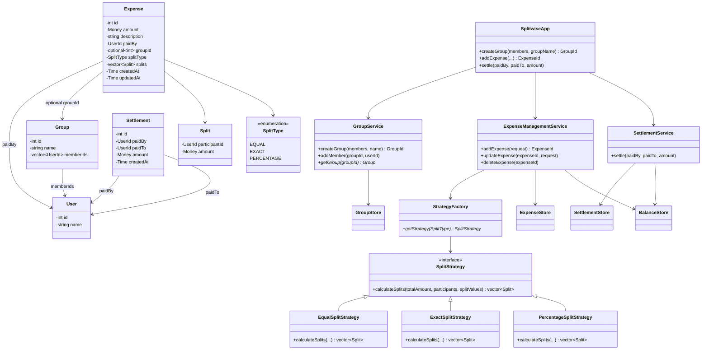

# Splitwise — Complete LLD Revision Notes

These notes consolidate your design, the refinements we discussed, and the interview follow-ups on balances, debt simplification, concurrency, idempotency, and atomicity.

---

## 1. Problem statement

Design a simplified Splitwise application where users can share expenses, track outstanding balances, and record settlements.

### Functional requirements

1. Users can create groups and add members. They can also share expenses without creating a group.
2. A user can add an expense with an amount, description, payer, and participants.
3. Support three split types: Equal, Exact, and Percentage.
4. Users can view how much they owe others and how much others owe them.
5. Users can record settlements that reduce outstanding balances.
6. Users can view expense history for a group.

**Assumptions:** One payer per expense, INR currency, and no actual payment-gateway integration. A settlement is a record of a payment made outside the application.

---

## 2. Entities

Keep the entity model **small**. First-pass grouping:

```text
User / Group
Expense / Split
Settlement
```

### User

```cpp
class User {
    int id;
    string name;
};
```

We initially considered storing `viewBalances` inside `User`. A separate `BalanceStore` is preferable for this design because balances represent relationships between users and are updated by multiple workflows.

### Group

```cpp
class Group {
    int id;
    string name;
    vector<UserId> memberIds;
};
```

A group contains members. An expense can optionally belong to a group.

### Split

A `Split` represents one participant's share of an expense, not a debt between two users.

```cpp
class Split {
    UserId participantId;
    Money amount;
};
```

For a ₹900 expense shared equally among A, B, and C:

```text
Split(A, ₹300)
Split(B, ₹300)
Split(C, ₹300)
```

### Expense

```cpp
class Expense {
    int id;
    Money amount;
    string description;

    UserId paidBy;
    optional<int> groupId;

    SplitType splitType;
    vector<Split> splits;

    Time createdAt;
    Time updatedAt;
};
```

`Expense` stores the calculated monetary shares. For an exact or percentage split, the original input values can also be retained if the application needs to display or edit them later.

### Settlement

```cpp
class Settlement {
    int id;

    UserId paidBy;
    UserId paidTo;

    Money amount;
    Time createdAt;
};
```

A settlement records an actual payment between two users and reduces their outstanding debt.

### Enums

```cpp
enum class SplitType {
    EQUAL,
    EXACT,
    PERCENTAGE
};
```

**Money:** Use integer paise or a fixed-decimal money type. Avoid floating-point values for stored monetary amounts.

---

## 3. Class diagram



The diagram shows the conceptual relationships. The actual C++ implementation can store IDs instead of object pointers, particularly when entities are persisted in a database.

**Interview line:** *`Split` is a participant's share of an expense, not a debt edge. Balances live in `BalanceStore`, not on `User`.*

---

## 4. Services

| Service | Responsibility |
| --- | --- |
| `GroupService` | Create groups, add members, retrieve groups |
| `ExpenseManagementService` | Validate expenses, calculate splits, save expenses, update balances |
| `SettlementService` | Validate and record settlements, update balances |
| `StrategyFactory` | Return the appropriate splitting strategy |
| `SplitStrategy` | Calculate each participant's share |

### SplitwiseApp — orchestrator

```cpp
class SplitwiseApp {
    GroupService* groupService;
    ExpenseManagementService* expenseService;
    SettlementService* settlementService;

public:
    GroupId createGroup(
        vector<UserId> members,
        string groupName
    );

    ExpenseId addExpense(
        UserId paidBy,
        vector<UserId> participants,
        Money amount,
        string description,
        SplitType type,
        optional<GroupId> groupId,
        vector<int> splitValues
    );

    void settle(
        UserId paidBy,
        UserId paidTo,
        Money amount
    );
};
```

The app delegates business logic rather than implementing splitting or balance calculations itself.

### GroupService

```cpp
class GroupService {
    GroupStore* groupStore;

public:
    GroupId createGroup(
        vector<UserId> members,
        string name
    );

    void addMember(GroupId groupId, UserId userId);

    Group* getGroup(GroupId groupId);
};
```

### ExpenseManagementService

```cpp
class ExpenseManagementService {
    StrategyFactory* strategyFactory;
    ExpenseStore* expenseStore;
    BalanceStore* balanceStore;

public:
    ExpenseId addExpense(const AddExpenseRequest& request);

    void updateExpense(
        ExpenseId expenseId,
        const UpdateExpenseRequest& request
    );

    void deleteExpense(ExpenseId expenseId);
};
```

### SettlementService

```cpp
class SettlementService {
    SettlementStore* settlementStore;
    BalanceStore* balanceStore;

public:
    void settle(
        UserId paidBy,
        UserId paidTo,
        Money amount
    );
};
```

---

## 5. Strategies

Your use of the Strategy Pattern was correct: the expense-management flow remains the same, but the algorithm for calculating participant shares changes.

```cpp
class SplitStrategy {
public:
    virtual vector<Split> calculateSplits(
        Money totalAmount,
        const vector<UserId>& participants,
        const vector<int>& splitValues
    ) = 0;

    virtual ~SplitStrategy() = default;
};
```

Concrete strategies:

```text
SplitStrategy
    ├── EqualSplitStrategy
    ├── ExactSplitStrategy
    └── PercentageSplitStrategy
```

`StrategyFactory` selects the strategy using `SplitType`.

| Strategy | Calculation and validation |
| --- | --- |
| Equal | Divide the total among participants and distribute any remaining paise deterministically |
| Exact | Use supplied amounts; verify their sum equals the expense total |
| Percentage | Verify percentages sum to 100%; calculate monetary shares and handle rounding |

**Important:** A strategy only calculates splits. It should not save expenses or modify balances.

---

## 6. Stores and indexes

### GroupStore

```text
groupId → Group
userId  → group IDs
```

The second index supports queries such as “show all groups for this user.”

### ExpenseStore

```text
expenseId → Expense

userId  → expense IDs
groupId → expense IDs
```

This is your original `ExpenseHistoryStore`, renamed because storing and retrieving history are both responsibilities of the same expense repository.

### SettlementStore

```text
settlementId → Settlement
userId       → settlement IDs
```

### BalanceStore

For the in-memory implementation:

```cpp
unordered_map<
    UserId,
    unordered_map<UserId, Money>
> balances;
```

Our chosen convention:

```text
balances[A][B] = +300
→ B owes A ₹300

balances[B][A] = -300
→ A owes B ₹300
```

If we maintain both directions, we must preserve:

```text
balances[A][B] = -balances[B][A]
```

Alternatively, store each unordered user pair only once and calculate the reverse view when queried.

### Why a separate BalanceStore?

Balances are derived from expenses and settlements and represent relationships between users. Keeping them in a separate store gives expense creation, settlement, and balance queries one place to access and maintain them.

It can act as a precomputed/materialized balance view, avoiding a full scan of expense history for every balance query.

---

## 7. Main flows

### A. Add an expense

```text
SplitwiseApp.addExpense(...)
          ↓
ExpenseManagementService
          ↓
Validate payer, participants, amount and group membership
          ↓
StrategyFactory.getStrategy(splitType)
          ↓
SplitStrategy.calculateSplits(...)
          ↓
Validate calculated shares
          ↓
Save Expense + update BalanceStore atomically
          ↓
Return expenseId
```

Calculate and validate before saving. An invalid exact or percentage split must not leave behind a partially created expense.

#### Example

A pays ₹900 for A, B, and C equally.

Calculated splits:

```text
A → ₹300
B → ₹300
C → ₹300
```

Balance updates:

```text
balances[A][B] += 300
balances[B][A] -= 300

balances[A][C] += 300
balances[C][A] -= 300
```

A's own share does not create a debt.

### B. Record a settlement

B owes A ₹300 and pays A ₹100.

```text
Before:
balances[A][B] = +300
balances[B][A] = -300

After:
balances[A][B] = +200
balances[B][A] = -200
```

`SettlementService` validates the request, saves the settlement, and updates both balance directions atomically.

For the simplified requirements, you can reject a settlement larger than the outstanding debt. If overpayments are allowed, that becomes an explicit product rule because the balance could reverse direction.

### C. Net opposing expenses

First expense: B owes A ₹300.

Second expense: A owes B ₹250.

```text
balances[A][B] = +300 - 250 = +50
balances[B][A] = -50
```

We maintain the net outstanding balance while retaining both original expenses in `ExpenseStore`.

---

## 8. Follow-up: Edit or delete an expense

Question: A pays ₹900 for A, B, and C equally. Later, the expense amount is corrected to ₹1,200. How do you update balances?

Your answer was correct: reverse the old expense's contribution, then apply the new contribution.

```text
Original:
B owes A ₹300
C owes A ₹300

Reverse original contribution:
B owes A ₹0
C owes A ₹0

Apply updated expense:
B owes A ₹400
C owes A ₹400
```

General flow:

```text
Fetch existing Expense
       ↓
Calculate and validate replacement splits
       ↓
Reverse existing expense's balance contributions
       ↓
Apply replacement contributions
       ↓
Update existing Expense
       ↓
Commit all changes together
```

We can preserve the existing `expenseId`. If edit history is required, add an audit log or expense versions.

**Important nuance:** Reverse the old expense's contribution, not the entire current balance between its users. Other expenses or settlements may have changed that balance since the original expense was recorded.

Deleting an expense uses the same principle: reverse its contribution and mark/delete the expense as one atomic operation.

---

## 9. Follow-up: Debt simplification

Question: Can we reduce the number of payments users need to make while preserving everyone's overall net balance?

Example:

```text
A owes B ₹100
B owes C ₹100
A owes C ₹100
```

Net positions:

```text
A: -₹200
B: ₹0
C: +₹200
```

Suggested settlement:

```text
A pays C ₹200
```

### Greedy simplification

Algorithm: Net balances + debtor/creditor matching.

Complexity: O(E + U) with unsorted collections, where E is the number of balance relationships processed and U is the number of users.

1. Calculate each user's net balance.
2. Discard users whose net balance is zero.
3. Separate debtors (negative) and creditors (positive).
4. Pick one debtor and one creditor.
5. Suggest a payment of `min(debt, credit)`.
6. Reduce both remaining amounts and repeat.

The amounts do not need to match exactly. Each payment fully settles at least one of the two selected users.

For example:

```text
A: -₹300       C: +₹250
B: -₹200       D: +₹250
```

One valid plan:

```text
A → C: ₹250
A → D: ₹50
B → D: ₹200
```

### Should we maintain a second simplified-balance map?

You correctly identified the risk of synchronizing two copies.

For the initial design, prefer:

```cpp
vector<SuggestedPayment> simplifyDebts();
```

This reads balances and returns a proposed plan. It does not modify actual balances or expense history: no one has paid yet.

A cached plan can be introduced later if necessary, with invalidation when expenses or settlements change.

### What if the interviewer asks for the absolute minimum number of payments?

The greedy algorithm gives a valid simplified plan but does not always guarantee the minimum transaction count.

The exact optimization can use backtracking with pruning:

1. Calculate net balances and discard zero entries.
2. Select the first nonzero balance.
3. Try settling it against each later balance with the opposite sign.
4. Recursively evaluate the remaining balances.
5. Take the minimum transaction count and prune equivalent or exact-cancellation cases.

Worst-case time is exponential in the number of users with nonzero balances.

Revision reminder: You chose to revisit the exact minimum-transactions algorithm later. For now, know the distinction between efficient greedy simplification and guaranteed minimum transactions.

---

## 10. Follow-up: In-memory concurrency

Question: B owes A ₹300. Two requests simultaneously add ₹100 and ₹200 to that debt. How do we avoid a lost update?

Wrong interleaving:

```text
Thread 1 reads ₹300
Thread 2 reads ₹300

Thread 1 writes ₹400
Thread 2 writes ₹500

Final: ₹500  ❌
Expected: ₹600
```

Your answer was correct: read + modify + write must be atomic.

### Locking approach

For a simple in-memory design, acquire locks for all affected users in a deterministic sorted order.

```text
Acquire relevant locks
       ↓
Read current balances
       ↓
Apply all expense contributions
       ↓
Release locks
```

A finer-grained alternative is to lock affected user pairs, such as `(min(userA,userB), max(userA,userB))`, because balances belong to relationships.

Both approaches are valid:

- Per-user locks: simpler, but can block unrelated balance updates involving the same user.
- Per-pair locks: more concurrency, but require more careful lock management.

When acquiring multiple locks, always use a consistent global order to avoid deadlocks.

Final result:

```text
balances[A][B] = +600
balances[B][A] = -600
```

The reverse entries must be updated under the same protection.

---

## 11. Follow-up: Distributed concurrency

In-memory C++ mutexes only synchronize threads within one process.

```text
Server 1 → its own mutexes
Server 2 → its own mutexes
```

Two servers can therefore modify the same database balance concurrently even if each holds its local lock.

Use shared database concurrency control instead.

### Option A: Atomic increment

For a single balance row:

```sql
UPDATE balances
SET amount = amount + 100
WHERE user_a = :a AND user_b = :b;
```

The database applies the increment atomically, avoiding the application's unsafe `SELECT → calculate → overwrite` sequence.

### Option B: Transaction + row-level locking

When one expense updates several balance rows, use a transaction and lock the relevant rows in a deterministic order before reading/modifying them.

For example:

```text
BEGIN TRANSACTION

Lock affected balance rows
Read balances
Apply all changes
Save Expense

COMMIT
```

The exact mechanism depends on the database. Also ensure the creation of a previously nonexistent balance row is safe—for example, through a unique pair key and an atomic upsert.

---

## 12. Follow-up: Atomicity and failure recovery

Question: An expense changes three balances. The first two updates succeed, but the third fails. What happens?

Your first suggestion was to reverse completed updates. That can be a recovery technique, but it is insufficient by itself: the server might crash before executing the reversals.

### Database-backed solution

Save the expense and update every affected balance in one database transaction:

```sql
BEGIN;

-- Save expense
-- Save calculated splits
-- Update all affected balances

COMMIT;
```

If any operation fails, roll back the transaction.

The intended guarantee is:

```text
Expense saved + ALL balances updated
                  OR
Neither expense nor balance changes committed
```

### In-memory solution

For a single-process exercise, hold the relevant locks, calculate and validate the complete change set first, and apply it together. If an application-level operation fails, restore the previous state before releasing the locks.

However, ordinary in-memory rollback does not provide durability across a process crash. That requires persistent transactional storage or a recovery mechanism.

---

## 13. Follow-up: Idempotency

We didn't work through this one in detail during your Splitwise revision, but it follows directly from the duplicate-request problem you covered in Amazon Locker.

Question: A client submits an expense. The server saves it, but the response times out. The client retries. How do we prevent recording the expense twice?

Use a unique `requestId` or `idempotencyKey` for the logical expense-creation operation.

```text
Request 1: key=K1
→ expense E1 created

Request 2: key=K1
→ return existing E1
→ do not apply balances again
```

For concurrent retries across servers, enforce uniqueness of the idempotency key in shared persistent storage. The idempotency record, expense creation, and balance updates must be coordinated transactionally; otherwise, two requests might reserve different outcomes or a crash could leave an incomplete operation.

Remember: A lock alone does not solve a retry that arrives after the original request has finished. The result must be persisted and discoverable.

---

## 14. Follow-up: Group balances versus global balances

Your current map tracks global net balances between users:

```text
balances[A][B]
```

That means debts from different groups and direct expenses can offset each other.

If the requirement is to show balances separately within each group, the data model needs to preserve that scope:

```text
(groupId, userA, userB) → balance
```

You can maintain global balances as an additional aggregated view if required.

This is a requirement clarification to make early in an interview: Should an expense in Group 1 offset a debt between the same users in Group 2?

---

## Final revision checklist

You should be able to explain these without looking at the notes:

- [ ] Why Split stores a participant's share rather than a payer-to-debtor edge
- [ ] Why balances are stored separately from User and Expense
- [ ] Equal, Exact, and Percentage strategy selection
- [ ] Expense creation and settlement balance updates
- [ ] Reversing an expense before editing or deleting it
- [ ] Greedy debt simplification versus minimum-transaction optimization
- [ ] Atomic read-modify-write and deterministic lock ordering
- [ ] Why local mutexes don't coordinate multiple servers
- [ ] Database transaction for expense + balance consistency
- [ ] Idempotency for duplicate expense submissions

Overall: Your Splitwise architecture is established. The remaining practice is implementing the flows cleanly and being able to explain the concurrency and failure cases—not adding more classes or patterns.
