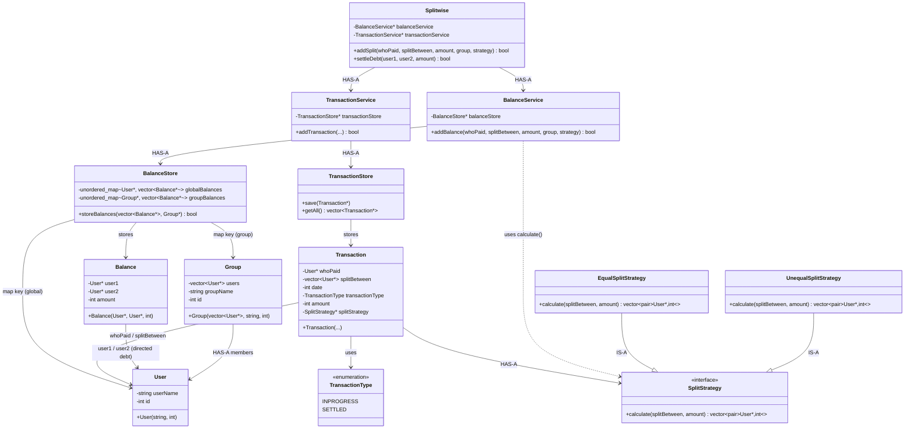

# Splitwise LLD

## Design rating (current code)

**7 / 10** for an interview **skeleton**. Layers are the right story. Wiring and a few domain details are still loose — fine if you say *design-focused, not fully implemented*.

### What is already strong

- **`Splitwise` is the facade / orchestrator** — like `ParkingLot` / `Game`. `main` talks to it; it does not own every list itself.
- **Services extracted for real reasons:** adding an expense touches *history* (`TransactionService`) and *who owes whom* (`BalanceService`). That is the same call you made for TicketManager vs PaymentService.
- **Stores** (`TransactionStore`, `BalanceStore`) = persistence boundary. Services coordinate; stores hold maps/lists.
- **`SplitStrategy` is justified.** Equal vs unequal vs percent is varying **algorithm**, not a new `Expense` subclass per type.
- **Models are thin:** `User`, `Group`, `Transaction`, `Balance`.
- **`BalanceStore` splits global vs group balances** — interviewers like that (friends vs trip).

### What they will poke

1. **`Splitwise` never injects the services.** `balanceService` / `transactionService` are uninitialized pointers. Add a constructor (or `main` wires them).
2. **`TransactionService` does not own `TransactionStore` in code** — empty service, `addTransaction()` takes no args. Intended: service HAS-A store, `addTransaction(Transaction*)` or build the entity inside the service.
3. **`addSplit` order is good** (record expense, then balances) but `addTransaction()` cannot save who/amount yet.
4. **`Balance` is `user1`, `user2`, `amount`** — say in the interview: *directed debt* (e.g. `user2` owes `user1`). Name fields `from` / `to` or `owedBy` / `owedTo`.
5. **`TransactionType` is INPROGRESS / SETTLED** — that is **status**, not split type. Split type is the strategy. Settle updates balances (and maybe status).
6. **`User*` as `unordered_map` key** works only if you never copy `User` and always use the same pointers. Safer: `userId`.
7. **`settleDebt` is a stub** — mention it: settle reduces/removes `Balance` rows; optionally a SETTLED transaction.
8. Hygiene: absolute `#include` paths, `virtual ~SplitStrategy()`, no getters.

**Interview line:** *Splitwise orchestrates. TransactionService + store = expense log. BalanceService + store = net debts. SplitStrategy computes shares. I didn’t implement every method on purpose.*

---

## Current / intended architecture

```text
main
 └── Splitwise
        ├── TransactionService  →  TransactionStore  →  Transaction[]
        └── BalanceService      →  BalanceStore      →  Balance[] (global + per group)
                                      ↑
                                 SplitStrategy.calculate()
```

```text
addSplit(whoPaid, people, amount, group, strategy)
    ↓
TransactionService.addTransaction(...)     // history
    ↓
BalanceService.addBalance(...)             // strategy → Balance rows → store
```

---

## Full class diagram

Stores are shown **owned by services** even where the `.h` files are still empty — that is the intended wiring.



### How to read it

| Piece | Role |
|---|---|
| `Splitwise` | Facade. `addSplit` / `settleDebt` only. |
| `TransactionService` | Create/save expense records. **HAS-A** `TransactionStore`. |
| `BalanceService` | Turn a split into `Balance` rows. **HAS-A** `BalanceStore`. |
| `TransactionStore` | Persistence for `Transaction` (in-memory list/map for LLD). |
| `BalanceStore` | Persistence for debts: global map + per-`Group` map. |
| `SplitStrategy` | How to divide `amount` among people. |
| `Transaction` | One expense event (history). |
| `Balance` | Net “A ↔ B owes X” (simplify later if asked). |
| `Group` | Optional scope for balances. |

Strategy vs service (same as parking lot):

```text
BalanceService          ←  owns the “update who owes whom” workflow
      ↓
SplitStrategy           ←  varying algorithm (equal / unequal)
      ↓
list of (User, share)
      ↓
BalanceStore
```

---

## What is intentionally unimplemented

- `TransactionService.addTransaction` body
- `TransactionStore` API
- `BalanceStore.storeBalances` body
- `EqualSplitStrategy` / `UnequalSplitStrategy` calculate
- `settleDebt`
- `Splitwise` constructor wiring

Say that up front so they don’t grade missing loops as missing design.

---

## Likely follow-ups (don’t build until asked)

| They say | You do |
|---|---|
| Percent / share split | New `SplitStrategy` implementation |
| Simplify debts (min transactions) | Algorithm on `BalanceStore` snapshot — not a new service on day one |
| Settle up | `BalanceService.settle` + maybe SETTLED on transaction |
| Persistence | Store interface + in-memory vs DB (repository) |
| Concurrent groups | Lock per group id, not one global lock |

---

## Interview script (30 seconds)

> Users and groups are models. An expense is a `Transaction` stored via `TransactionService`. Shares come from `SplitStrategy`. `BalanceService` writes directed `Balance` rows into `BalanceStore` (global or group). `Splitwise` only orchestrates those two services. Stores are empty on purpose; the dependencies are the design.
