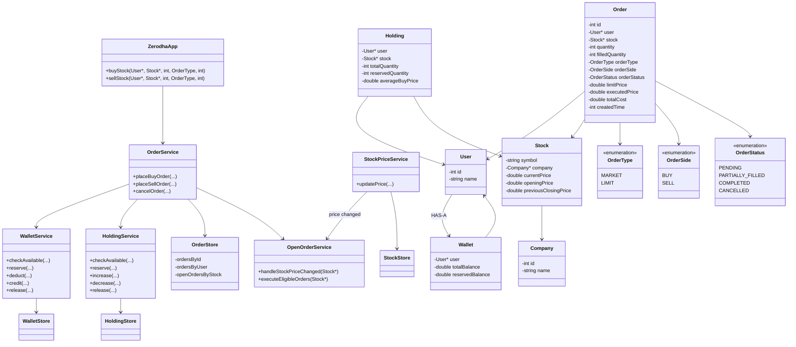
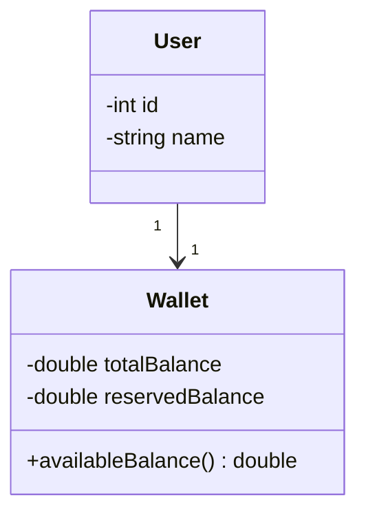
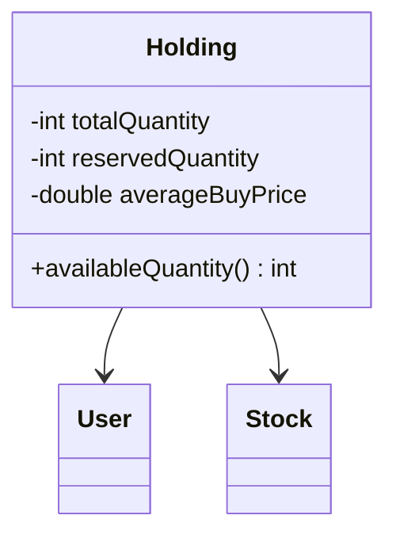
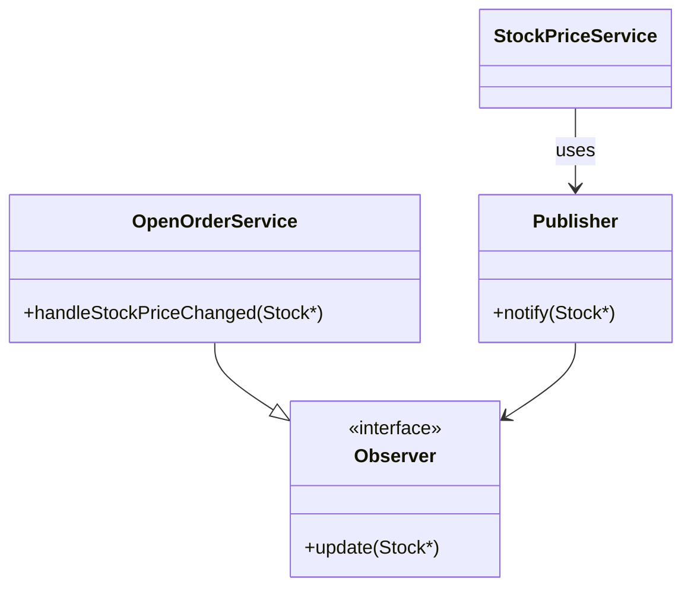
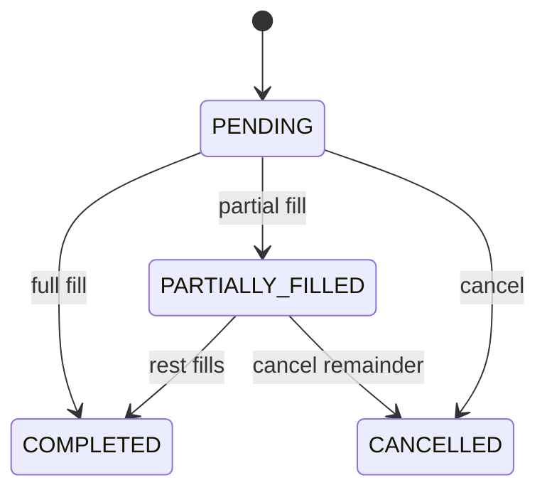

# Stock Broker Platform — LLD Notes

Zerodha / Groww style. Includes the design, corrections, and follow-ups. We design the **broker**, not the exchange / matching engine, unless they ask.

---

## Overall class diagram

```text
                   ZerodhaApp
                       |
                 OrderService
                /      |      \
               /       |       \
              v        v        v
         WalletService |   HoldingService
                       |
                       v
               OpenOrderService
                       ^
                       |
               price changed
                       |
               StockPriceService
```



**Mental model**

```text
Order   = what the user is trying / tried to do
Holding = what the user currently owns
Wallet  = what money the user currently has
```

**Interview line:** *MARKET executes now. LIMIT reserves money (BUY) or shares (SELL) and sits in openOrdersByStock. Price change is event-driven. Cancel vs execute is an atomic PENDING transition.*

---

## 1. Requirements

```text
1. Manage company stocks and prices
2. User can BUY stocks
3. User can SELL stocks
4. User can view account balance
5. User can view holdings
6. Support MARKET and LIMIT orders
7. Handle OPEN orders when stock price changes
```

Assumptions:

> We are designing the broker platform, not the actual stock exchange / matching engine.

Abstract exchange execution unless they ask otherwise.

> No short selling initially. User can sell only shares they currently own.

---

## 2. Core entities

### User

```text
User
- id
- name
```

Move balance into a separate `Wallet` instead of `WalletMoney` on `User`.

### Wallet

```text
Wallet
- User*
- totalBalance
- reservedBalance
```

```text
availableBalance = totalBalance - reservedBalance
```

Why `reservedBalance`? LIMIT BUY can stay pending.

```text
Wallet = ₹10,000
LIMIT BUY needs ₹8,000

reserved  = ₹8,000
available = ₹2,000
```

That stops another ₹8,000 order from using the same money.



---

## 3. Company

```text
Company
- id
- name
```

Simple entity.

---

## 4. Stock

```text
Stock
- id / symbol
- Company*
- currentPrice
- openingPrice
- previousClosingPrice
```

`Stock` is the tradable instrument.

---

## 5. Order

```text
Order
- id
- User*
- Stock*
- quantity
- filledQuantity
- OrderType
- OrderSide
- OrderStatus
- limitPrice
- executedPrice
- totalCost
- createdTime
```

Do **not** use `BuyPrice` — the same `Order` can be BUY or SELL. Use `limitPrice` and `executedPrice`.

---

## 6. OrderType

```text
OrderType
- MARKET
- LIMIT
```

**MARKET** — execute immediately at current / available price (simplified design).

**LIMIT** — execute only when the price condition is satisfied.

```text
Current price = ₹100

BUY LIMIT @ ₹90  → remain OPEN
SELL LIMIT @ ₹120 → remain OPEN
```

---

## 7. OrderSide

Easy to miss initially.

```text
OrderSide
- BUY
- SELL
```

```text
BUY LIMIT
SELL LIMIT
BUY MARKET
SELL MARKET
```

---

## 8. OrderStatus

```text
PENDING
PARTIALLY_FILLED
COMPLETED
CANCELLED
```

`PARTIALLY_FILLED` matters because an order may execute only in part.

---

## 9. Holding

Do **not** derive ownership from historical BUY orders. Use current-state:

```text
Holding
- User*
- Stock*
- totalQuantity
- reservedQuantity
- averageBuyPrice
```

```text
availableQuantity = totalQuantity - reservedQuantity
```



---

## 10. Why Holding must not depend on old BUY orders

```text
User bought 10 TCS
User sold 4
Current holding = 6 TCS
```

Don’t inspect old BUY orders every time. **`Holding` is the source of truth for current ownership.**

---

## 11. Main application / facade

```cpp
class ZerodhaApp {
public:
    void buyStock(
        User* user,
        Stock* stock,
        int quantity,
        OrderType orderType,
        int limitPrice
    );

    void sellStock(
        User* user,
        Stock* stock,
        int quantity,
        OrderType orderType,
        int limitPrice
    );
};
```

Delegate to `OrderService`.

---

## 12. OrderService

```text
OrderService
- placeBuyOrder(...)
- placeSellOrder(...)
- cancelOrder(...)
```

```text
validate request
validate wallet / holdings
reserve money or shares if needed
create Order
execute MARKET orders
store LIMIT orders as OPEN / PENDING
```

---

## 13. MARKET vs LIMIT flow

### MARKET BUY

```text
Current price = ₹100
User wants 10 shares
```

```text
check available wallet >= ₹1000
execute immediately
deduct wallet
increase holding
mark order COMPLETED
```

### LIMIT BUY

```text
Current price = ₹100
Limit price = ₹90
```

```text
reserve required money
create PENDING order
store in openOrdersByStock
```

Later, when price is eligible: execute.

### MARKET SELL

```text
check available holding quantity
execute immediately
decrease holdings
credit wallet
mark COMPLETED
```

### LIMIT SELL

```text
reserve shares
create PENDING order
wait for price condition
```

---

## 14. BUY vs SELL reservation symmetry

One of the most important concepts:

```text
LIMIT BUY  → reserve MONEY
LIMIT SELL → reserve SHARES
```

```text
Wallet = ₹10,000
Open BUY LIMIT needs ₹8,000

reserved money  = ₹8,000
available money = ₹2,000
```

```text
Holding = 10 TCS
Open SELL LIMIT = 10 TCS

reserved shares  = 10
available shares = 0
```

Prevents using the same resource twice.

---

## 15. Sell reservation follow-up

> User owns 10 TCS and places a LIMIT SELL for all 10. Then places another SELL for the same 10.

Wrong: inspect old BUY, mutate it into SELL. **Do not mutate old orders.**

Correct:

```text
Holding
- totalQuantity     = 10
- reservedQuantity  = 10
- availableQuantity = 0
```

Second sell: `availableQuantity >= requestedQuantity`? **False** → reject.

---

## 16. OrderStore

```cpp
unordered_map<User*, vector<Order*>> orders;
```

Good for “all orders for user”. Bad for “TCS price changed — find all OPEN TCS orders”.

Maintain **multiple indexes**:

```text
OrderStore
- ordersById
- ordersByUser
- openOrdersByStock
```

```cpp
unordered_map<OrderId, Order*> ordersById;
unordered_map<UserId, vector<Order*>> ordersByUser;
unordered_map<StockId, vector<Order*>> openOrdersByStock;
```

---

## 17. “Isn’t that duplication?”

Interview defense:

> The Order object itself is stored **once**. The other maps are **secondary indexes / references** for different access patterns.

```text
ordersById:          123  → Order*
ordersByUser:        user7 → Order* #123
openOrdersByStock:   TCS   → Order* #123
```

**Indexing**, not duplicate business data. Same idea as primary data + secondary indexes.

Tradeoff: more memory, faster queries.

> `OrderStore` should own updates so **all indexes stay consistent**.

---

## 18. OpenOrderService

```text
OpenOrderService
- handleStockPriceChanged(stock)
- executeEligibleOrders(stock)
```

---

## 19. Don’t poll every 5 seconds

A thread that wakes and scans all pending orders **works** but is not ideal.

Better — **event-driven**:

```text
StockPriceService
       |
       | price changed
       v
OpenOrderService
       |
       v
find open orders for stock
       |
       v
execute eligible ones
```

---

## 20. Observer pattern possibility

Open orders should close / fill when stock price changes:

```text
StockPricePublisher
        |
        v
OpenOrderService
```

Price change → `notify(stock)` → `OpenOrderService` reacts.



---

## 21. Limit order eligibility

```text
BUY LIMIT  → execute when currentPrice <= limitPrice
SELL LIMIT → execute when currentPrice >= limitPrice
```

---

## 22. Exchange vs broker scope

Real world:

```text
Broker
   |
   v
Exchange
   |
   v
Order Book
BUY <-> SELL
```

Unless they say *design matching engine / order book*, do **not** implement exchange complexity.

> I’ll assume the exchange is external. The broker validates, reserves funds / holdings, sends the order, and receives execution updates.

---

## 23. Concurrency — Wallet

> User has ₹10,000 and places two BUY LIMIT orders requiring ₹8,000 each.

If you only check **total** balance, both may pass. ❌

Correct:

```text
totalBalance     = ₹10,000
reservedBalance  = ₹8,000
availableBalance = ₹2,000
```

Second order fails.

```text
lock(userWallet)

check availableBalance
reserve amount
create order

unlock
```

Critical section: **CHECK available balance + RESERVE money**.

---

## 24. Per-user locking

Do **not** globally lock all wallets.

```text
lock(userId)
```

or logically `lock(userWallet)`. Different users can trade concurrently.

---

## 25. Concurrency — Holdings

For SELL:

```text
lock(userId, stockId)

check availableQuantity
reserve shares
create SELL order

unlock
```

Critical section: **CHECK available shares + RESERVE shares**.

---

## 26. Price change vs cancellation race

```text
Order #123 = PENDING

Thread A: price changed → execute
Thread B: user → cancel
```

Need an **atomic state transition**. Order-level lock:

```text
lock(orderId)

check status == PENDING

if executing:  PENDING → COMPLETED
if cancelling: PENDING → CANCELLED

unlock
```

Whichever wins first decides.

### State machine (simple)

```text
          COMPLETED
         /
   PENDING
         \
          CANCELLED
```

Only **one** transition should succeed.

---

## 27. Why order-level lock?

Don’t lock the whole stock, whole user, or whole system.

Shared resource is **Order #123**. Natural granularity: `lock(orderId)`.

---

## 28. Distributed version of the state transition

Multiple servers: a C++ mutex is **not** enough. Atomic DB transition:

```sql
UPDATE orders
SET status = 'COMPLETED'
WHERE id = 123
AND status = 'PENDING';
```

Affected rows: **1** → execution won; **0** → someone else changed it. Same for cancel. Compare-and-set.

---

## 29. Partial execution

> BUY 100 shares, but only 40 execute.

```text
Order
- requestedQuantity = 100
- filledQuantity    = 40
- remainingQuantity = 60
- status            = PARTIALLY_FILLED
```

---

## 30. Holdings during partial fill

40 execute → `Holding quantity += 40`. Remaining 60 still pending.

---

## 31. Wallet reservation during partial fill

100 shares @ ₹100 → initially **₹10,000 reserved**.

40 execute:

```text
₹4,000 actually spent
₹6,000 remains reserved   (60 still pending)
```

Later: remaining 60 execute → ₹6,000 spent; **or** remaining 60 cancelled → ₹6,000 released.

---

## 32. Partial fill state flow

```text
PENDING
   |
   v
PARTIALLY_FILLED
   |
   +----> COMPLETED
   |
   +----> CANCELLED
```

Cancel after partial fill: **already executed shares stay executed**; remaining quantity is cancelled.



---

## 33. MARKET vs open order

```text
MARKET  → normally executes immediately
LIMIT   → may remain OPEN / PENDING
```

The prompt “close relevant open orders when stock price changes” mostly means **pending LIMIT orders** in this simplified design.

---

## 34. Suggested services

```text
ZerodhaApp
    |
    +-- OrderService
    +-- OpenOrderService
    +-- StockPriceService
    +-- WalletService
    +-- HoldingService
```

You don’t have to create all of these immediately in code. **Responsibilities matter more than class count.**

---

## 35. Suggested stores

```text
OrderStore
WalletStore
HoldingStore
StockStore
```

OrderStore indexes: `ordersById`, `ordersByUser`, `openOrdersByStock`.

---

## 36. Final architecture

Stores: `OrderStore`, `WalletStore`, `HoldingStore`, `StockStore`.

The main improvements were not a wholesale redesign — they were the right **state ownership**: `Holding`, reserved balance / shares, `OrderSide`, and proper indexes.

---

## 37. Most important interview concepts

```text
1. OrderSide = BUY / SELL

2. OrderType = MARKET / LIMIT

3. Holdings = current ownership
   Orders   = transaction intent / history

4. LIMIT BUY  → reserve money

5. LIMIT SELL → reserve shares

6. MARKET executes immediately
   LIMIT may remain OPEN

7. openOrdersByStock is a secondary index,
   not duplicate Order data

8. Price change → open-order processing
   (event-driven, not a 5s poll)

9. Cancel vs execute
   → atomic PENDING state transition

10. Partial fills:
    filledQuantity, remainingQuantity, PARTIALLY_FILLED

11. Wallet / Holding check + reserve must be atomic

12. In-memory locks = one process;
    distributed → DB atomicity / transactions
```
