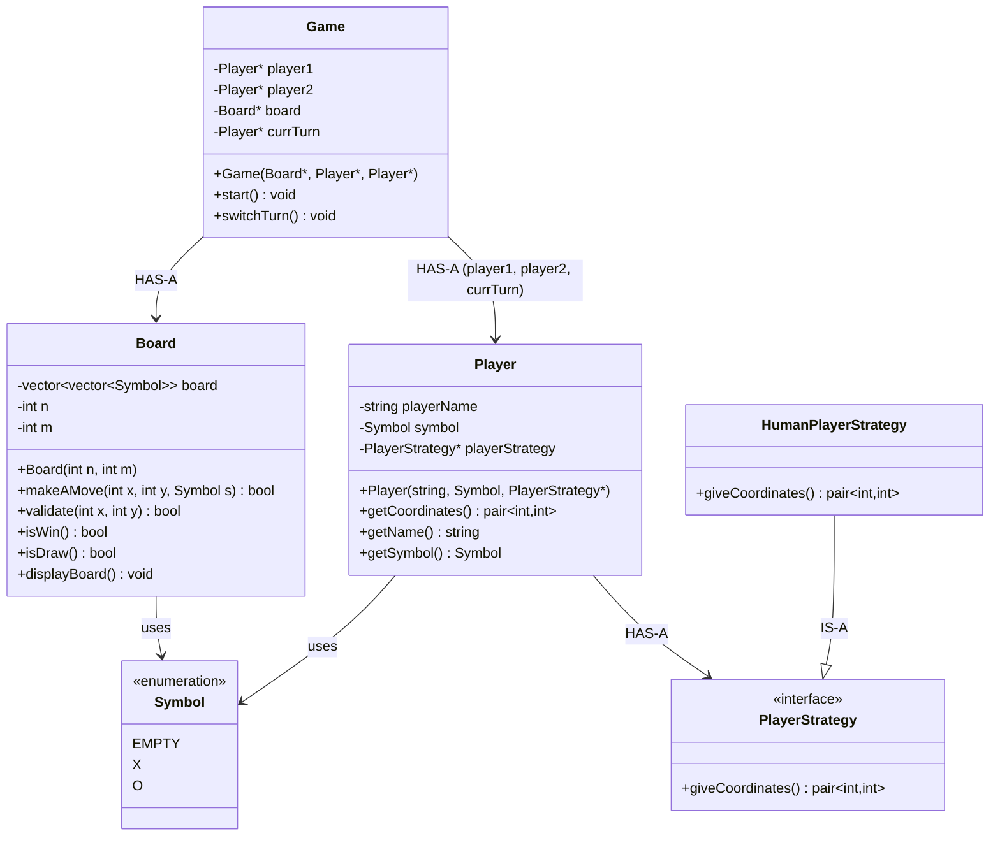
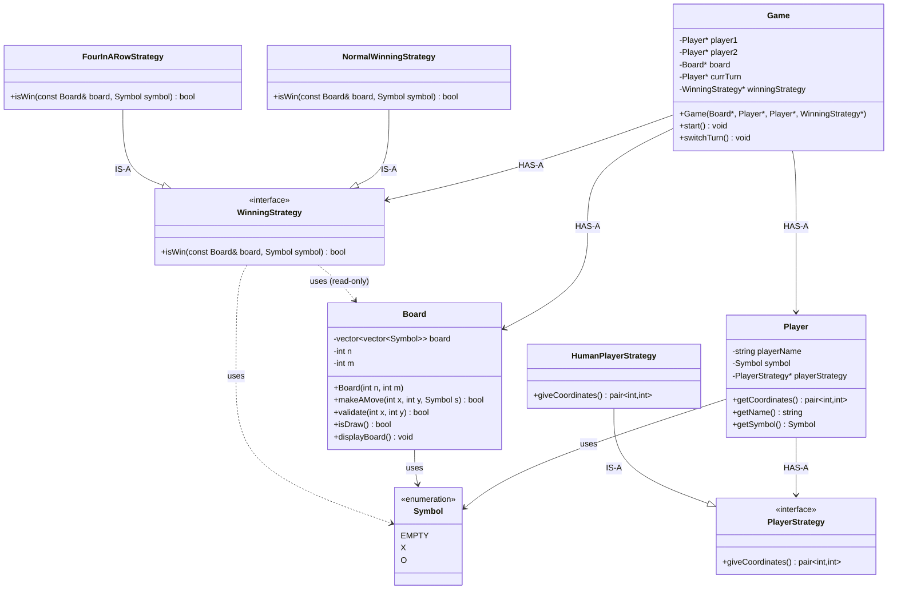
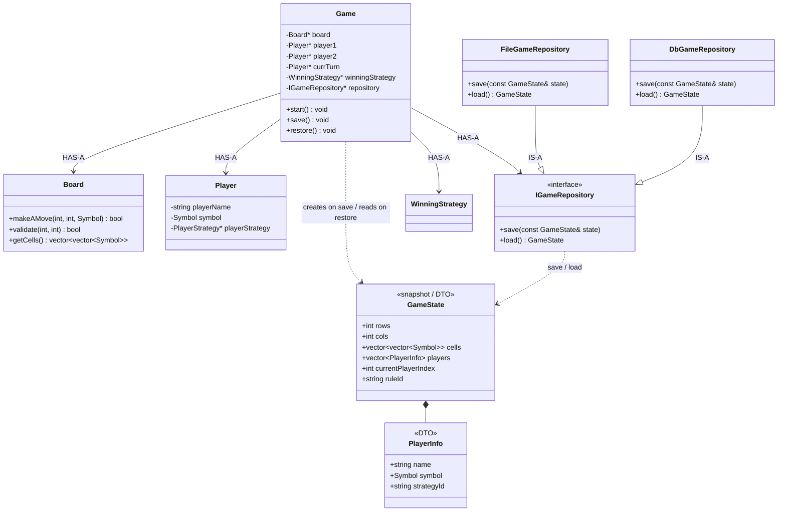
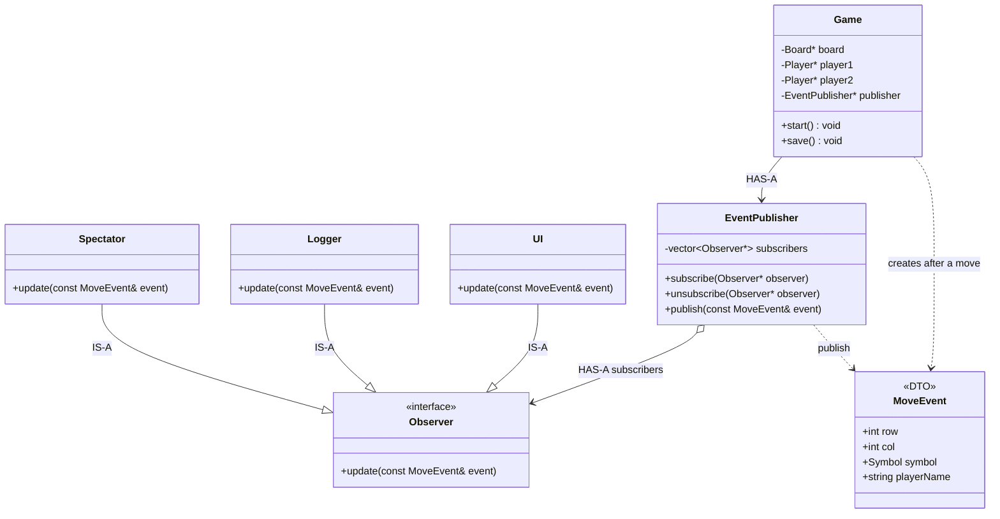
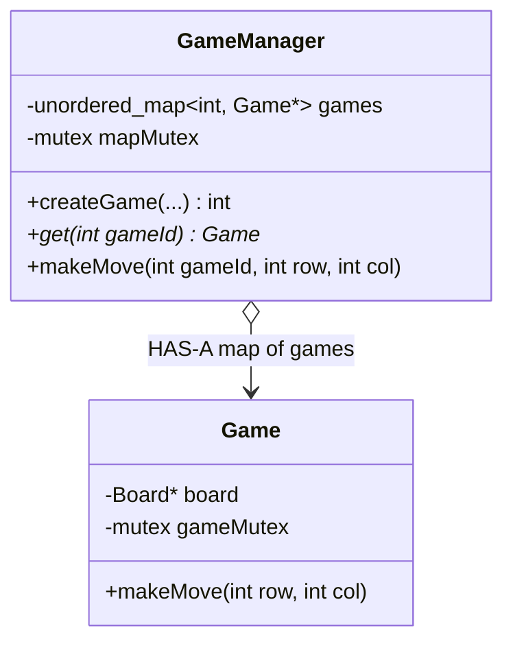

# Tic-Tac-Toe LLD — Complete Notes

## Current Code — Class Diagram

This is the design of **what the code has now**, not the full interview evolution.



### How to read it

| Relationship | Meaning in the code |
|---|---|
| `Game` HAS-A `Board` | Game tells the board to move / check win |
| `Game` HAS-A two `Player`s | Plus `currTurn` pointing at one of them |
| `Player` HAS-A `PlayerStrategy` | `getCoordinates()` delegates to strategy |
| `HumanPlayerStrategy` IS-A `PlayerStrategy` | Only concrete strategy so far |
| `Board` / `Player` use `Symbol` | Cells and player marks |

### Runtime (from `main`)

```text
main
 ├── HumanPlayerStrategy   (one object, shared by both players today)
 ├── Player Sahil (O)
 ├── Player Vishal (X)
 ├── Board 3×3
 └── Game
        ├── board
        ├── player1 → Sahil
        ├── player2 → Vishal
        └── currTurn → Sahil
```

There is no `WinningStrategy`, `Move`, `GameState`, or Observer in this diagram — those exist later in these notes, not in the current code.

---

## 1. How to Think About LLD

The biggest mistake in LLD is starting with:

> "Which design pattern should I use?"

Instead, start with the requirements and let the design emerge.

### Recommended thinking process

```text
Requirements
    ↓
Identify entities / nouns
    ↓
What data does each entity own?
    ↓
What responsibilities does each entity have?
    ↓
Who should call whom?
    ↓
What is the main workflow?
    ↓
Identify things that can vary
    ↓
Introduce interfaces / patterns only where needed
    ↓
Think about dependencies and cycles
    ↓
Think about edge cases
    ↓
Design main()
    ↓
Implement
```

### Important rule

> Don't add abstraction unless there is a reason for it.

If there is only one implementation, a simple class is often better.

---

## 2. Start With the Simplest Requirements

Basic Tic-Tac-Toe:

- Two players
- 3×3 board
- Players take turns
- A player wins with horizontal, vertical, or diagonal symbols
- If the board is full without a winner → draw

First identify the important nouns:

- `Player`
- `Board`
- `Game`

Initially, you don't need:

- `PlayerFactory`
- `BoardManager`
- `GameManager`
- `SymbolFactory`
- `MoveManager`

That would be overengineering.

---

## 3. Initial Model

### Player

`Player` represents a participant.

```text
Player
├── name
└── symbol
```

Possible responsibilities:

- `getName()`
- `getSymbol()`
- `getMove()`

### Board

`Board` owns the board state.

```text
Board
├── size
└── cells
```

Possible responsibilities:

- `isValidMove()`
- `makeMove()`
- `isFull()`
- `hasWon()`

The important principle:

> The object that owns the data should generally own the operations that modify that data.

Therefore:

```text
Board owns cells
    ↓
Board should modify cells
```

### Game

`Game` controls the game flow.

```text
Game
├── Player 1
├── Player 2
├── Board
└── currentPlayer
```

Possible responsibilities:

- `start()`
- `switchTurn()`

`Game` is the orchestrator.

---

## 4. How `main()` Should Work

`main()` should not contain the entire game logic.

It should mainly construct the objects and start the game.

Conceptually:

```cpp
int main() {
    Player p1("Sahil", 'X');
    Player p2("Rahul", 'O');

    Board board(3);

    TicTacToeGame game(p1, p2, board);

    game.start();
}
```

Then:

```text
main()
   ↓
creates objects
   ↓
creates Game
   ↓
game.start()
   ↓
Game controls everything
```

This gives a clean separation:

| Piece | Role |
|---|---|
| `main` | Application entry point |
| `Game` | Controls workflow |
| `Player` | Represents player |
| `Board` | Maintains board state |

---

## 5. Who Calls Whom?

This is one of the biggest sources of confusion in LLD.

Think about the real-world flow.

```text
Game
 ↓
asks current Player for a move
 ↓
Player/Strategy decides coordinates
 ↓
Game gets coordinates
 ↓
Game tells Board to perform the move
 ↓
Board updates itself
 ↓
Game checks result
 ↓
Game switches turn
```

So:

| Piece | Responsibility |
|---|---|
| Player / Strategy | Decides **WHERE** to move |
| `Board` | Performs the move |
| `Game` | Controls **WHAT HAPPENS NEXT** |

These are different responsibilities.

---

## 6. Introducing Move Strategy

Now the interviewer says:

> "Players can have different ways of choosing moves."

For example:

- Human
- Random
- AI

Now there is genuine variation.

This is a perfect place for **Strategy Pattern**.

```text
MoveStrategy
     |
     ├── HumanMoveStrategy
     ├── RandomMoveStrategy
     └── AIMoveStrategy
```

`Player` now becomes:

```text
Player
├── name
├── symbol
└── moveStrategy
```

---

## 7. How Strategy Connects to Board

This was one of the important confusions.

The Strategy should **decide** the move, not **perform** the move.

For example:

```text
HumanMoveStrategy
→ asks user
→ returns (1,2)

RandomMoveStrategy
→ generates (2,0)

AIMoveStrategy
→ calculates best move
→ returns (0,2)
```

Then `Game` performs the move:

```text
Game
 ↓
Player.getMove(board)
 ↓
MoveStrategy.getMove(board)
 ↓
(row, col)
 ↓
Board.makeMove(row, col, symbol)
```

So:

| Piece | Question it answers |
|---|---|
| Strategy | "Where should I move?" |
| `Board` | "Can I make that move?" |
| `Game` | "What happens after that?" |

### Important distinction

```cpp
strategy.getMove(board);
```

means: **Decide** the move.

Whereas:

```cpp
board.makeMove(row, col, symbol);
```

means: **Perform** the move.

---

## 8. Why Can AI Use Board Without Creating a Cycle?

You might initially imagine:

```text
Game → Player → Board → Game
```

But that's not necessary.

A cleaner relationship is:

```text
Game
 ├────────→ Board
 │
 └────────→ Player
              ↓
          MoveStrategy
              ↓
           uses Board
```

The strategy can receive the board as a parameter:

```cpp
Move getMove(const Board& board);
```

It doesn't own the `Board`.

### Important distinction

This:

```cpp
class Player {
    Board board;
};
```

means `Player` **owns** a `Board`.

Whereas:

```cpp
Move getMove(const Board& board);
```

means the strategy **temporarily uses** the `Board`.

Those are very different relationships.

---

## 9. Dependency Rule

When designing LLD, ask:

> Does this class own this object, or does it merely need information from it?

Also ask:

> Who really needs to know about whom?

For Tic-Tac-Toe:

```text
Game
 ├── knows Players
 └── knows Board

Player
 └── knows MoveStrategy

MoveStrategy
 └── can use Board

Board
 └── doesn't need to know Game
```

Avoid unnecessary bidirectional dependencies.

If you ever get:

```text
Game → Player → Board → Game
```

stop and ask:

> "Does `Board` really need to know about `Game`?"

Often the answer is no.

---

## 10. Requirement: Variable Board Size

**Interviewer:**

> "Support 3×3, 4×4, 5×5, etc."

Your answer: make the board dynamic.

Correct. But ideally:

```text
Board
├── size
└── cells
```

`Board` should own its size because it owns the board.

For example:

```cpp
Board board(5);
```

Then `Board` internally manages `5 × 5`.

The `Game` doesn't need to know how the board stores itself.

### Principle

> Keep knowledge close to the object that owns it.

---

## 11. Requirement: Different Winning Conditions

**Interviewer:**

> "On a 5×5 board, 4 in a row should win."

Now winning behavior can vary.

You can introduce:

```text
WinningStrategy
      |
      ├── NormalWinningStrategy
      └── FourInARowStrategy
```

Potentially:

```cpp
bool isWin(const Board& board, const Player& player);
```

The strategy determines whether the current state is a winning state.

`Game` owns the `WinningStrategy`. After a move it does **not** call `board->isWin()`. It asks the strategy:

```cpp
winningStrategy->isWin(*board, currTurn->getSymbol());
```

`Board` only stores cells and applies moves. Win rules live in the strategy.

### Class diagram (after this requirement)



| Relationship | Meaning |
|---|---|
| `Game` HAS-A `WinningStrategy` | Injected like `PlayerStrategy` — classic vs 4-in-a-row |
| `WinningStrategy` uses `Board` | Reads cells; does not call `makeAMove` |
| `isWin(board, symbol)` | "Did this symbol complete a winning line?" |
| `Board` has **no** `isWin()` | State only; rules moved out |

```text
Game
 ├── Board              (state + makeAMove)
 ├── Players
 └── WinningStrategy    (Normal or FourInARow)
         ↓
    isWin(board, symbol)
```

---

## 12. Board vs Winning Strategy

Initially we had:

```text
Board
├── makeMove()
├── isValidMove()
├── hasWon()
└── isFull()
```

After introducing variable winning rules, a cleaner design can be:

```text
Board
├── makeMove()
├── isValidMove()
└── isFull()

WinningStrategy
└── isWin()
```

Then:

```text
Game
 ├── Board
 └── WinningStrategy
```

`Game` can do:

```cpp
winningStrategy.isWin(board, player);
```

This keeps responsibilities clean:

| Piece | Role |
|---|---|
| `Board` | Maintains state |
| `WinningStrategy` | Determines winning condition |
| `Game` | Coordinates them |

---

## 13. Requirement: Completely Different Game Rules

**Interviewer:**

> "Now create Misère Tic-Tac-Toe where getting three in a row means you lose."

Don't immediately abstract the entire `Game`.

First ask: **What exactly changed?**

If only the winning condition changed:

```text
Normal
3 in row → win

Misère
3 in row → lose
```

then:

```text
Game
 └── GameRule / WinningStrategy
```

may be enough.

But if the entire workflow changes, abstraction might be necessary.

For example:

```text
Normal:
Player 1 → Player 2 → Player 1

New game:
Both players submit moves simultaneously
```

Now the workflow itself is different.

### Useful question

> Is the data changing, the behavior changing, or the entire workflow changing?

---

## 14. Requirement: N Players

**Interviewer:**

> "Support 3, 4, or N players."

Don't do:

```cpp
Player player1;
Player player2;
Player player3;
Player player4;
```

Use:

```cpp
vector<Player> players;
int currentPlayerIndex;
```

Flow:

```text
Player 0
   ↓
Player 1
   ↓
Player 2
   ↓
...
Player N-1
   ↓
Player 0
```

Now `Game` handles turn rotation.

---

## 15. Requirement: Different Symbols

If there are four players:

```text
Player 1 → X
Player 2 → O
Player 3 → A
Player 4 → B
```

Don't hardcode the logic around `X` and `O`.

The `Board` should be able to represent arbitrary player symbols.

For example:

```text
Player
├── name
└── symbol
```

The important idea is:

> Don't build your design around today's exact values if the requirement says they can vary.

---

## 16. Requirement: Undo

**Interviewer:**

> "Players can undo a move."

First simple solution:

```text
Game
└── lastMove
```

But immediately ask:

> "What if the user wants to undo 10 moves?"

Now you need history:

```cpp
stack<Move> moveHistory;
```

A `Move` might contain:

```text
Move
├── player
├── row
└── col
```

Flow:

```text
makeMove()
   ↓
Board changes
   ↓
Move pushed to history
```

Undo:

```text
undo()
   ↓
get last Move
   ↓
reverse it on Board
   ↓
remove from history
```

### Important separation

`Game` decides: **Can the user undo?**

History remembers: **What happened?**

---

## 17. Requirement: Save and Resume

**Interviewer:**

> "The player can close the game and continue later."

Now we need to persist the state.

Don't think: *Save entire Game object*.

Think: `GameState`.

Possible state:

```text
GameState
├── BoardState
├── Players
├── currentPlayer
├── board size
└── game configuration
```

Then separate persistence from the state itself:

```text
Game
 ↓
GameState
 ↓
Persistence / Repository
 ↓
File / Database
```

Today: JSON file.

Tomorrow: Database.

`Game` doesn't need to know the storage implementation.

### Who calls save / resume?

**Yes — `Game` is the one that talks to persistence.** `Board` and `Player` do not talk to the DB.

**Save (close the game)**

```text
Game.save()
    ↓
copy live data into GameState   (snapshot)
    ↓
repository.save(gameState)
    ↓
File or Database
```

`Game` **builds** the snapshot. The **repository** writes bytes. `Game` never knows JSON vs SQL.

**Resume (start that saved game)**

```text
main / Game.restore()
    ↓
repository.load()  →  GameState
    ↓
Game copies snapshot back into live objects
    ↓
new Board(cells), Players, whose turn, which rule
    ↓
game.start() continues
```

You do **not** create `BoardState`, `PlayerState`, `SymbolState` as a parallel class tree. `GameState` already **contains** the board cells and player info. Load **reconstructs** the real `Board` / `Player` objects from that one snapshot.

### Class diagram (save and resume)



| Piece | Role |
|---|---|
| `Game` | Orchestrator. Builds snapshot on save. Rebuilds `Board` / `Player`s on restore. Calls repository. |
| `GameState` | Plain data copy. Not a live game. Safe to put in a file or DB. |
| `PlayerInfo` | Nested fields inside the snapshot (name, symbol, strategy kind) — not a second `Player` class tree. |
| `IGameRepository` | Abstraction. `Game` depends on this, not on files or SQL. |
| `FileGameRepository` / `DbGameRepository` | How the snapshot is stored. Swap without changing `Game`. |

```text
SAVE
Game (live)  →  GameState  →  IGameRepository  →  disk / DB

RESUME
disk / DB  →  IGameRepository  →  GameState  →  Game (live Board + Players)
```

---

## 18. Requirement: Observer / Notifications

**Interviewer:**

> "Whenever a move occurs, notify the UI and logger."

Now multiple objects are interested in the same event.

This is exactly where **Observer Pattern** fits.

```text
Game / Publisher
       ↓
    observers
     /     \
    ↓       ↓
   UI     Logger
```

When a move happens:

```text
Game
 ↓
notify()
 ↓
UI
Logger
Spectators
...
```

The key trigger is:

> One event → many interested objects need to be notified.

`Game` **HAS-A** `EventPublisher`. It does not hold UI/logger itself. After a valid move it calls `publisher->publish(event)`. The publisher loops over subscribers and calls `update`.

Wire subscribers in `main`:

```cpp
publisher->subscribe(ui);
publisher->subscribe(logger);
```

### Class diagram (Observer — Game HAS-A Publisher)



| Piece | Role |
|---|---|
| `Game` | After `makeAMove` succeeds, `publisher->publish(event)`. Does not call UI or logger by name. |
| `EventPublisher` | Holds `vector<Observer*>`. `publish` notifies everyone. |
| `Observer` | Contract: `update(MoveEvent)`. |
| `UI` / `Logger` / `Spectator` | Subscribers. Each decides what to do with the event. |
| `MoveEvent` | DTO payload (row, col, symbol, player name). |

```text
main
 ├── subscribe(UI)
 └── subscribe(Logger)

Game
 └── HAS-A EventPublisher
           ↓ publish(MoveEvent)
     ┌─────┼─────┐
     ↓     ↓     ↓
    UI  Logger  Spectator
```

---

## 19. Requirement: Different UIs

**Interviewer:**

> "The same game engine should support console, web, and mobile UI."

Don't put `cout` / `cin` everywhere inside `Game`.

You could introduce:

```text
UI
 |
 ├── ConsoleUI
 ├── WebUI
 └── MobileUI
```

Now `Game` can depend on an abstraction rather than a specific UI implementation.

This is where **Dependency Inversion** becomes useful.

---

## 20. Requirement: Network Multiplayer

**Interviewer:**

> "Player 1 and Player 2 can be on different computers."

Your strategy abstraction can evolve:

```text
MoveStrategy
      |
      ├── HumanMoveStrategy
      ├── RandomMoveStrategy
      ├── AIMoveStrategy
      └── NetworkMoveStrategy
```

Potentially:

```text
NetworkMoveStrategy
       ↓
NetworkClient
```

Again:

| Piece | Role |
|---|---|
| Strategy | Decides how to obtain a move |
| `Board` | Applies the move |
| `Game` | Controls the game |

Networking should not leak into `Board`.

---

## 21. Requirement: Spectators

**Interviewer:**

> "1000 spectators can watch a game. Whenever a move happens, they should receive an update."

Immediately think: **Observer Pattern**.

```text
Game
 ↓
Subject
 ↓
Observers
 ├── Player UI
 ├── Spectator 1
 ├── Spectator 2
 ├── ...
 └── Spectator 1000
```

This is a classic Observer use case.

---

## 22. Requirement: Concurrent Games

**Interviewer:**

> "Our server runs 100,000 Tic-Tac-Toe games simultaneously."

Now think about isolation.

```text
GameManager
    |
    ├── Game 1
    ├── Game 2
    ├── Game 3
    └── ...
```

Ask:

- Is anything static?
- Is state shared between games?
- Can two requests modify the same game?
- Do we need synchronization?
- Where should locks exist?
- Is each game's state independent?

This is where your concurrency knowledge becomes relevant.

Think in terms of an **API**, not one console `game.start()`.

The client cannot keep a C++ `Game*`. Each HTTP request is new. The client sends a **`gameId`**. The manager looks up the live object and then you apply the move.

```text
POST /games              →  manager.createGame(...)  →  return gameId
POST /games/42/move      →  Game* g = manager.get(42)
                         →  g->makeMove(row, col)
```

`GameManager` **stores** the objects. The **id** is how the next request finds the same match.

```text
GameManager
 └── unordered_map<gameId, Game*>

createGame()  →  new Game, put in map, return id
get(id)       →  return Game*   (then decide: move / win / save)
```

`main` (or the API layer) owns the manager, **adds** games, and **does not** run a single `start()` for 100k matches.

### Class diagram (many games + id lookup)



### Where concurrency comes in

Isolation is **not** the same as concurrency.

**Independent games** (no shared `static` board): Game 1 and Game 2 can run at the same time. You do **not** lock all 100k games for that.

Concurrency matters when **two threads / two API requests** can touch the **same** data at once.

| Situation | Need a lock? |
|---|---|
| Request A → game 42, Request B → game 99 | **No** shared game state. Can proceed in parallel. |
| Two requests both → **game 42** (two moves at once) | **Yes.** Lock **that** `Game` (or `gameId`) so two `makeMove`s don’t corrupt the board. |
| `createGame` / `get` on the **map** | **Yes, briefly.** Two threads inserting into `unordered_map` at once is unsafe. Lock the **map**, not every game. |

```text
Thread 1: move on game 42          Thread 2: move on game 42
        \                              /
         lock Game 42  →  makeMove  →  unlock
```

```text
Thread 1: move on 42     Thread 2: move on 99
        \                      /
         no common Game lock — only each game's own lock
```

**Where locks live**

- `GameManager` map: short lock for add/lookup/remove  
- `Game`: lock around `makeMove` (board + turn) if that game can get concurrent requests  

Do **not** put `static` board / `static` current player — then all 100k games share one board and you have a real race (and a wrong design).

### Interview line

> Manager is `map<id, Game*>`. API uses id, manager returns the `Game*`, then we apply the move. Games are isolated. Concurrency: lock the map for lookup; lock **per game** if two requests can hit the same match. Different games don’t share a lock.

### Lookup vs concurrency (remember this)

`get(42)` → `Game*` → `makeMove` is only **finding** the object.

That is **not** concurrency yet.

Concurrency starts when **two threads use that object (or the map) at the same time**:

- **Game 42 and Game 99 at once** — independent. No one big lock. Each game can have its own lock (or none if only one thread uses that game).
- **Two requests both on game 42** — both get the **same** `Game*`. Without a lock, two `makeMove`s can interleave and corrupt the board. **That** is the race.
- **Two `createGame`s at once** — both write the **map**. Short lock on the manager for insert/lookup.

**One line:** id + pointer is the API story. Concurrency is **shared map** and **the same `Game` hit twice** — not “we have many games.”

---

## 23. Requirement: Tournament Mode

**Interviewer:**

> "Hundreds of games can be played as part of a tournament."

Now you might have:

```text
Tournament
    ↓
GameManager
    ↓
Games
```

Important: `Game` shouldn't suddenly become responsible for `Tournament`, because `Tournament` is a higher-level concept.

### Principle

> Don't make a class responsible for a higher-level concept just because it happens to use it.

---

## 24. Requirement: Redo

**Interviewer:**

> "Now support redo as well."

If you already have `undoStack`, you can introduce `redoStack`.

Conceptually:

```text
make move
    ↓
undoStack.push(move)

undo
    ↓
undoStack.pop()
    ↓
redoStack.push(move)

redo
    ↓
redoStack.pop()
    ↓
apply move
```

This starts looking like an action/history problem, where **Command Pattern** may become useful.

Don't introduce Command just because it exists.

First solve the requirement simply.

---

## 25. The Patterns You Should Recognize

Don't memorize:

> "Tic-Tac-Toe uses 5 patterns."

Instead recognize the requirement that creates the need.

| Requirement | Possible Design |
|---|---|
| Different ways of doing something | Strategy |
| Different object creation | Factory |
| One event → many listeners | Observer |
| Object behavior changes with state | State |
| Undo / redo actions | Command / History |
| Complex object construction | Builder |
| Incompatible external interface | Adapter |
| One shared instance | Singleton |
| Multiple implementations | Interface / abstraction |
| Storage can vary | Repository / abstraction |

The important word is **possible**.

A pattern is a tool, not a mandatory component.

---

## 26. How Your Design Evolved

This is the most important part to remember.

We started with:

```text
Game
├── Players
└── Board
```

Then requirements introduced different move behaviors:

```text
Game
├── Players
│    └── MoveStrategy
└── Board
```

Then different winning rules:

```text
Game
├── Players
│    └── MoveStrategy
├── Board
└── WinningStrategy
```

Then multiple players:

```text
Game
├── vector<Player>
├── Board
├── MoveStrategy
└── WinningStrategy
```

Then undo:

```text
Game
├── vector<Player>
├── Board
├── MoveStrategy
├── WinningStrategy
└── MoveHistory
```

Then notifications:

```text
Game
├── Players
├── Board
├── MoveStrategy
├── WinningStrategy
├── MoveHistory
└── Observers
```

Then persistence:

```text
Game
├── Players
├── Board
├── MoveStrategy
├── WinningStrategy
├── MoveHistory
├── Observers
└── GameState / Persistence
```

This is how real LLD should evolve.

---

## 27. The Most Important Mental Model

Whenever the interviewer gives you a new requirement, ask:

### Is this new data?

Example: *"Board can be 5×5."*

→ `Board` changes

### Is this new behavior?

Example: *"AI can choose moves."*

→ Strategy

### Is this variable business logic?

Example: *"Four in a row wins."*

→ `WinningStrategy` / `GameRule`

### Does one event have multiple listeners?

Example: *"Notify spectators."*

→ Observer

### Do we need to remember actions?

Example: *"Undo."*

→ History / Command

### Do we need persistence?

Example: *"Save and resume."*

→ State + persistence abstraction

### Is the entire workflow different?

Example: *"Players make moves simultaneously."*

→ Reconsider `Game` abstraction

---

## 28. How to Think During a Machine Coding Interview

When you receive the problem, don't start coding immediately.

Use this sequence:

```text
1. Read requirements
       ↓
2. Identify nouns
       ↓
3. Create basic model classes
       ↓
4. Decide what data each owns
       ↓
5. Assign responsibilities
       ↓
6. Draw relationships
       ↓
7. Walk through ONE complete use case
       ↓
8. Identify variation points
       ↓
9. Introduce interfaces/patterns only there
       ↓
10. Think about edge cases
       ↓
11. Think through main()
       ↓
12. Start coding
```

---

## 29. Your Tic-Tac-Toe Mental Diagram

A mature version of the design could conceptually look like:

```text
                         TicTacToeGame
                              |
             ┌────────────────┼─────────────────┐
             ↓                ↓                 ↓
          Players           Board          WinningStrategy
             |
             ↓
       MoveStrategy
        /    |     \
       /     |      \
   Human   Random     AI


Game
 |
 ├── MoveHistory
 |
 ├── GameState
 |
 └── Observers
```

But remember:

> You don't necessarily implement all of this in the interview.

You implement what the requirements justify.

---

## 30. Final Rules to Remember

### Rule 1

Start simple.

Don't build abstractions before you need them.

### Rule 2

One class should have a clear responsibility.

Not necessarily one method.

### Rule 3

The owner of data should generally own operations on that data.

`Board` owns cells → `Board` modifies cells.

### Rule 4

Separate deciding from performing.

Strategy decides: **WHERE?**

`Board` performs: **DO IT.**

### Rule 5

`Game` is usually the orchestrator.

It coordinates `Player`, `Board`, Rules, etc.

### Rule 6

Interfaces are useful when implementations can vary.

Don't create interfaces just to "make it LLD."

### Rule 7

Think about dependencies.

Ask: *"Who needs to know about whom?"*

Avoid unnecessary circular dependencies.

### Rule 8

Let requirements introduce design patterns.

Don't start with: *"I need Strategy."*

Start with: *"Can this behavior have multiple implementations?"*

### Rule 9

Walk through the runtime flow.

If you can explain:

```text
main()
 ↓
Game
 ↓
Player
 ↓
Strategy
 ↓
Move
 ↓
Board
 ↓
Rule
 ↓
Observer
 ↓
next turn
```

you understand the design.

### Rule 10

Good LLD is not maximum complexity.

The goal is:

```text
Simple
     +
Extensible
     +
Maintainable
     +
Clear responsibilities
```

—not the maximum number of classes or design patterns.
