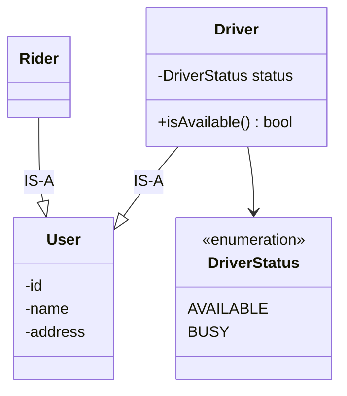
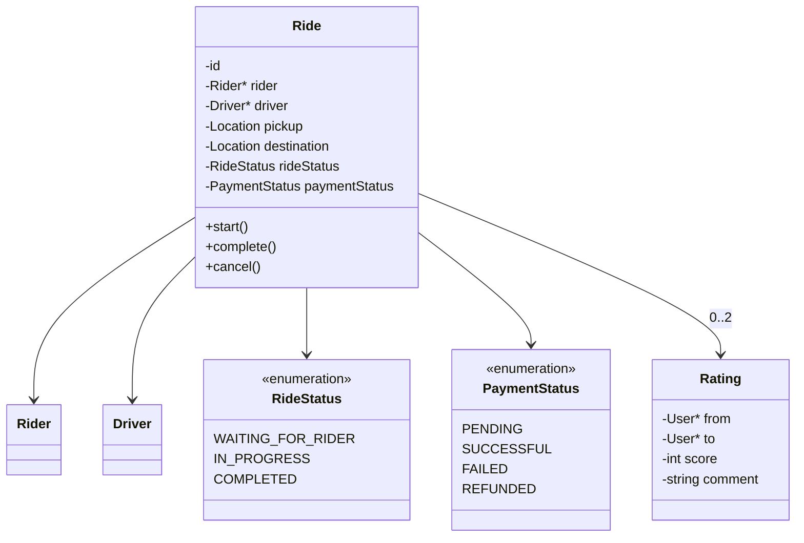
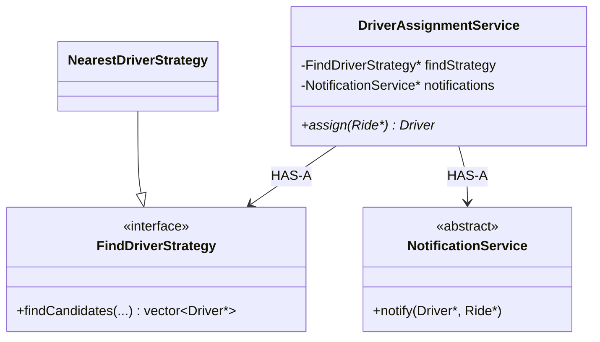
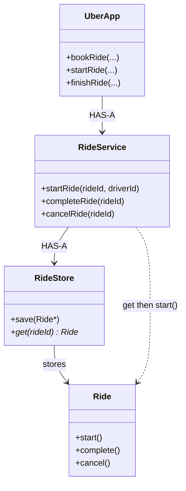
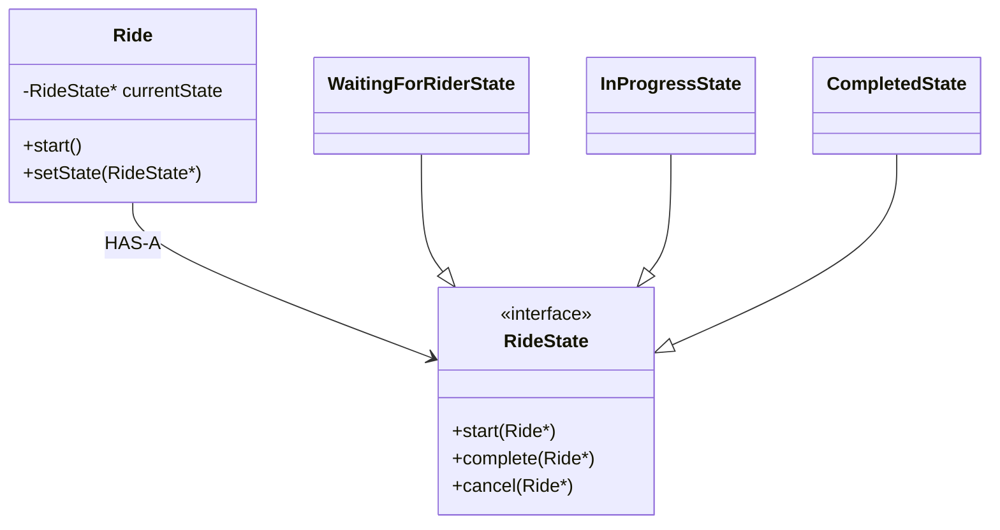
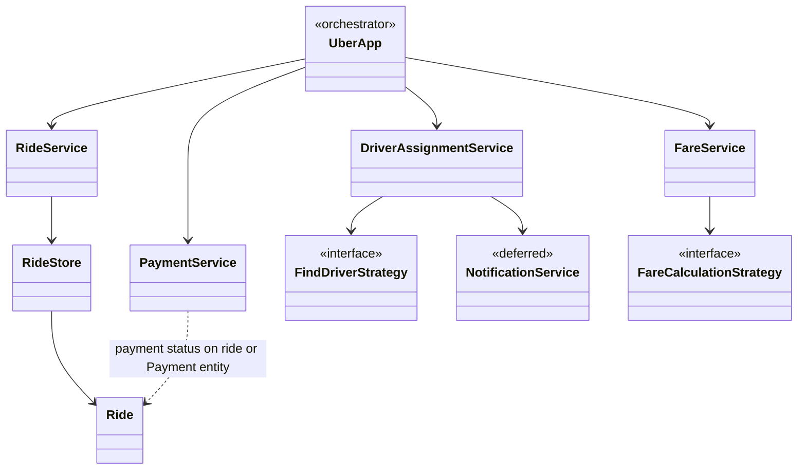

# Ride-Sharing System — LLD Design Journey

Simplified Uber/Ola. Focus: **responsibilities**, not GPS, network, DB, payment gateway, notifications, or concurrency (until asked).

---

## Requirements

1. Rider requests a ride  
2. Drivers available / unavailable  
3. Find a suitable driver  
4. Driver can accept  
5. Ride **starts** at pickup  
6. Ride **ends** at destination  
7. Fare from the ride  
8. Rider pays  
9. Rider rates driver  
10. Driver rates rider  

---

## 1. Core people

**Availability lives on `Driver`**, not on `UberApp`.

```text
Rider     Driver
 ├── id    ├── id
 └── name  ├── name
           └── status  →  AVAILABLE | BUSY
```

### `User` base class



Reasonable **is-a**. Don’t inherit only because two classes share `id`/`name`.

---

## 2. `Ride` is the domain object

Connects rider ↔ driver and owns the **trip lifecycle**.

```text
Ride
 ├── Rider, Driver
 ├── Pickup, Destination
 ├── RideStatus
 ├── PaymentStatus
 └── Rating(s)
```

**Accept ≠ start.** Driver can be assigned and still be travelling to the rider.

```text
accept → travel to rider → pickup → ride starts
```

```text
RideStatus (example)
 ├── REQUESTED / DRIVER_ASSIGNED   (optional; or implied by data)
 ├── WAITING_FOR_RIDER             ← key: accepted, not yet picked up
 ├── IN_PROGRESS
 └── COMPLETED
```

### Payment is a **separate** lifecycle

```text
RideStatus = COMPLETED
PaymentStatus = FAILED     ← valid
```

If two concepts evolve independently, **don’t** stuff both into one enum.

```text
PaymentStatus: PENDING | SUCCESSFUL | RETRYING | FAILED | REFUNDED
```

### Rating: who rated whom

```text
Rating
 ├── from, to
 ├── score
 └── comment
```

Not a nameless `rating` on the ride.



Prefer `ride.start()` / `complete()` / `cancel()` over `setStatus(...)` so invalid jumps (`WAITING` → `COMPLETED`) cannot happen.

---

## 3. First orchestrator (too fat if you stop here)

```text
UberApp
 ├── FindDriverStrategy*
 ├── PaymentCalculationStrategy*
 ├── vector<Ride>
 ├── bookARide / startARide / finishARide
 ├── RateDriver / DoPayment
```

Strong **start**. Then it owns matching + lifecycle + fare + pay + ratings + storage → **God app**.

**Strategy is correct** when the **algorithm varies**:

```text
FindDriverStrategy
 ├── NearestDriverStrategy
 ├── CheapestDriverStrategy
 └── HighestRatedDriverStrategy
```

Start from *what varies*, not *I need Strategy*.

---

## 4. Find vs assign (two jobs)

```text
Request
  ↓
Find candidates          ← FindDriverStrategy
  ↓
Notify
  ↓
Someone accepts
  ↓
That driver is assigned  ← DriverAssignmentService
```

| | Question |
|---|---|
| **Find** | Who are suitable candidates? |
| **Assign** | Who actually gets this ride? |

Observer may help **notify**. It does **not** replace assignment.

**Defer** a full notification LLD; keep `NotificationService` abstract until that problem is designed separately.



A service **coordinates** a workflow; it need not own all data.

---

## 5. Ride store + RideService

Don’t keep `vector<Ride>` on `UberApp`.

```text
Ride          → one trip
RideStore     → save / get
RideService   → use cases: startRide(rideId, driverId), ...
UberApp       → high-level orchestration
```

```text
startRide(rideId, driverId)
    ↓
RideStore.get(rideId)
    ↓
verify assigned driver
    ↓
Ride.start()
```

**Only the assigned driver can start** — `RideService` checks the use case; `Ride` still protects transitions.

### Service vs entity

| | Question |
|---|---|
| **Service** | What should happen for this **request**? |
| **Ride** | What must always be true about **this trip**? |



---

## 6. State Pattern — optional

`enum RideStatus` **≠** State Pattern.

Simple `if (status != WAITING) throw` in `start()` is enough.

Use State Pattern when **every** method is a forest of `if (state == …)` (`start` / `cancel` / `pay` / `rate` all differ by state).

Then:

```text
Ride HAS-A RideState
 ├── WaitingForRiderState
 ├── InProgressState
 └── CompletedState
ride.start() → currentState->start(ride)
```

**Ride still owns the lifecycle**; it **delegates** state-specific behavior.

`RideService` ≠ State Pattern. Service = use case. State objects = optional technique.



**Next open question (don’t implement yet):** rider vs driver cancel **before** pickup vs **after** pickup — if those rules explode, State Pattern starts to earn its keep.

---

## 7. Interview architecture (current)



ASCII sketch:

```text
                    UberApp
                       |
     +-----------------+------------------+
     |                 |                  |
     ↓                 ↓                  ↓
Assignment         RideService        Fare / Payment
     |                 |
FindStrategy       RideStore
Notify (abstract)      ↓
                      Ride
```

Not final — keep testing against new requirements.

---

## 8. Mental model (who does what)

| Piece | Responsibility |
|---|---|
| `Rider` / `Driver` | People; driver availability |
| `Ride` | One trip + **valid** status transitions |
| `RideStore` | Persistence of rides |
| `RideService` | Ride **use cases** |
| `DriverAssignmentService` | Find **then** assign |
| `FindDriverStrategy` | Matching **algorithm** |
| `NotificationService` | Tell drivers (design later) |
| `FareCalculationStrategy` | Fare **algorithm** |
| `PaymentService` | Pay / retry / refund |
| `Rating` | from → to feedback |
| `UberApp` | Glue the use cases |

---

## 9. Lessons

1. **Store ≠ business logic.** Store saves; `Ride` / `RideService` decide.  
2. **Find ≠ assign.**  
3. **Independent concepts → separate enums** (ride vs payment).  
4. **Service = use case; entity = invariants.**  
5. **No raw `setStatus` on important lifecycle.**  
6. **State Pattern = messy per-state behavior, not “we have an enum.”**  
7. **Patterns from variation**, not from a pattern list.

**Process:** responsibility → data → behavior → what varies → invariants → interactions → **then** pattern.

Don’t implement until this story is solid.

---

## Interview line

> `UberApp` orchestrates. Matching is Strategy + an assignment service (find vs accept). `RideService` + `RideStore` handle trips; `Ride.start()` enforces WAITING → IN_PROGRESS. Payment status is separate from ride status. Notifications and State Pattern wait until those areas actually get complex.
