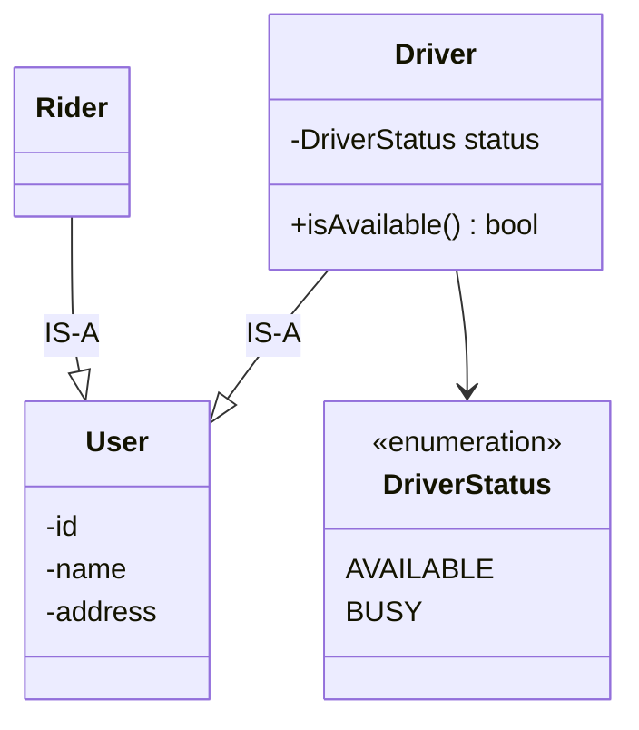
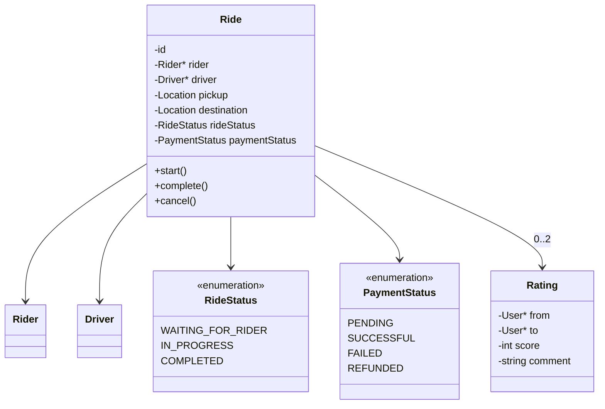
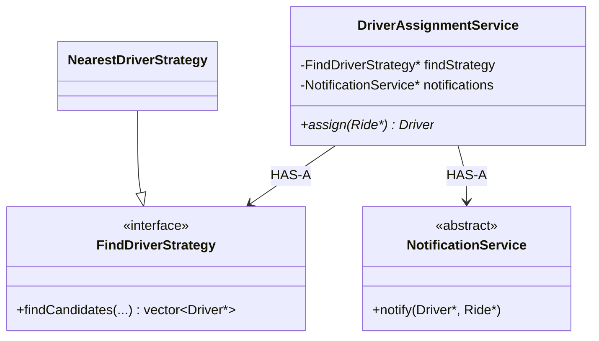
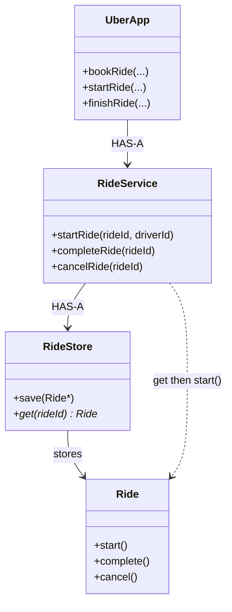
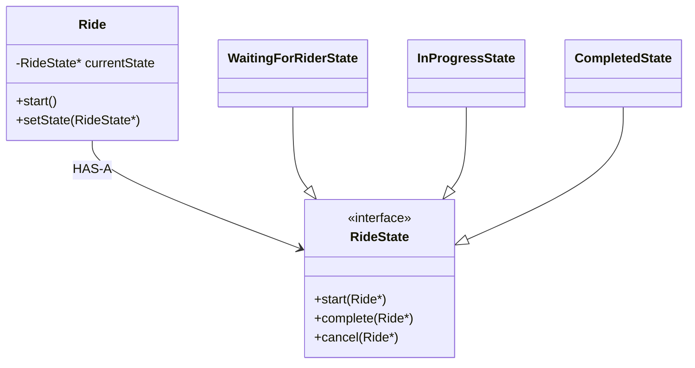
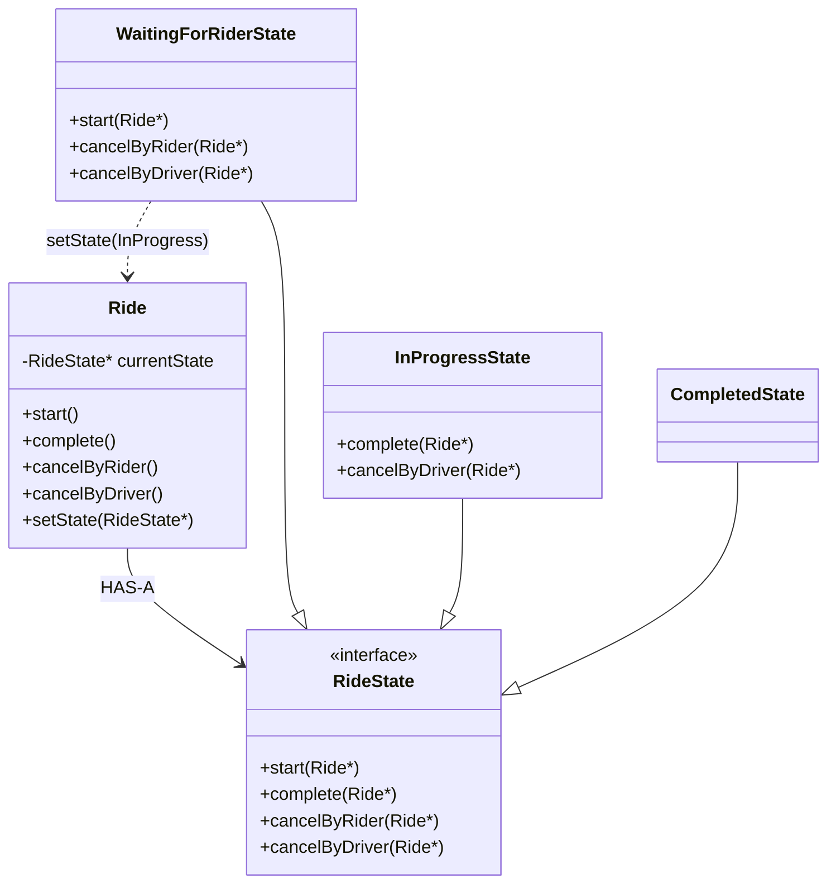
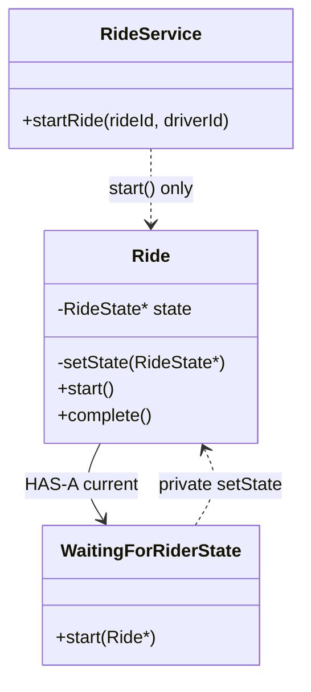
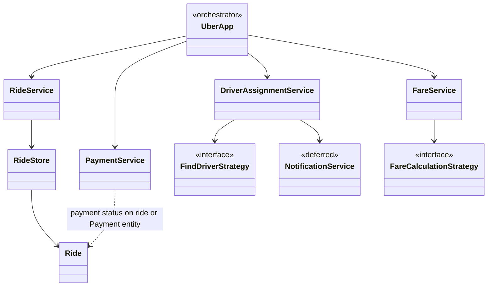

# Ride-Sharing System — LLD Design Journey

Simplified Uber/Ola. Focus: **responsibilities**, not GPS, network, DB, payment gateway, notifications, or concurrency (until asked).

---

## Requirements

1. Rider requests a ride  
2. Drivers available / unavailable  
3. Find a suitable driver  
4. Driver can accept  
5. Ride **starts** at pickup  
6. Ride **ends** at destination  
7. Fare from the ride  
8. Rider pays  
9. Rider rates driver  
10. Driver rates rider  

---

## 1. Core people

**Availability lives on `Driver`**, not on `UberApp`.

```text
Rider     Driver
 ├── id    ├── id
 └── name  ├── name
           └── status  →  AVAILABLE | BUSY
```

### `User` base class



Reasonable **is-a**. Don’t inherit only because two classes share `id`/`name`.

---

## 2. `Ride` is the domain object

Connects rider ↔ driver and owns the **trip lifecycle**.

```text
Ride
 ├── Rider, Driver
 ├── Pickup, Destination
 ├── RideStatus
 ├── PaymentStatus
 └── Rating(s)
```

**Accept ≠ start.** Driver can be assigned and still be travelling to the rider.

```text
accept → travel to rider → pickup → ride starts
```

```text
RideStatus (example)
 ├── REQUESTED / DRIVER_ASSIGNED   (optional; or implied by data)
 ├── WAITING_FOR_RIDER             ← key: accepted, not yet picked up
 ├── IN_PROGRESS
 └── COMPLETED
```

### Payment is a **separate** lifecycle

```text
RideStatus = COMPLETED
PaymentStatus = FAILED     ← valid
```

If two concepts evolve independently, **don’t** stuff both into one enum.

```text
PaymentStatus: PENDING | SUCCESSFUL | RETRYING | FAILED | REFUNDED
```

### Rating: who rated whom

```text
Rating
 ├── from, to
 ├── score
 └── comment
```

Not a nameless `rating` on the ride.



Prefer `ride.start()` / `complete()` / `cancel()` over `setStatus(...)` so invalid jumps (`WAITING` → `COMPLETED`) cannot happen.

---

## 3. First orchestrator (too fat if you stop here)

```text
UberApp
 ├── FindDriverStrategy*
 ├── PaymentCalculationStrategy*
 ├── vector<Ride>
 ├── bookARide / startARide / finishARide
 ├── RateDriver / DoPayment
```

Strong **start**. Then it owns matching + lifecycle + fare + pay + ratings + storage → **God app**.

**Strategy is correct** when the **algorithm varies**:

```text
FindDriverStrategy
 ├── NearestDriverStrategy
 ├── CheapestDriverStrategy
 └── HighestRatedDriverStrategy
```

Start from *what varies*, not *I need Strategy*.

---

## 4. Find vs assign (two jobs)

```text
Request
  ↓
Find candidates          ← FindDriverStrategy
  ↓
Notify
  ↓
Someone accepts
  ↓
That driver is assigned  ← DriverAssignmentService
```

| | Question |
|---|---|
| **Find** | Who are suitable candidates? |
| **Assign** | Who actually gets this ride? |

Observer may help **notify**. It does **not** replace assignment.

**Defer** a full notification LLD; keep `NotificationService` abstract until that problem is designed separately.



A service **coordinates** a workflow; it need not own all data.

---

## 5. Ride store + RideService

Don’t keep `vector<Ride>` on `UberApp`.

```text
Ride          → one trip
RideStore     → save / get
RideService   → use cases: startRide(rideId, driverId), ...
UberApp       → high-level orchestration
```

```text
startRide(rideId, driverId)
    ↓
RideStore.get(rideId)
    ↓
verify assigned driver
    ↓
Ride.start()
```

**Only the assigned driver can start** — `RideService` checks the use case; `Ride` still protects transitions.

### Service vs entity

| | Question |
|---|---|
| **Service** | What should happen for this **request**? |
| **Ride** | What must always be true about **this trip**? |



---

## 6. State Pattern — optional

`enum RideStatus` **≠** State Pattern.

Simple `if (status != WAITING) throw` in `start()` is enough.

Use State Pattern when **every** method is a forest of `if (state == …)` (`start` / `cancel` / `pay` / `rate` all differ by state).

Then:

```text
Ride HAS-A RideState
 ├── WaitingForRiderState
 ├── InProgressState
 └── CompletedState
ride.start() → currentState->start(ride)
```

**Ride still owns the lifecycle**; it **delegates** state-specific behavior.

`RideService` ≠ State Pattern. Service = use case. State objects = optional technique.



---

## Follow-up: rider vs driver cancel (State Pattern earns its keep)

**Not:** “two cancel functions, therefore State Pattern.”

**Yes:** **each operation’s behavior depends on the ride’s state**, and that matrix grows across `start` / `complete` / `cancelByRider` / `cancelByDriver` / refund.

```text
                    WAITING_FOR_RIDER     IN_PROGRESS     COMPLETED
                    -----------------     -----------     ---------
Rider cancels       ✅ allowed            ❌              ❌
Driver cancels      ✅ allowed            ⚠️ special      ❌
Start               ✅                    ❌              ❌
Complete            ❌                    ✅              ❌
Refund              ?                     ?              ✅
```

Rider cancel only **before start**. Driver cancel **before pickup** vs **after pickup** = different rules. That’s **state × actor**, not two unrelated methods.

If you keep an enum, `Ride` becomes:

```cpp
cancelByRider()  { if WAITING ... else if IN_PROGRESS ... }
cancelByDriver() { if WAITING ... else if IN_PROGRESS ... }
start()          { if WAITING ... }
complete()       { if IN_PROGRESS ... }
```

That’s a **state × behavior matrix**. Then State Pattern:

```text
Ride
 └── currentState
        ├── WaitingForRiderState   cancelByRider / cancelByDriver / start
        ├── InProgressState        cancelByRider ❌ / cancelByDriver ⚠️ / complete
        └── CompletedState         mostly no-ops or refund
```

**2–3 `if`s** → enum is still fine. **Many operations × many states** → State Pattern. That’s the interview judgment.

### Class diagram (cancel matrix)



`Ride.cancelByRider()` still exists — it **forwards** to `currentState`. Callers don’t switch on the enum.

### Who changes Waiting → InProgress?

**`Ride` owns the pointer. The current state decides when to change it.**

```text
RideService.startRide(id, driverId)
    ↓
Ride.start()                    // still the API
    ↓
currentState->start(this)       // WaitingForRiderState
    ↓
validate (assigned driver, etc.)
    ↓
ride->setState(new InProgressState())
```

`WaitingForRiderState` should **not** poke `Ride`’s private `status` field. It calls **`ride->setState(...)`** (same as the Light example: `OffState` calls `light->setState(new OnState())`).

Alternative (also fine): `start()` **returns** the next state, `Ride` applies it — only `Ride` assigns `currentState`. The **decision** still lives in `WaitingForRiderState`.

| | Role |
|---|---|
| `Ride` | Owns `currentState`, exposes `setState` / `start()` |
| `WaitingForRiderState` | Knows “successful start → InProgress” |
| `RideService` | Use case + “is this the assigned driver?” — then `ride.start()`, not `setState` from the service |

**Interview line:** *Cancellation isn’t two strategies; it’s the same operations behaving differently per state. When that matrix is large, I delegate to state objects. Transitions: the state calls `ride.setState`; Ride still owns the lifecycle.*

---

## Follow-up: RideService must not flip Ride’s state

If we use State Pattern, **`RideService` does not change internal state.**

```text
RideService   →  coordinates the use case
Ride          →  owns currentState  (setState is private)
RideState     →  behavior for this state
```

```text
RideService
    |
    |  ride.start()          // public API only
    ↓
Ride
    |
    |  currentState->start(this)
    ↓
WaitingForRiderState
    |
    |  valid → Ride.setState(InProgress)   // private / friend
```

`setState()` should **not** be public. Otherwise anyone can skip the machine:

```cpp
class Ride {
    RideState* state;
    void setState(RideState* newState);   // private
public:
    void start();
    void complete();
    void cancelByRider();
    void cancelByDriver();
};
```

### Why not RideService?

```text
RideService:
    if ride.getState() == WAITING
        ride.setState(IN_PROGRESS)     ❌
```

Then the service **is** the state machine again. Tomorrow’s rules pile up in the service — the opposite of why we added State Pattern.

```text
                    Responsibility
                         |
        +----------------+----------------+
        |                |                |
   RideService          Ride          RideState
   use cases          owns state      state behavior
```

**Use-case orchestration** stays on `RideService` (load ride, check assigned driver, call `ride.start()`, maybe notify).

**State-dependent rules** (can we start? rider cancel? driver cancel after pickup?) live on **state objects**.

Arbitrary classes must not freely `setState`.

### Test question

> In `WaitingForRiderState`, driver calls `startRide()`. Should **that state** contain “go to `InProgressState`”, or only say “start is allowed” and let **`Ride`** transition?

**Either is fine** if `setState` stays inside `Ride` + states.

| Approach | Who knows “WAITING + start → IN_PROGRESS”? |
|---|---|
| **A — State triggers** | `WaitingForRiderState` calls private `ride.setState(InProgress)` (Light pattern) |
| **B — Ride applies** | State returns “ok” / next-state enum; `Ride.start()` assigns `currentState` |

Interview answer: *The service never chooses InProgress. Either the waiting state requests the transition via private `setState`, or `Ride` applies it after the state says start is legal. External code only calls `ride.start()`.*



---

## 7. Interview architecture (current)



ASCII sketch:

```text
                    UberApp
                       |
     +-----------------+------------------+
     |                 |                  |
     ↓                 ↓                  ↓
Assignment         RideService        Fare / Payment
     |                 |
FindStrategy       RideStore
Notify (abstract)      ↓
                      Ride
```

Not final — keep testing against new requirements.

---

## 8. Mental model (who does what)

| Piece | Responsibility |
|---|---|
| `Rider` / `Driver` | People; driver availability |
| `Ride` | One trip + **valid** status transitions |
| `RideStore` | Persistence of rides |
| `RideService` | Ride **use cases** |
| `DriverAssignmentService` | Find **then** assign |
| `FindDriverStrategy` | Matching **algorithm** |
| `NotificationService` | Tell drivers (design later) |
| `FareCalculationStrategy` | Fare **algorithm** |
| `PaymentService` | Pay / retry / refund |
| `Rating` | from → to feedback |
| `UberApp` | Glue the use cases |

---

## 9. Lessons

1. **Store ≠ business logic.** Store saves; `Ride` / `RideService` decide.  
2. **Find ≠ assign.**  
3. **Independent concepts → separate enums** (ride vs payment).  
4. **Service = use case; entity = invariants.**  
5. **No raw `setStatus` on important lifecycle.**  
6. **State Pattern = messy per-state behavior, not “we have an enum.”**  
7. **Patterns from variation**, not from a pattern list.

**Process:** responsibility → data → behavior → what varies → invariants → interactions → **then** pattern.

Don’t implement until this story is solid.

---

## Interview line

> `UberApp` orchestrates. Matching is Strategy + an assignment service (find vs accept). `RideService` + `RideStore` handle trips; `Ride.start()` enforces WAITING → IN_PROGRESS. Payment status is separate from ride status. Notifications and State Pattern wait until those areas actually get complex.
