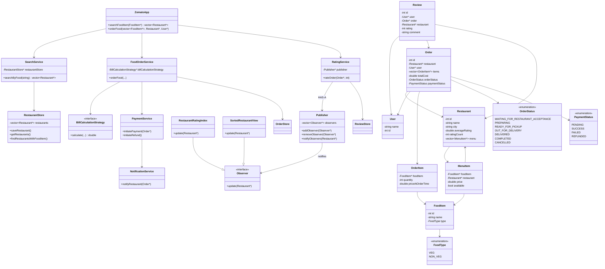
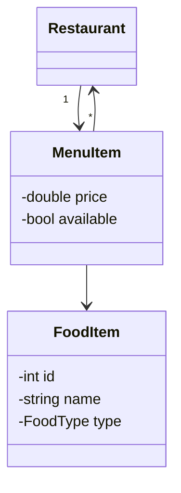
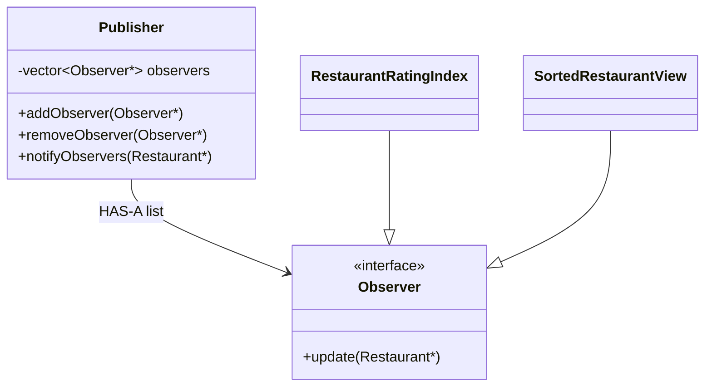
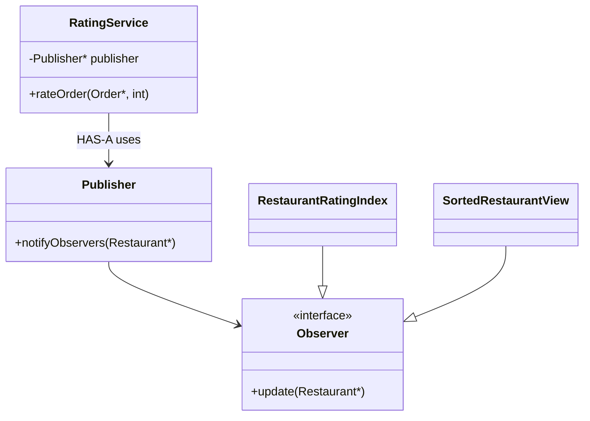

# Zomato / Swiggy / DoorDash — LLD Notes

Interview notes: design, corrections, Observer. Stop adding classes until a follow-up forces it. Next value is edge cases (inventory concurrency, payment success + restaurant reject, cancel) — not more architecture.

---

## Overall class diagram

```text
                   ZomatoApp
                       |
        +--------------+--------------+
        |              |              |
        ↓              ↓              ↓
 SearchService   FoodOrderService  RatingService
                       |              |
                       ↓              ↓
                PaymentService    Publisher  (HAS-A)
                       |              |
                       ↓              ↓
              NotificationService  Observers
```



**Interview line:** *Facade to Search / Order / Rating. MenuItem is restaurant-specific FoodItem + price. RatingService HAS-A Publisher; indexes are Observers. Don’t invent Rider until they ask delivery.*

---

## 1. Requirements

```text
1. Search restaurants using food-item name
2. Order food from a restaurant
3. Rate an order / restaurant
4. Sort restaurants using parameters such as average rating
5. Sorted / search views should update when restaurant rating changes
```

Because rating changes need to update dependent views / indexes, **Observer Pattern** is applicable.

---

## 2. Entities

### FoodItem

Initially:

```text
FoodItem
- id
- name
- FoodType
- rating
- price
```

Important correction: `price` should generally **not** belong to the global `FoodItem`.

The same food can have different prices:

```text
Burger
  Restaurant A -> ₹150
  Restaurant B -> ₹220
```

Separate the food definition from its restaurant-specific offering.

```cpp
class FoodItem {
    int id;
    string name;
    FoodType type;
};
```

---

## 3. MenuItem — restaurant × food

```cpp
class MenuItem {
    FoodItem* foodItem;
    Restaurant* restaurant;

    double price;
    bool available;
};
```

```text
FoodItem = What is the food?
MenuItem = How this restaurant sells that food
```

```text
Restaurant
     |
     +---- MenuItem ---- FoodItem
             |
             +-- price
             +-- availability
```



This allows:

```text
Burger at Restaurant A = ₹150
Burger at Restaurant B = ₹220
```

---

## 4. Restaurant

```cpp
class Restaurant {
    int id;
    string name;
    string city;

    double averageRating;
    int ratingCount;

    vector<MenuItem*> menu;
};
```

`averageRating` is an aggregate from user ratings. Update incrementally:

```text
newAverage =
(oldAverage * ratingCount + newRating)
/
(ratingCount + 1)
```

rather than scanning every review each time.

---

## 5. Review / Rating

Initial idea:

```text
Rating
- rating
- vector<string> comments
```

Better — one `Review` = one user’s rating:

```cpp
class Review {
    int id;

    User* user;
    Order* order;
    Restaurant* restaurant;

    int rating;
    string comment;
};
```

Example:

```text
User Sahil
Order #123
Restaurant X
Rating = 4
Comment = "Good food"
```

---

## 6. User

```text
User
- name
- id
```

That’s fine.

If requirements later introduce restaurant owners / admins, model roles separately. Don’t over-engineer initially.

---

## 7. Order

Original:

```text
Order
- Restaurant
- vector<FoodItem>
- User
- Cost
- Status
```

Better:

```cpp
class Order {
    int id;

    Restaurant* restaurant;
    User* user;

    vector<OrderItem*> items;

    double totalCost;

    OrderStatus orderStatus;
    PaymentStatus paymentStatus;
};
```

---

## 8. OrderItem

Instead of `vector<FoodItem*>` on the order:

```cpp
class OrderItem {
    FoodItem* foodItem;

    int quantity;

    double priceAtOrderTime;
};
```

Why `priceAtOrderTime`?

```text
Monday:
Burger = ₹150

Tuesday:
Restaurant changes Burger = ₹180
```

The old order must still say **₹150**.

> **Order stores a snapshot of the price when the purchase happened.**

Do not recompute historical orders from the current `MenuItem` price.

---

## 9. Rider

```text
Rider
- name
- id
- RiderStatus   (AVAILABLE / BUSY)
```

is reasonable — but given current requirements, **Rider isn’t necessary yet**.

Current scope:

```text
search
order
rate
sort restaurants
```

If the interviewer later says *now design delivery partner assignment*, then introduce `Rider` and `RiderAssignmentService`.

> **Don’t design features that aren’t required yet.**

---

## 10. Enums

### FoodType

```cpp
enum class FoodType {
    VEG,
    NON_VEG
};
```

### OrderStatus

```text
WAITING_FOR_RESTAURANT_ACCEPTANCE
PREPARING
READY_FOR_PICKUP
OUT_FOR_DELIVERY
DELIVERED
COMPLETED
CANCELLED
```

```text
WAITING_FOR_RESTAURANT_ACCEPTANCE
             ↓
         PREPARING
             ↓
      READY_FOR_PICKUP
             ↓
      OUT_FOR_DELIVERY
             ↓
         DELIVERED
             ↓
         COMPLETED
```

### PaymentStatus

```text
PENDING
SUCCESS
FAILED
REFUNDED
```

---

## 11. High-level services

Facade / orchestrator:

```cpp
class ZomatoApp {
public:
    vector<Restaurant*> searchFoodItem(FoodItem* item);

    void orderFood(
        vector<FoodItem*> items,
        Restaurant* restaurant,
        User* user
    );
};
```

Okay as the **external** API. Don’t put all business logic inside it.

```text
ZomatoApp / Controller
        |
        +-- SearchService
        |
        +-- FoodOrderService
        |
        +-- PaymentService
        |
        +-- RatingService
        |
        +-- NotificationService
```

---

## 12. SearchService

Responsible for:

```text
search restaurants by food
search restaurants by city
sort restaurants by rating
```

```cpp
class SearchService {
    RestaurantStore* restaurantStore;

public:
    vector<Restaurant*> searchByFood(string foodName);
};
```

---

## 13. FoodOrderService

```cpp
class FoodOrderService {
    BillCalculationStrategy* billCalculationStrategy;

public:
    void orderFood(...) {
        // calculate cost
        // create Order
        // WAITING_FOR_RESTAURANT_ACCEPTANCE
        // save order
        // initiate payment
    }
};
```

`BillCalculationStrategy` is reasonable because pricing may eventually involve item prices, discounts, coupons, tax, delivery fee, platform fee.

Don’t create strategies for all of these immediately. The pricing **abstraction** is enough.

---

## 14. PaymentService

```cpp
class PaymentService {
public:
    void initiatePayment(Order* order);
};
```

```text
Order created
     ↓
PaymentService
     ↓
Payment SUCCESS
     ↓
WAITING_FOR_RESTAURANT_ACCEPTANCE
     ↓
Notify Restaurant
```

Future edge case:

```text
Payment SUCCESS
       ↓
Restaurant REJECTS order
       ↓
PaymentService.initiateRefund()
```

Handle properly when discussing concurrency / failure.

---

## 15. NotificationService

```cpp
class NotificationService {
public:
    void notifyRestaurant(Order* order);
};
```

Later:

```text
NotificationService
        |
        +-- Email
        +-- SMS
        +-- Push Notification
```

Could use Strategy / Factory if they demand multiple channels. Don’t add until asked.

---

## 16. Stores

```cpp
class RestaurantStore {
    vector<Restaurant*> restaurants;

public:
    void saveRestaurant();
    vector<Restaurant*> getRestaurants();
    vector<Restaurant*> findRestaurantsWithFoodItem();
};
```

Fine for interview implementation.

Conceptually:

```text
RestaurantStore
OrderStore
ReviewStore
```

Later, only if needed: `MenuStore`, `PaymentStore`. Don’t create stores until a requirement needs them.

---

## 17. Observer — why

Requirement: sorted restaurant views / indexes should update whenever a user rates an order.

```text
Restaurant A = 4.2
Restaurant B = 4.3

ranking: B, A

User gives A a 5
A average → 4.4

ranking: A, B
```

Instead of `RatingService` knowing every component that needs updating, use Observer.

---

## 18. Observer structure

Two sides:

```text
Publisher / Subject   →  something changed
Observer / Subscriber →  tell me when it changes
```

```cpp
class Observer {
public:
    virtual void update(Restaurant* restaurant) = 0;
};
```

Possible observers: `RestaurantRatingIndex`, `SortedRestaurantView`.

```cpp
class RestaurantRatingIndex : public Observer {
public:
    void update(Restaurant* restaurant) override {
        // update restaurant's position in rating index
    }
};
```



---

## 19. Publisher

```cpp
class Publisher {
    vector<Observer*> observers;

public:
    void addObserver(Observer* observer);
    void removeObserver(Observer* observer);
    void notifyObservers(Restaurant* restaurant);
};
```

```text
Publisher
    |
    +---- Observer A
    |
    +---- Observer B
    |
    +---- Observer C
```

```text
Publisher.notifyObservers()
        ↓
for each Observer:
    observer->update(...)
```

---

## 20. Should RatingService inherit Publisher?

```cpp
class RatingService : public Publisher {
};
```

**Valid.** Classic Observer:

```text
             Publisher
                 ↑
           RatingService
                 |
        notifyObservers()
          /           \
         ↓             ↓
 RatingIndex      SortedView
      ↑               ↑
   Observer         Observer
```

```cpp
void RatingService::rateOrder(...) {
    // save review
    // update restaurant average rating
    notifyObservers(restaurant);
}
```

---

## 21. Composition is cleaner

Usual LLD question: **Is RatingService a Publisher?** Not really.

```text
RatingService → rating business logic
Publishing events is something it uses
```

```cpp
class RatingService {
    Publisher* publisher;

public:
    void rateOrder(Order* order, int rating) {
        // save review
        // update average rating
        publisher->notifyObservers(order->getRestaurant());
    }
};
```

```text
RatingService
     |
     | uses
     ↓
RatingEventPublisher
     |
     | notifies
     |
     +---------------------+
     ↓                     ↓
RatingIndex        SortedRestaurantView
     ↑                     ↑
     └──── Observer ───────┘
```



---

## 22. Responsibilities

```text
RatingService  →  business logic
Publisher      →  observer registration + notification
Observer       →  reaction to event
```

```text
RatingService
    |
    | rating changed
    ↓
Publisher
    |
    | notify
    ↓
Observers
    |
    | update()
    ↓
Search / Rating indexes updated
```

---

## 23. Full rating flow

User rates a completed order:

```text
User
 |
 | rateOrder(orderId, 5)
 ↓
RatingService
 |
 | verify order belongs to user
 | verify order completed
 | create Review
 | update average rating
 ↓
ReviewStore
 |
 ↓
Publisher.notifyObservers(restaurant)
 |
 +-------------------+
 ↓                   ↓
RatingIndex      SortedRestaurantView
 ↓                   ↓
update()            update()
```

That’s the Observer use case in this problem.

---

## 24. Current overall architecture

```text
                   ZomatoApp
                       |
        +--------------+--------------+
        |              |              |
        ↓              ↓              ↓
 SearchService   FoodOrderService  RatingService
                       |              |
                       ↓              ↓
                PaymentService    Publisher
                       |              |
                       ↓              ↓
              NotificationService  Observers

Stores: RestaurantStore, OrderStore, ReviewStore

Entities: User, Restaurant, FoodItem, MenuItem, Order, OrderItem, Review
```

Solid base. **Stop adding classes** until a requirement / follow-up forces it.
